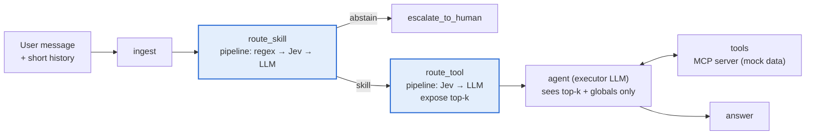

<div align="center">

# agent-router-study

**How should an agent decide which skill and which tool to use?**
An empirical, reproducible comparison of six routing strategies — regex, BM25, dense embeddings,
hybrid RRF, LLM and the Jev decision model — and their cascades, on one agent, one MCP server
and one labelled dataset.


[Results](#results-at-a-glance) · [Architecture](#architecture) · [Quickstart](#quickstart) ·
[Experiments](#experiments) · [Full study](docs/study-results.md)

</div>

---

## Why this exists

The *agent-skill* pattern keeps an agent's context small: a handful of **global tools** are
always visible, and each **skill** (a bundle of domain tools + a playbook) is loaded on demand.
That moves the hard question out of the executor LLM and into a **router**:

1. **Skill stage** — which skill does this message belong to (or none: abstain / escalate)?
2. **Tool stage** — within the loaded skill (+ globals), which tool(s) should the executor see?

Routers range from free and brittle (regex) to accurate and expensive (a frontier LLM). This
repo measures, on the same agent and the same data, **accuracy × cost × latency × engineering
effort** for each strategy and for cascades of them ("the first confident router decides").

## Results at a glance

Dev split, 151 pt-BR cases, both routing stages (skill → tool). Cascades replayed offline from
one `shadow` run; E6 is a separate real run. **Total spend for the study: US$ 0.93.**

| Config | Router | Skill acc. | Joint acc. | US$ / 1k req. | Verdict |
| --- | --- | ---: | ---: | ---: | --- |
| E1 | regex | 62.3 % | 46.9 % | 0.00 | brittle on paraphrase / multi-turn |
| E2 | BM25 | 55.6 % | 53.4 % | 0.00 | worst overall |
| E3 | embeddings | 70.2 % | 72.5 %* | 0.0005 | best free-ish option, blind to history |
| E4 | Jev | 84.1 % | 71.6 % | 0.43 | LLM-level accuracy at ~1/5 of the cost |
| E5 | LLM Sonnet 5 | 83.4 % | 70.5 % | 2.31 | best-calibrated confidence |
| E6 | LLM Haiku 4.5 | 83.4 % | 70.9 % | 3.40 | *not* cheaper than Sonnet 5 per billed call |
| **E7** | **regex → Jev** | **84.1 %** | **71.5 %** | **0.42** | **Pareto-optimal: 22 % of traffic free via regex** |
| E8 | regex → LLM | 84.1 % | 70.7 % | 2.17 | same accuracy, 5× the cost of E7 |
| E9 | regex → Jev → LLM | 84.1 % | 70.2 % | 0.62 | LLM step decided 4/151 cases: +46 % cost, +0 pp |

<sub>* measured on the subset where its skill matched the recorded one (n = 120); see the study, §3.</sub>

**Key findings**

- 🥇 **Jev ≈ frontier LLM on accuracy, ~5× cheaper.** Cascade it behind a high-precision regex
  (E7) and a fifth of requests cost nothing.
- 🧠 **Multi-turn is the dividing line**: routers that read history (Jev, LLMs) score 86.7 %;
  lexical and embedding routers score 20–27 %.
- 🎯 **Use the LLM's confidence, not Jev's, as a gate**: Sonnet at ≥ 0.9 confidence was right
  75/76 times (ECE 0.068); Jev reports ≥ 0.9 on 86 % of cases regardless.
- 🚪 **No router abstains**: out-of-scope messages go to global scope → `escalate_to_human`.
  Counted as abstention (the study's policy), Jev/LLM skill accuracy is ~90–91 %.
- 💸 **Routed agent turns were ~3.5× cheaper than the native agent** in the e2e smoke run
  (small n, directional only).

> Full numbers, per-category breakdowns, calibration, error analysis and caveats:
> **[docs/study-results.md](docs/study-results.md)**.

## Architecture



| Component | What it is | Where |
| --- | --- | --- |
| **Host agent** | LangGraph `StateGraph` (`ingest → route_skill → route_tool → agent ⇄ tools`), Redis checkpointer, layered cacheable system prompt | [`src/routing_study/graph`](src/routing_study/graph) |
| **Routers** | One contract (`RouteOption → RouteDecision{choice, confidence, candidates, cost, latency}`) implemented by 6 strategies; used by both stages | [`src/routing_study/routers`](src/routing_study/routers) |
| **Pipeline** | `single` · `cascade` (first router above its threshold decides) · `shadow` (all run in parallel, one decides, the rest are logged) | [`routers/pipeline.py`](src/routing_study/routers/pipeline.py) |
| **MCP server** | FastMCP over streamable HTTP: 3 skills × 5 tools + 3 globals, skill/policy resources, deterministic mock DB, OTel tracing | [`mcp_server/`](mcp_server) |
| **Dataset** | 500 pt-BR post-sales cases (104 hand-written + 396 synthetic), 6 categories, multi-label gold, 30/70 dev/test | [`data/`](data) |
| **Eval harness** | Runner → Langfuse dataset runs, scorers (skill/tool/args/e2e/grounding/abstention), offline cascade simulation, cost estimate | [`src/routing_study/eval`](src/routing_study/eval) |
| **Observability** | Every turn is a trace; every router decision a span with strategy, confidence, candidates, latency and real `usage.cost` | [`src/routing_study/tracing`](src/routing_study/tracing) |

### Domain: e-commerce post-sales (pt-BR)

| Scope | Tools |
| --- | --- |
| Globals (always visible) | `load_skill`, `get_customer_profile`, `search_help_center`, `escalate_to_human` |
| `pedidos_logistica` | `get_order_status`, `track_shipment`, `update_delivery_address`, `reschedule_delivery`, `cancel_order` |
| `pagamentos_reembolsos` | `get_payment_status`, `generate_boleto_second_copy`, `request_refund`, `get_refund_status`, `dispute_charge` |
| `trocas_devolucoes` | `check_return_eligibility`, `create_return_request`, `generate_return_label`, `create_exchange`, `open_warranty_claim` |

Confusable on purpose: `cancel_order × request_refund × create_return_request` (crosses all three
skills), `get_order_status × track_shipment`, `get_payment_status × get_refund_status`, and
`search_help_center` as a permanent distractor.

### Routing strategies

| Strategy | How it decides | Confidence | Cost per call | Effort to add a tool |
| --- | --- | --- | --- | --- |
| `regex` | Weighted pt-BR patterns per option ([`config/regex_rules.yaml`](config/regex_rules.yaml)) | heuristic, reduced on ties | free, ~0 ms | high — patterns per paraphrase |
| `bm25` | `rank_bm25` over description + examples + keywords | normalized top-1/top-2 margin | free, local | low |
| `embedding` | `qwen/qwen3-embedding-8b` cosine vs. example vectors (cached) | softmax, T = 0.05 | ~US$ 10⁻⁷ | low |
| `hybrid` | Reciprocal Rank Fusion of BM25 + embedding | fused score | ~US$ 10⁻⁷ | low |
| `llm` | Structured output with an `enum` of option ids, T = 0 (Sonnet 5 / Haiku 4.5) | self-reported | ~US$ 10⁻³ | low — description only |
| `jev` | `typesafe/jev-router` via OpenRouter, JSON `{choice, confidence}` with a tolerant parser | model-reported | ~US$ 10⁻⁴ | low — description only |

All strategies read the **same catalog** served by the MCP server (descriptions, examples,
keywords), so none has privileged information.

## Quickstart

**Requirements:** Python 3.12, [uv](https://docs.astral.sh/uv/), Docker, an
[OpenRouter](https://openrouter.ai) API key.

```bash
git clone https://github.com/LucaPinheiro/agent-router-study.git
cd agent-router-study
uv sync
cp .env.example .env            # set OPENROUTER_API_KEY

make up                         # Langfuse v4 (http://localhost:3300) + Redis
make up-app                     # + MCP server on :8765
make health
```

Local Langfuse login: `admin@local.dev` / `admin12345` (throwaway, local only).

### Run an experiment

```bash
# cost estimate before spending
uv run study estimate -c config/experiments/e9_regex_jev_llm.yaml --split dev --mode routing-only

# one config, routing only (no executor)
uv run study run -c config/experiments/e9_regex_jev_llm.yaml --split dev --mode routing-only

# every strategy in one pass, then replay any cascade offline for free
uv run study run -c config/experiments/e9_regex_jev_llm.yaml --split dev \
  --mode routing-only --routing-mode shadow --run-name shadow-dev
uv run study simulate results/shadow-dev.jsonl -c config/experiments/e7_regex_jev.yaml

# full agent with tools (executor fills args and answers)
uv run study run -c config/experiments/e0_native.yaml --split dev --mode e2e --limit 10

uv run study report                        # table over results/*.jsonl
uv run python scripts/analysis/study_report.py results/shadow-dev.jsonl   # per-strategy study
uv run study trace <trace_id>              # print a trace tree from Langfuse
```

Any setting can be overridden by env var, e.g.
`ROUTING__SKILL__PIPELINE__0__MIN_CONFIDENCE=0.95`. Model slugs live only in YAML.

### Tests & lint

```bash
make test     # 160 unit tests: routers, pipeline, graph, scorers, MCP server, dataset
make e2e      # integration: trace-tree shape against the live stack (needs make up-app)
make lint
```

## Experiments

| ID | Skill pipeline | Tool pipeline | Question |
| --- | --- | --- | --- |
| E0 | native — the agent calls `load_skill` itself | native | Is a router worth it at all? |
| E1 | regex | regex | Floor/ceiling without a model |
| E2 | BM25 | BM25 | Lexical, zero API cost |
| E3 | embeddings | embeddings | Cheap semantics |
| E4 | Jev | Jev | Decision model in isolation |
| E5 | LLM Sonnet 5 | LLM Sonnet 5 | Accuracy reference |
| E6 | LLM Haiku 4.5 | LLM Haiku 4.5 | How much a cheap LLM loses |
| E7 | regex → Jev | Jev | Cascade without an LLM |
| E8 | regex → LLM | LLM | Classic cascade |
| E9 | regex → Jev → LLM | Jev → LLM | Best cost/benefit? |

Configs: [`config/experiments/`](config/experiments). Metrics: skill accuracy, conditional
tool accuracy, joint accuracy, abstention, coverage per cascade step, calibration (ECE),
latency p50/p95, US$ per 1,000 requests, argument validity and grounding (e2e).

## Repository layout

```text
agent-router-study/
├─ config/
│  ├─ experiments/          # e0_native.yaml … e9_regex_jev_llm.yaml
│  └─ regex_rules.yaml      # written from the catalog only, never from test data
├─ data/                    # seed, synthetic, dev/test splits + dataset card
├─ docs/
│  ├─ study-results.md      # the study: results, analysis, recommendations
│  ├─ projeto.md            # original study plan (pt-BR)
│  ├─ graph.md              # generated LangGraph topology
│  └─ results/              # raw run files used by the study (jsonl)
├─ infra/                   # docker compose: Langfuse v4, Redis, MCP server
├─ mcp_server/              # FastMCP server, mock DB, skills, tests
├─ scripts/
│  ├─ dataset/              # generate + split
│  └─ analysis/             # study_report.py
├─ spikes/                  # Langfuse v4 SDK spike
├─ src/routing_study/
│  ├─ routers/              # contract, 6 strategies, pipeline
│  ├─ graph/                # LangGraph host agent
│  ├─ eval/                 # runner, scorers, simulate, report, estimate
│  ├─ tracing/              # Langfuse + cost capture
│  ├─ prompts/              # layered system prompt
│  ├─ catalog.py · llm.py · settings.py · cli.py
└─ tests/
```

## Methodology guardrails

- **No leakage:** regex rules, option examples and thresholds are tuned on **dev** only; the
  test split (349 cases) is held out.
- **Different generator family:** synthetic cases come from `google/gemini-2.5-flash`, not from
  any router model.
- **Multi-label gold:** ambiguous cases list every acceptable skill/tool; forcing one label
  would punish routers that pick a valid alternative.
- **Real cost:** OpenRouter's `usage.cost` per call, not list-price arithmetic.
- **Reproducible offline:** `shadow` mode records every strategy's decision, so any cascade and
  threshold can be replayed with `study simulate` without new API calls.

## Status and limitations

- Human review of the dataset is **pending** (`reviewed: false` everywhere) — see
  [`data/README.md`](data/README.md).
- Current results are on the **dev split, 1 repetition**; the held-out test run with 3
  repetitions is the next step.
- Jev is early-access; `typesafe/jev-router` is a meta-router whose served model varies per
  call (recorded in every trace).

## License

No license file yet — all rights reserved by the author until one is added.
