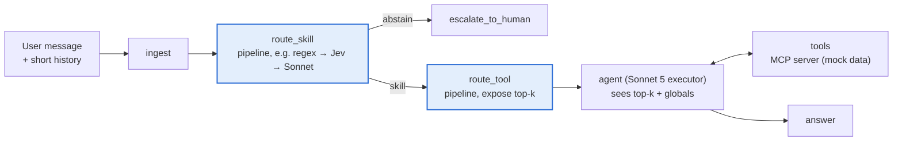

<div align="center">

# agent-router-study

**How should an agent decide which skill and which tool to use, and does it need a router at all?**
A pre-registered, reproducible comparison of regex, BM25, dense embeddings, a trained classifier,
a hybrid, general-purpose LLMs (Bedrock and local) and the Jev decision model, alone and in
cascades, on one LangGraph agent, one MCP server and one labelled pt-BR dataset.


[Results](#headline-results) · [Architecture](#architecture) · [Quickstart](#quickstart) ·
[Reproduce the study](#reproduce-the-study) · [Full study (pt-BR)](estudos/README.md) ·
[Português](README.pt-BR.md)

</div>

---

## What this is

The *agent-skill* pattern keeps an agent's context small: a few **global tools** are always
visible and each **skill** (a bundle of domain tools plus a playbook) is loaded on demand. Routing
can then happen in two stages, outside the executor LLM:

1. **Skill stage**: which skill does the message belong to (or none: abstain / escalate)?
2. **Tool stage**: within that skill (plus globals), which tools should the executor see?

This repository measures, on the same agent and data, **accuracy × cost × latency × maintenance
effort** for each routing strategy and for cascades ("the first confident router decides"), and
compares the routed agent with a **native** agent that calls `load_skill` by itself.

The confirmatory run was pre-registered (git tag `prereg-v1`) and executed once on a fresh split
(`test_v2`, 349 cases) that no router, prompt or threshold had seen. The full write-up, in
Portuguese, is in [`estudos/`](estudos/README.md).

## Headline results

test-v2, 349 cases, intention to treat, 95% paired cluster-bootstrap CIs (10k resamples).
Routing-only joint accuracy = skill and tool both correct at top-1.

| Config | Router | Joint accuracy % [95% CI] | Routing US$ / 1k cases | Warm p95 latency |
|---|---|---|---|---|
| E1 | regex | 52.7 [47.3, 57.9] | 0 | 0.4 ms |
| E2 | BM25 | 49.0 [43.8, 54.2] | 0 | 7 ms |
| E3 | embeddings (qwen3-embedding 8B, local) | 73.6 [68.8, 78.2] | 0 | 0.7 s |
| E10 | linear probe classifier (local) | 74.8 [70.2, 79.4] | 0 | 1.0 s |
| E11 | hybrid regex + classifier (local) | 72.8 [67.9, 77.4] | 0 | 1.0 s |
| E6b | Qwen3-8B (local, Ollama) | 79.9 [75.6, 84.0] | 0 | 12.0 s |
| E4 | Jev (`typesafe/jev-router` via OpenRouter) | **84.7** [81.0, 88.2] | **0.82** | 6.9 s |
| E5 | Claude Sonnet 5 (Bedrock) | 84.1 [80.3, 87.8] | 4.98 | 11.0 s |
| E6 | Claude Haiku 4.5 (Bedrock) | 84.5 [80.5, 88.3] | 5.23 | 5.9 s |
| E7 | regex → Jev | 79.9 [75.8, 84.0] | 0.73 | 7.1 s |
| E9 | regex → Jev → Sonnet | 81.8 [77.8, 85.6] | 0.99 | 9.9 s |

Pre-registered hypotheses ([primary.md](docs/results/final/primary.md),
[secondary.md](docs/results/final/secondary.md)):

- **H1** cascade E9 vs Sonnet 5: −2.4 pp [−5.4, 0.7]; non-inferiority (margin 3 pp) **not shown**.
  Routing cost ratio 0.199 [0.174, 0.224].
- **H2** cascade E7 vs Sonnet 5: −4.2 pp [−7.8, −0.6]; non-inferiority **not shown**.
- **H3** end to end, routed E9 vs native E0 (Sonnet 5 executor): e2e_success 45.8% vs 55.6%,
  **−9.7 pp [−13.5, −6.0]**, Holm p 0.0003. **The native agent beats the routed one**, and the
  router saves only ~9% per turn (cost ratio 0.909 [0.859, 0.960]).
- Prompt engineering: the pre-declared one-SE rule kept the base prompt P0 for all four LLMs, so
  no tuning gain was found. Model equivalence (±3 pp vs Sonnet) was not established after Holm.
- Regex rules written on the dev split dropped from 84.8% (dev) to 52.7% (test): **−32.1 pp**.

Exploratory (post hoc, same split): exposing all tools of the routed skill instead of the top-2
lifted E9 to 48.1% (still −7.4 pp vs native). In 22 of the 40 cases only the native agent solved,
the routed executor made exactly the same tool calls and failed only because the router's skill
label was scored; see [estudos/07](estudos/07-ponta-a-ponta.md).


**Practical reading for this catalog (18 tools):** do not put a router in front of the agent;
if you need one (governance, audit, a growing catalog), Jev alone is as accurate as Sonnet 5 at
about one sixth of the cost; no tested router reaches 75% joint accuracy under a 2 s p95.
Decision matrix by use case: [estudos/11](estudos/11-matriz-enterprise.md).

### Phase 2: managed models and a 62-tool catalog

Two more pre-registrations, each frozen before its first test row (tags `prereg-v2a`, `prereg-v2`).
No local model is run in phase 2; everything is on Bedrock except Jev (OpenRouter).

**Part A, managed vs local on the 18-tool catalog** (test-v2, routing only,
[addendum-a/primary.md](docs/results/addendum-a/primary.md)): the managed Ministral 3 8B is
non-inferior to local Qwen3-8B, +2.3 pp [−2.0, 6.6] (82.2% joint, p95 1.6 s, US$ 0.44/1k), the
first configuration with ≥ 75% joint under a 2 s p95. Managed embeddings (Cohere v4, Titan v2)
lose 18–19 pp to the local embedder. Write-up: [estudos/14](estudos/14-fase2-nuvem.md).

**Part B, a 62-tool catalog** (10 skills + globals, 12 deliberately confusable groups; new split
test-L, 300 cases; symmetric e2e scorer that attributes the skill from behaviour in both arms;
[phase2-b/primary.md](docs/results/phase2-b/primary.md),
[secondary.md](docs/results/phase2-b/secondary.md),
[estimation.md](docs/results/phase2-b/estimation.md)):

| Hypothesis (Holm across H1-L..H3-L) | Δ [95% CI] | Holm p | Verdict |
|---|---|---|---|
| **H1-L** e2e_success_sym, routed E9-L − native E0-L | −0.3 pp [−4.0, 3.3] | 1 | no directional claim (57.0% vs 57.3%) |
| **H2-L** Ministral 3 8B − Haiku 4.5, joint (NI 3 pp) | −2.7 pp [−7.0, 1.7] | 0.8795 | non-inferiority **not shown** |
| **H3-L** Jev − Haiku 4.5, joint (NI 3 pp) | +2.9 pp [−0.7, 6.6] | 0.0027 | **non-inferior** |

| Config (62 tools) | Joint % [95% CI] | Routing US$ / 1k | Warm p95 |
|---|---|---|---|
| E1 regex | 56.3 [50.7, 62.0] | 0 | 2 ms |
| E11 hybrid regex + Titan probe | 62.3 [56.7, 67.7] | 0.000 | 0.3 s |
| E6m Ministral 3 8B (Bedrock) | 79.3 [74.7, 84.0] | 0.69 | 1.4 s |
| E6 Haiku 4.5 (Bedrock) | 82.0 [77.7, 86.0] | 7.15 | 5.3 s |
| E9-L regex → Jev → Sonnet | 82.7 [78.6, 86.6] | 1.00 | 9.6 s |
| E4 Jev | **84.9** [81.1, 88.4] | 0.98 | 9.2 s |

- **At 62 tools the routed agent ties the native one end to end** (H1-L), and it costs **1.101×
  [1.014, 1.196]** per turn: it halves the executor prompt (10,067 vs 18,254 tokens) but the
  native agent's stable prefix is served from the Bedrock prompt cache. Without the cache discount
  the routed agent would be cheaper (24.46 vs 39.95 US$/1k turns).
- Exposing every tool of the routed skill does not help (S1: −0.3 pp [−2.7, 1.7]); regex written
  on dev-L drops 26.4 pp on test-L (S3); the Titan probe is 25.9 pp below Jev (S7).
- Exploratory, same cases (114 test-L cases the 18-tool catalog can answer): the 44 added
  confusable tools cost Jev 9.6 pp [−14.6, −5.0] and BM25 16.7 pp
  ([catalog_size.md](docs/results/phase2-b/catalog_size.md)).

**Final reading (both phases):** for end-to-end quality a router did not pay off at 18 tools
(native better) nor at 62 tools (a tie, and costlier with prompt caching). It is defensible for
governance (an auditable routing decision), an executor context cap, or an uncached deployment;
then use Jev alone. Under a 2 s p95 the only ≥ 75% option is managed Ministral 3 8B. Write-up:
[estudos/15](estudos/15-fase2-catalogo-grande.md); final decision matrix:
[estudos/11 §6](estudos/11-matriz-enterprise.md).

## Architecture



| Component | What it is | Where |
|---|---|---|
| **MCP server** | FastMCP: 3 skills × 5 tools + 3 global tools, skill and policy resources, deterministic mock DB; the single source of the catalog every router reads | [`mcp_server/`](mcp_server) |
| **Host agent** | LangGraph `StateGraph` (`ingest → route_skill → route_tool → agent ⇄ tools`) with a Redis checkpointer; native mode (E0) lets the executor call `load_skill` itself | [`src/routing_study/graph`](src/routing_study/graph) |
| **Routers** | One contract (choice, confidence, candidates, cost, latency) for both stages: regex, BM25, embedding, classifier, hybrid, LLM (Bedrock / Ollama), Jev; pipelines `single`, `cascade`, `shadow` | [`src/routing_study/routers`](src/routing_study/routers) |
| **Providers** | AWS Bedrock (Claude Sonnet 5, Haiku 4.5), OpenRouter (Jev, dataset generation, label audit), Ollama (Qwen3-8B, qwen3-embedding) | [`src/routing_study/llm.py`](src/routing_study/llm.py) |
| **Observability** | Langfuse v4: a trace per turn, spans per graph node and router step, MCP calls as child spans; each run is a Langfuse dataset experiment | [`src/routing_study/tracing`](src/routing_study/tracing) |
| **Eval harness** | Runner, offline rescoring (the only source of numbers), pre-registered manifest runner with version guard and budget ledger, stats (paired cluster bootstrap, McNemar, sign-flip, Holm, TOST) | [`src/routing_study/eval`](src/routing_study/eval) |
| **Dataset** | pt-BR e-commerce post-sales: dev 151, test-v1 349 (exposed), test-v2 349 (confirmatory, generated by a non-Claude model, blind-audited by two other families) | [`data/`](data), [dataset card](docs/dataset-card.md) |

Domain: `pedidos_logistica`, `pagamentos_reembolsos`, `trocas_devolucoes` (5 tools each) plus
`get_customer_profile`, `search_help_center`, `escalate_to_human`; confusable pairs on purpose
(`cancel_order × request_refund × create_return_request`, `get_order_status × track_shipment`,
`get_payment_status × get_refund_status`).

## Quickstart

Requirements: Python 3.12, [uv](https://docs.astral.sh/uv/), Docker, an OpenRouter API key, AWS
credentials with Bedrock access (default boto3 chain, region `sa-east-1`) and, for local routers,
[Ollama](https://ollama.com) with `qwen3:8b-q8_0` and `qwen3-embedding:8b-q8_0`.

```bash
git clone https://github.com/LucaPinheiro/agent-router-study.git
cd agent-router-study
uv sync
cp .env.example .env            # OPENROUTER_API_KEY, Langfuse keys, MCP_TOKEN, REDIS_URL

make up                         # Langfuse v4 (http://localhost:3300) + Redis
make up-app                     # + MCP server on :8765
make health

uv run study estimate -c config/experiments/e9_regex_jev_llm.yaml --split dev --mode routing-only
uv run study run -c config/experiments/e9_regex_jev_llm.yaml --split dev --mode routing-only --limit 10
uv run study run -c config/experiments/e0_native.yaml --split dev --mode e2e --limit 10
uv run study budget             # spend ledger by provider and model
make test && make lint
```

Any setting can be overridden with an env var, e.g.
`ROUTING__SKILL__PIPELINE__0__MIN_CONFIDENCE=0.95`. Model ids live only in the YAML configs.

## Reproduce the study

```bash
BUDGET__AWS_USD_CAP=85 uv run study run-manifest config/study_manifest.yaml   # 102 pre-registered runs
uv run study run-manifest config/study_manifest_explore.yaml                  # 2 exploratory runs (D-002)
uv run python scripts/analysis/final_all.py                                   # every table and figure
```

The manifest pins each run's `config_hash` and `prompt_hash`, checks the budget before each run,
resumes by (case, repetition) and flags runs with more than 2% errors. Frozen hashes, the
deviation log (D-001 to D-003) and the per-table commands are in
[`docs/prereg/`](docs/prereg/prereg-v1.md) and [estudos/13](estudos/13-reprodutibilidade.md).
Analysis outputs: [`docs/results/final/`](docs/results/final/). Phase 2:
`uv run python scripts/analysis/addendum_a.py` (Part A) and
`uv run python scripts/analysis/phase2_b.py --manifest config/study_manifest_l.yaml` (Part B,
after the sym rescore of the e2e runs) write [`docs/results/addendum-a/`](docs/results/addendum-a/)
and [`docs/results/phase2-b/`](docs/results/phase2-b/); tags, hashes and commands in
[estudos/13 §7](estudos/13-reprodutibilidade.md). The local Langfuse also has a
custom dashboard, "Agent Router Study: operação" (9 widgets; see [estudos/13](estudos/13-reprodutibilidade.md)). Spend for the final study:
US$ 34.48 Bedrock + US$ 1.43 OpenRouter (ledger at the end of phase 1: US$ 52.11 Bedrock, US$ 5.83
OpenRouter). Phase 2 (Parts A and B) added US$ 27.65 Bedrock and US$ 1.69 OpenRouter.

## Repository layout

```text
config/          experiments/ (E0–E12), study manifests, prompt selection, prices, regex rules, rq5/
data/            dev, test-v1, test-v2, audit/, dataset card inputs
docs/            prereg/ (pre-registration, hashes, deviations), results/final/ (analysis), method notes
docs-ptbr/       Brazilian Portuguese translation of docs/ (prose only)
estudos/         the study write-up (pt-BR) and figures
infra/           docker compose: Langfuse v4, Redis, MCP server
mcp_server/      FastMCP server, mock DB, skills, tests
scripts/         dataset generation and audit; analysis (final_*.py, tuning, prompt selection)
src/routing_study/  routers/, graph/, eval/, tracing/, prompts/, catalog, llm, settings, cli
tests/
```

## Limitations

One domain, one language, 18 tools: the native agent is strong at this size and the conclusions
do not automatically extend to catalogs with hundreds of tools. Phase 2 extended this to 62 tools
(a tie end to end); hundreds of tools remain untested. Data are synthetic and labels were
audited by models, not humans. "Jev" here is `typesafe/jev-router` via OpenRouter, a meta-router
whose served model varies per call, not Jev's native typed API. Full list:
[estudos/12](estudos/12-limitacoes.md).

The previous dev-only write-up ([docs/study-results.md](docs/study-results.md)) is **superseded**
by this study.

## License

No license file yet: all rights reserved by the author until one is added.
