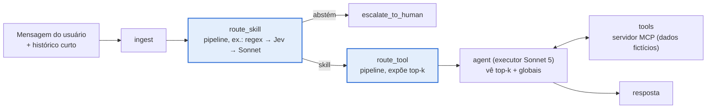

<div align="center">

# agent-router-study

**Como um agente deve decidir qual skill e qual tool usar, e ele precisa mesmo de um roteador?**
Uma comparação pré-registrada e reproduzível de regex, BM25, embeddings densos, um classificador
treinado, um híbrido, LLMs de uso geral (Bedrock e locais) e o modelo de decisão Jev, isolados e em
cascata, num agente LangGraph, num servidor MCP e num dataset rotulado em pt-BR.

[Resultados](#resultados-principais) · [Arquitetura](#arquitetura) · [Início rápido](#início-rápido) ·
[Reproduzir o estudo](#reproduzir-o-estudo) · [Estudo completo](estudos/README.md) ·
[English](README.md)

</div>

---

## O que é

O padrão *agent-skill* mantém o contexto do agente pequeno: algumas **tools globais** ficam sempre
visíveis e cada **skill** (um conjunto de tools de domínio mais um playbook) é carregada sob
demanda. O roteamento pode então acontecer em dois estágios, fora do LLM executor:

1. **Skill:** a que skill a mensagem pertence (ou nenhuma: abster ou escalar)?
2. **Tool:** dentro dessa skill (mais as globais), quais tools o executor deve ver?

Este repositório mede, no mesmo agente e nos mesmos dados, **acurácia × custo × latência × esforço
de manutenção** de cada estratégia e de cascatas ("o primeiro roteador confiante decide"), e
compara o agente roteado com um agente **nativo**, que chama `load_skill` sozinho.

O run confirmatório foi pré-registrado (tag `prereg-v1`) e executado uma única vez num split novo
(`test_v2`, 349 casos) que nenhum roteador, prompt ou limiar tinha visto. O relatório completo está
em [`estudos/`](estudos/README.md).

## Resultados principais

test-v2, 349 casos, intenção de tratar, IC 95% por bootstrap pareado por caso (10 mil reamostragens).
Acurácia conjunta de roteamento = skill e tool certas no top-1.

| Config | Roteador | Conjunta % [IC 95%] | US$ de roteamento / 1k casos | p95 quente |
|---|---|---|---|---|
| E1 | regex | 52,7 [47,3; 57,9] | 0 | 0,4 ms |
| E2 | BM25 | 49,0 [43,8; 54,2] | 0 | 7 ms |
| E3 | embeddings (qwen3-embedding 8B, local) | 73,6 [68,8; 78,2] | 0 | 0,7 s |
| E10 | classificador (sonda linear, local) | 74,8 [70,2; 79,4] | 0 | 1,0 s |
| E11 | híbrido regex + classificador (local) | 72,8 [67,9; 77,4] | 0 | 1,0 s |
| E6b | Qwen3-8B (local, Ollama) | 79,9 [75,6; 84,0] | 0 | 12,0 s |
| E4 | Jev (`typesafe/jev-router` via OpenRouter) | **84,7** [81,0; 88,2] | **0,82** | 6,9 s |
| E5 | Claude Sonnet 5 (Bedrock) | 84,1 [80,3; 87,8] | 4,98 | 11,0 s |
| E6 | Claude Haiku 4.5 (Bedrock) | 84,5 [80,5; 88,3] | 5,23 | 5,9 s |
| E7 | regex → Jev | 79,9 [75,8; 84,0] | 0,73 | 7,1 s |
| E9 | regex → Jev → Sonnet | 81,8 [77,8; 85,6] | 0,99 | 9,9 s |

Hipóteses pré-registradas ([primary.md](docs/results/final/primary.md),
[secondary.md](docs/results/final/secondary.md)):

- **H1** cascata E9 × Sonnet 5: −2,4 pp [−5,4; 0,7]; não inferioridade (margem 3 pp) **não
  demonstrada**. Razão de custo de roteamento 0,199 [0,174; 0,224].
- **H2** cascata E7 × Sonnet 5: −4,2 pp [−7,8; −0,6]; não inferioridade **não demonstrada**.
- **H3** ponta a ponta, E9 roteado × E0 nativo (executor Sonnet 5): `e2e_success` 45,8% × 55,6%,
  **−9,7 pp [−13,5; −6,0]**, Holm p 0,0003. **O agente nativo vence o roteado**, e o roteador
  economiza só ~9% por turno (razão de custo 0,909 [0,859; 0,960]).
- Engenharia de prompt: a regra de um erro-padrão manteve o prompt base P0 para os quatro LLMs;
  nenhum ganho de ajuste foi encontrado. A equivalência entre modelos (±3 pp contra o Sonnet) não
  se estabeleceu depois de Holm.
- As regras de regex escritas no dev caíram de 84,8% (dev) para 52,7% (teste): **−32,1 pp**.

Exploratório (post hoc, mesmo split): expor todas as tools da skill roteada em vez das top-2 levou
o E9 a 48,1% (ainda −7,4 pp contra o nativo). Em 22 dos 40 casos que só o nativo resolveu, o
executor roteado fez exatamente as mesmas chamadas de tool e falhou só pela pontuação do rótulo de
skill do roteador; ver [estudos/07](estudos/07-ponta-a-ponta.md).


**Leitura prática para este catálogo (18 tools):** não coloque um roteador na frente do agente;
se precisar de um (governança, auditoria, catálogo crescendo), o Jev sozinho tem a acurácia do
Sonnet 5 por cerca de um sexto do custo; nenhum roteador testado chega a 75% de conjunta com p95
abaixo de 2 s. Matriz de decisão por caso de uso: [estudos/11](estudos/11-matriz-enterprise.md).

### Fase 2: modelos gerenciados e um catálogo de 62 tools

Mais dois pré-registros, cada um congelado antes da primeira linha do seu teste (tags
`prereg-v2a`, `prereg-v2`). Nenhum modelo local roda na fase 2; tudo fica no Bedrock, menos o Jev
(OpenRouter).

**Parte A, gerenciado × local no catálogo de 18 tools** (test-v2, só roteamento,
[addendum-a/primary.md](docs/results/addendum-a/primary.md)): o Ministral 3 8B gerenciado é não
inferior ao Qwen3-8B local, +2,3 pp [−2,0; 6,6] (82,2% de conjunta, p95 1,6 s, US$ 0,44/1k), a
primeira configuração com ≥ 75% de conjunta abaixo de 2 s de p95. Os embeddings gerenciados
(Cohere v4, Titan v2) perdem 18–19 pp para o embedding local. Relatório:
[estudos/14](estudos/14-fase2-nuvem.md).

**Parte B, catálogo de 62 tools** (10 skills + globais, 12 grupos confundíveis de propósito; split
novo test-L, 300 casos; scorer e2e simétrico, que atribui a skill pelo comportamento nos dois
braços; [phase2-b/primary.md](docs/results/phase2-b/primary.md),
[secondary.md](docs/results/phase2-b/secondary.md),
[estimation.md](docs/results/phase2-b/estimation.md)):

| Hipótese (Holm entre H1-L..H3-L) | Δ [IC 95%] | p Holm | Veredito |
|---|---|---|---|
| **H1-L** e2e_success_sym, roteado E9-L − nativo E0-L | −0,3 pp [−4,0; 3,3] | 1 | sem afirmação direcional (57,0% × 57,3%) |
| **H2-L** Ministral 3 8B − Haiku 4.5, conjunta (NI 3 pp) | −2,7 pp [−7,0; 1,7] | 0,8795 | não inferioridade **não demonstrada** |
| **H3-L** Jev − Haiku 4.5, conjunta (NI 3 pp) | +2,9 pp [−0,7; 6,6] | 0,0027 | **não inferior** |

| Config (62 tools) | Conjunta % [IC 95%] | US$ de roteamento / 1k | p95 quente |
|---|---|---|---|
| E1 regex | 56,3 [50,7; 62,0] | 0 | 2 ms |
| E11 híbrido regex + sonda Titan | 62,3 [56,7; 67,7] | 0,000 | 0,3 s |
| E6m Ministral 3 8B (Bedrock) | 79,3 [74,7; 84,0] | 0,69 | 1,4 s |
| E6 Haiku 4.5 (Bedrock) | 82,0 [77,7; 86,0] | 7,15 | 5,3 s |
| E9-L regex → Jev → Sonnet | 82,7 [78,6; 86,6] | 1,00 | 9,6 s |
| E4 Jev | **84,9** [81,1; 88,4] | 0,98 | 9,2 s |

- **Com 62 tools, o agente roteado empata com o nativo de ponta a ponta** (H1-L) e custa
  **1,101× [1,014; 1,196]** por turno: corta pela metade o prompt do executor (10.067 × 18.254
  tokens), mas o prefixo estável do nativo é lido do cache de prompt do Bedrock. Sem o desconto de
  cache, o roteado sairia mais barato (24,46 × 39,95 US$/1k turnos).
- Expor todas as tools da skill roteada não ajuda (S1: −0,3 pp [−2,7; 1,7]); o regex escrito no
  dev-L cai 26,4 pp no test-L (S3); a sonda sobre o Titan fica 25,9 pp abaixo do Jev (S7).
- Exploratório, mesmos casos (114 casos do test-L que o catálogo de 18 tools consegue responder):
  as 44 tools confundíveis a mais custam 9,6 pp [−14,6; −5,0] ao Jev e 16,7 pp ao BM25
  ([catalog_size.md](docs/results/phase2-b/catalog_size.md)).

**Leitura final (as duas fases):** pela qualidade de ponta a ponta, o roteador não compensou com
18 tools (o nativo foi melhor) nem com 62 (empate, e mais caro com cache de prompt). Ele é
defensável por governança (decisão de roteamento auditável), teto de contexto do executor ou
implantação sem cache; nesse caso, use o Jev sozinho. Abaixo de 2 s de p95, a única opção com
≥ 75% é o Ministral 3 8B gerenciado. Relatório: [estudos/15](estudos/15-fase2-catalogo-grande.md);
matriz de decisão final: [estudos/11 §6](estudos/11-matriz-enterprise.md).

## Arquitetura



| Componente | O que é | Onde |
|---|---|---|
| **Servidor MCP** | FastMCP: 3 skills × 5 tools + 3 tools globais, recursos de skill e política, banco fictício determinístico; a única fonte do catálogo que todos os roteadores leem | [`mcp_server/`](mcp_server) |
| **Agente** | `StateGraph` do LangGraph (`ingest → route_skill → route_tool → agent ⇄ tools`) com checkpointer no Redis; no modo nativo (E0) o executor chama `load_skill` sozinho | [`src/routing_study/graph`](src/routing_study/graph) |
| **Roteadores** | Um contrato (escolha, confiança, candidatos, custo, latência) para os dois estágios: regex, BM25, embedding, classificador, híbrido, LLM (Bedrock / Ollama), Jev; pipelines `single`, `cascade`, `shadow` | [`src/routing_study/routers`](src/routing_study/routers) |
| **Provedores** | AWS Bedrock (Claude Sonnet 5, Haiku 4.5), OpenRouter (Jev, geração do dataset, auditoria de rótulos), Ollama (Qwen3-8B, qwen3-embedding) | [`src/routing_study/llm.py`](src/routing_study/llm.py) |
| **Observabilidade** | Langfuse v4: um trace por turno, spans por nó do grafo e por passo de roteamento, chamadas MCP como spans filhos; cada run é um experimento de dataset | [`src/routing_study/tracing`](src/routing_study/tracing) |
| **Avaliação** | Runner, rescore offline (a única fonte de números), executor de manifesto pré-registrado com trava de versão e ledger de gastos, estatística (bootstrap pareado por caso, McNemar, permutação de sinais, Holm, TOST) | [`src/routing_study/eval`](src/routing_study/eval) |
| **Dataset** | Pós-venda de e-commerce em pt-BR: dev 151, test-v1 349 (exposto), test-v2 349 (confirmatório, gerado por um modelo fora da família Claude, auditado às cegas por duas outras famílias) | [`data/`](data), [dataset card](docs/dataset-card.md) |

## Início rápido

Requisitos: Python 3.12, [uv](https://docs.astral.sh/uv/), Docker, chave do OpenRouter, credenciais
AWS com acesso ao Bedrock (cadeia padrão do boto3, região `sa-east-1`) e, para os roteadores locais,
[Ollama](https://ollama.com) com `qwen3:8b-q8_0` e `qwen3-embedding:8b-q8_0`.

```bash
git clone https://github.com/LucaPinheiro/agent-router-study.git
cd agent-router-study
uv sync
cp .env.example .env            # OPENROUTER_API_KEY, chaves do Langfuse, MCP_TOKEN, REDIS_URL

make up                         # Langfuse v4 (http://localhost:3300) + Redis
make up-app                     # + servidor MCP em :8765
make health

uv run study estimate -c config/experiments/e9_regex_jev_llm.yaml --split dev --mode routing-only
uv run study run -c config/experiments/e9_regex_jev_llm.yaml --split dev --mode routing-only --limit 10
uv run study run -c config/experiments/e0_native.yaml --split dev --mode e2e --limit 10
uv run study budget             # ledger de gastos por provedor e modelo
make test && make lint
```

## Reproduzir o estudo

```bash
BUDGET__AWS_USD_CAP=85 uv run study run-manifest config/study_manifest.yaml   # 102 runs pré-registrados
uv run study run-manifest config/study_manifest_explore.yaml                  # 2 runs exploratórios (D-002)
uv run python scripts/analysis/final_all.py                                   # todas as tabelas e figuras
```

O manifesto fixa o `config_hash` e o `prompt_hash` de cada run, confere o orçamento antes de cada
um, retoma por (caso, repetição) e marca runs com mais de 2% de erros. Hashes congelados, desvios
(D-001 a D-003) e comandos por tabela estão em [`docs/prereg/`](docs/prereg/prereg-v1.md) e em
[estudos/13](estudos/13-reprodutibilidade.md). Saídas da análise:
[`docs/results/final/`](docs/results/final/). Gasto do estudo final: US$ 34,48 no Bedrock +
US$ 1,43 no OpenRouter (ledger ao fim da fase 1: US$ 52,11 Bedrock, US$ 5,83 OpenRouter). A fase 2
(Partes A e B) somou US$ 27,65 no Bedrock e US$ 1,69 no OpenRouter. Fase 2:
`uv run python scripts/analysis/addendum_a.py` (Parte A) e
`uv run python scripts/analysis/phase2_b.py --manifest config/study_manifest_l.yaml` (Parte B,
depois do rescore simétrico dos runs e2e) geram [`docs/results/addendum-a/`](docs/results/addendum-a/)
e [`docs/results/phase2-b/`](docs/results/phase2-b/); tags, hashes e comandos em
[estudos/13 §7](estudos/13-reprodutibilidade.md).

## Limitações

Um domínio, um idioma, 18 tools: nesse tamanho o agente nativo é forte, e as conclusões não se
estendem automaticamente a catálogos com centenas de tools. A fase 2 estendeu isso a 62 tools
(empate de ponta a ponta); centenas de tools continuam sem teste. Os dados são sintéticos e os rótulos
foram auditados por modelos, não por humanos. "Jev" aqui é o `typesafe/jev-router` via OpenRouter,
um meta-roteador cujo modelo atendido varia por chamada, e não a API tipada nativa do Jev. Lista
completa: [estudos/12](estudos/12-limitacoes.md).

Documentação técnica em português: [`docs-ptbr/`](docs-ptbr/README.md) espelha [`docs/`](docs/)
(pré-registro, métricas, dataset card, resultados finais). No Langfuse local há um painel
personalizado, "Agent Router Study: operação", com 9 widgets ([estudos/13](estudos/13-reprodutibilidade.md)).

O relatório anterior, só com o dev ([docs/study-results.md](docs/study-results.md)), foi
**substituído** por este estudo.
