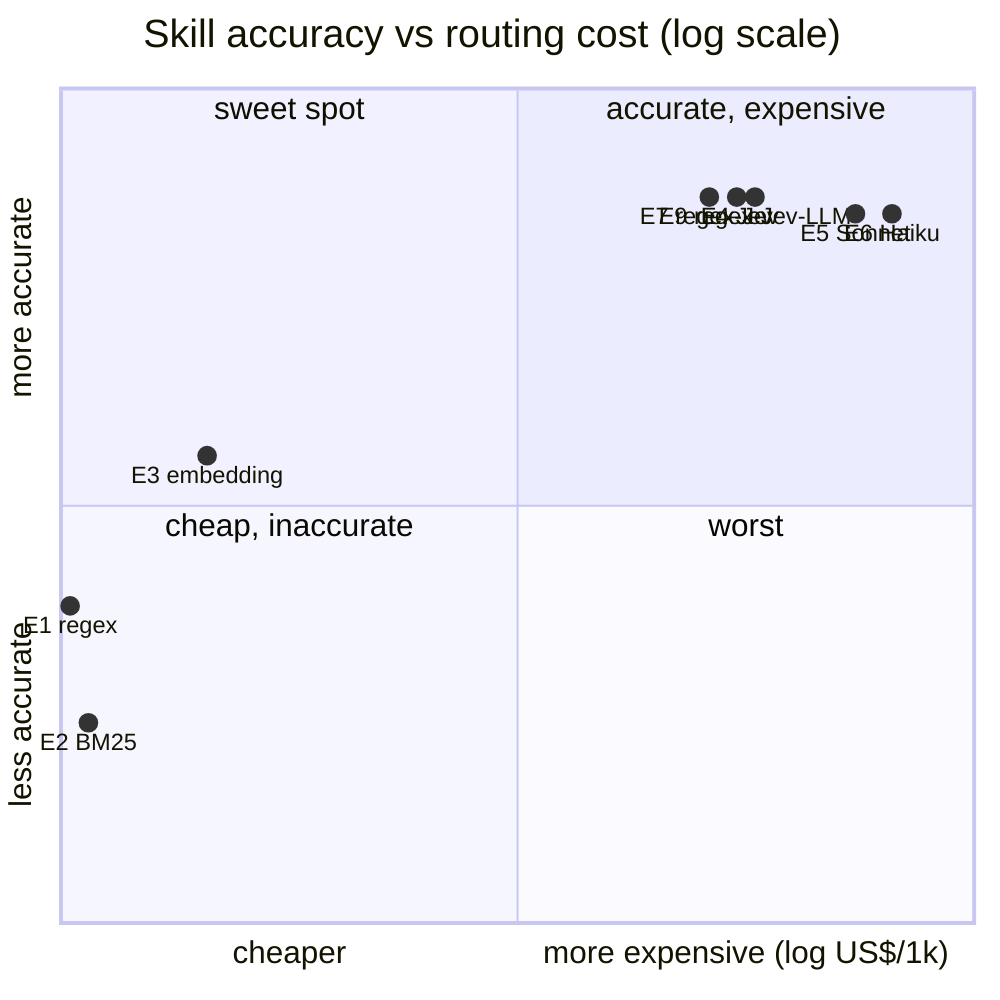

> **SUBSTITUÍDO (2026-10-01).** Este relatório preliminar, só do dev, foi substituído pelo
> estudo pré-registrado no test-v2: [estudos/](../estudos/README.md) (pt-BR) e
> [docs/results/final/](results/final/). Seus números são mantidos apenas como histórico.

# Estudo de roteamento — resultados no split dev

**Data:** 2026-09-29 · **Split:** dev (151 casos, pt-BR) · **Repetições:** 1 ·
**Status:** preliminar (somente dev, dataset ainda não revisado por humanos)

Este documento relata o que as seis estratégias de roteamento e suas cascatas de fato fizeram nos
mesmos 151 casos, quanto custaram e onde cada uma falha. Todo número abaixo pode ser recalculado
a partir dos arquivos brutos em [`docs/results/`](../docs/results) com:

```bash
uv run python scripts/analysis/study_report.py docs/results/shadow-dev-routing-only.jsonl \
  --single docs/results/e6-haiku-dev-routing-only.jsonl
uv run study simulate docs/results/shadow-dev-routing-only.jsonl -c config/experiments/e7_regex_jev.yaml
```

A saída renderizada do primeiro comando está em [`results/study_report.md`](results/study_report.md).

---

## TL;DR

1. **Jev e um LLM de fronteira empatam em acurácia; Jev custa ~5× menos.** Acurácia de skill 84.1 %
   (Jev) vs 83.4 % (Sonnet 5) vs 83.4 % (Haiku 4.5); custo de roteamento US$ 0.43 vs 2.31 vs 3.40 por
   1,000 requisições (ambos os estágios).
2. **A cascata `regex → Jev` (E7) é o melhor ponto de custo/benefício.** Mesma acurácia de skill que
   qualquer LLM (84.1 %), 21.9 % do tráfego resolvido de graça pelo regex, US$ 0.42 / 1k.
   Adicionar um LLM como terceiro passo (E9) resolveu só 4 de 151 casos e aumentou o custo em 46 %
   sem mudar a acurácia.
3. **Roteadores léxicos não são viáveis sozinhos.** Regex (62.3 %) e BM25 (55.6 %) desabam em
   casos de paráfrase e multi-turno. O regex ainda tem valor como **primeiro passo de alta
   precisão**: quando dispara com confiança ≥ 0.9, acerta 91 % das vezes, a 0 ms / US$ 0.
4. **Embeddings densos são a opção semântica mais barata (70.2 %) e o não-LLM mais bem
   calibrado**, mas não conseguem usar o histórico da conversa (26.7 % em multi-turno) e nunca
   se abstêm.
5. **Ninguém se abstém.** O erro dominante de todo roteador baseado em modelo é rotear
   mensagens fora de escopo para o escopo global e, depois, para `escalate_to_human`. Pela
   própria política do estudo (escalar *é* o comportamento de abstenção) isso está correto, e a
   acurácia de skill de Jev / LLM sobe para ~90–91 %. Os rótulos gold são inconsistentes nesse ponto
   e precisam ser corrigidos antes da rodada de teste.
6. **Haiku 4.5 não é mais barato que Sonnet 5 aqui.** Cobrada por chamada via OpenRouter, a
   chamada de skill do Haiku custou em média US$ 0.00109 vs US$ 0.00089 do Sonnet 5, com acurácia igual.
   "Use o modelo pequeno para economizar" não se confirmou para este prompt de roteador.

## 1. Setup

| Item | Valor |
| --- | --- |
| Casos | 151 casos dev: 45 diretos, 38 paráfrases, 30 ambíguos, 15 multi-turno, 15 fora de escopo, 8 adversariais |
| Opções de skill | 3 skills + `__global__` (tools globais) ; abstenção = `__abstain__` |
| Opções de tool | 5 tools da skill carregada + 3 tools globais, `expose_top_k = 2` |
| LLM (shadow) | `anthropic/claude-sonnet-5`, T = 0, structured output com enum, confiança autodeclarada |
| LLM (E6) | `anthropic/claude-haiku-4.5`, mesmo prompt, rodada real separada |
| Jev | `typesafe/jev-router` via OpenRouter, JSON `{choice, confidence}` |
| Embeddings | `qwen/qwen3-embedding-8b`, cosseno máximo sobre os exemplos das opções, softmax T = 0.05 |
| BM25 / híbrido | `rank_bm25` (k1 = 1.5, b = 0.75); RRF k = 60 |
| Regex | [`config/regex_rules.yaml`](../config/regex_rules.yaml), escrito apenas a partir do catálogo |

**Como os dados foram produzidos.** Uma rodada `shadow` da config E9
(`--mode routing-only --routing-mode shadow`): em todo caso, as seis estratégias rodaram em
paralelo no estágio de skill; a cascata E9 decidiu, e então as seis estratégias rodaram de novo no
estágio de tool, sobre as tools da skill que a cascata havia carregado. As cascatas E1–E5 e E7–E9
foram então **reexecutadas offline** com `study simulate`, que alimenta as decisões gravadas no mesmo
código de `RoutingPipeline` usado online, de modo que a simulação não pode divergir da lógica real.
O E6 (Haiku) exige outro LLM, então foi uma rodada real separada.

Gasto total deste estudo: **US$ 0.42** (shadow, todas as estratégias) + **US$ 0.51** (E6) =
**US$ 0.93**.

## 2. Estratégias isoladas

| Estratégia | Acur. skill | Acur. tool (dada a skill certa) | Acur. conjunta¹ | ECE (skill) | Mediana ms / chamada² | US$ / 1k (ambos os estágios) |
| --- | ---: | ---: | ---: | ---: | ---: | ---: |
| regex | 62.3 % | 62.0 % | 42.1 % | 0.218 | ~0 | 0.0000 |
| BM25 | 55.6 % | 69.8 % | 39.0 % | 0.230 | ~0 | 0.0000 |
| embedding | 70.2 % | 86.1 % | 59.6 % | **0.089** | 2,779 | 0.0005 |
| híbrido (RRF) | 58.9 % | 81.0 % | 45.4 % | 0.136 | 2,646 | 0.0004 |
| **Jev** | **84.1 %** | 83.2 % | 69.8 % | 0.131 | 2,506 | **0.43** |
| LLM Sonnet 5 | 83.4 % | 81.3 % | 67.8 % | **0.068** | 5,798 | 2.31 |
| LLM Haiku 4.5 (E6, rodada real) | 83.4 % | 84.9 % | 70.9 % | – | 1,541 | 3.40 |

¹ Conjunta = skill **e** tool corretas. As decisões de tool na rodada shadow existem só para a skill
que a cascata carregou, então a acurácia conjunta de uma estratégia conta como 0 seus casos de skill errada
e pontua a tool nos casos em que a skill dela coincide com a carregada (regex 76, BM25 67, embedding 120,
híbrido 94, Jev 148, LLM 145 de 151). Para roteadores fracos, a coluna condicional de tool é, portanto,
medida num subconjunto menor e mais fácil.

² Chamada do estágio de skill, mediana. No modo shadow, seis estratégias compartilham um processo e um
rate limiter do OpenRouter, então as latências de rede ficam **infladas pela contenção** (o p95 do embedding chegou a
34 s). Trate-as como ordinais. O número do Haiku vem de uma rodada sem contenção; espera-se que Sonnet e
Jev, nas mesmas condições, fiquem proporcionalmente menores.

### Acurácia de skill por categoria

| Estratégia | direto | paráfrase | ambíguo | multi-turno | fora de escopo | adversarial |
| --- | ---: | ---: | ---: | ---: | ---: | ---: |
| regex | 82.2 | 42.1 | 56.7 | 20.0 | **100.0** | 75.0 |
| BM25 | 71.1 | 39.5 | 60.0 | 20.0 | 80.0 | 50.0 |
| embedding | 80.0 | 84.2 | 76.7 | 26.7 | 26.7 | 87.5 |
| híbrido | 73.3 | 55.3 | 73.3 | 20.0 | 20.0 | 87.5 |
| Jev | 93.3 | **86.8** | **90.0** | **86.7** | 26.7 | **100.0** |
| LLM Sonnet 5 | **95.6** | 84.2 | 83.3 | **86.7** | 33.3 | **100.0** |
| LLM Haiku 4.5 | 93.3 | 84.2 | **90.0** | **86.7** | 26.7 | **100.0** |

Lendo a tabela:

- **Paráfrase separa o léxico do semântico.** Regex e BM25 perdem cerca de metade da acurácia
  quando o usuário não usa as palavras do catálogo ("meu pacote sumiu"). Embeddings acompanham
  (84.2 %), no mesmo nível dos LLMs.
- **Multi-turno exige um modelo que leia o histórico.** Regex, BM25, embeddings e híbrido roteiam
  apenas a última mensagem ("e o outro pedido?") e marcam 20–27 %. Jev e os dois LLMs recebem o
  histórico curto e chegam a 86.7 %.
- **Fora de escopo é a única categoria que os roteadores léxicos vencem**, e por um motivo trivial:
  o regex se abstém em 54 de 151 casos (qualquer coisa sem match de padrão), então pega todas as
  mensagens fora de escopo com 31 % de precisão. Isso não é uma habilidade, é um default.
- **Adversarial (n = 8)** é pequeno demais para ranquear qualquer coisa; todos os roteadores baseados em modelo foram robustos
  às tentativas de tool-por-nome e de injeção no conjunto dev.

## 3. Cascatas (replay offline)

| Config | Pipeline de skill → pipeline de tool | Acur. skill | Acur. tool³ | US$ / 1k | Resolvido por (estágio de skill) |
| --- | --- | ---: | ---: | ---: | --- |
| E1 | regex → regex | 62.3 % | 46.9 % | 0.00 | regex 97, abstenções 54 |
| E2 | BM25 → BM25 | 55.6 % | 53.4 % | 0.00 | BM25 115, abstenções 36 |
| E3 | embedding → embedding | 70.2 % | 72.5 % | 0.0005 | embedding 151 |
| E4 | Jev → Jev | 84.1 % | 71.6 % | 0.43 | Jev 151 |
| E5 | LLM → LLM (Sonnet 5) | 83.4 % | 70.5 % | 2.31 | LLM 147, abstenções 4 |
| E6 | LLM → LLM (Haiku 4.5, real) | 83.4 % | 70.9 % | 3.40 | LLM 151 |
| **E7** | **regex(≥0.9) → Jev → Jev** | **84.1 %** | **71.5 %** | **0.42** | regex 33, Jev 118 |
| E8 | regex(≥0.9) → LLM → LLM | 84.1 % | 70.7 % | 2.17 | regex 33, LLM 115, abstenções 3 |
| E9 | regex(≥0.9) → Jev(≥0.75) → LLM → Jev(≥0.7) → LLM | 84.1 % | 70.2 % | 0.62 | regex 33, Jev 114, LLM 4 |

³ Acurácia de tool do `study simulate`: a fração de casos cuja tool final é aceitável, nos casos
em que a skill reexecutada é igual à gravada (n = 103–151). Para E4–E9 isso é, na prática,
acurácia conjunta sobre todos os casos.

### Acurácia × custo



(x = (log10(US$/1k + 10⁻⁴) + 4) / 5, com E1/E2 e E4/E7 levemente afastados para que os rótulos não se sobreponham; y = (acurácia de skill − 45 %) / 45 %.)

**Fronteira de Pareto (acurácia de skill vs custo):** E1/E2 (grátis) → E3 (US$ 0.0005) → **E7
(US$ 0.42, 84.1 %)**. E4, E5, E6, E8 e E9 são todos dominados pelo E7: nenhum é mais preciso, todos
custam o mesmo ou mais.

### O que cada passo da cascata compra

- **Regex como passo 1 é precisão de graça.** Disparou com confiança ≥ 0.9 em 33 casos (21.9 %)
  e acertou 30 (91 %) — mais ou menos a precisão do próprio Jev, a custo e latência zero. Seus
  buckets de calibração confirmam o limiar: acurácia de 0.91 em ≥ 0.9, 0.44 abaixo de 0.5.
- **Jev como passo 2 absorve quase tudo.** Com `min_confidence = 0.75`, o Jev aceitou 114 dos
  118 casos restantes; sua confiança autodeclarada é ≥ 0.9 em 130 de 151 casos.
- **O LLM como passo 3 fica quase ocioso.** Decidiu 4 casos de skill e não mudou a acurácia;
  no estágio de tool, o Jev (≥ 0.7) resolveu 137 casos e o LLM 10. Só essas 14 chamadas ao LLM
  aumentaram o custo de roteamento do E9 em 46 % sobre o E7.
  **A confiança do Jev é comprimida demais perto de 1.0 para servir de gate útil** (a acurácia é 0.85 em
  ≥ 0.9 e 0.81 em 0.75–0.9): subir o limiar mandaria mais tráfego para o LLM
  sem selecionar os casos que o Jev de fato erra.
- **Jev e o LLM concordam em 145 de 151 decisões de skill** e erram juntos os mesmos 22
  casos (10 fora de escopo, 5 paráfrases, 3 ambíguos, 2 multi-turno, 2 diretos). Um fallback
  entre dois modelos que falham juntos não consegue recuperar muito — isso explica E9 ≈ E7.

## 4. Calibração

| Estratégia | ECE | Acurácia por bucket de confiança |
| --- | ---: | --- |
| LLM Sonnet 5 | 0.068 | ≥ 0.9: **0.99** (n 76) · 0.75–0.9: 0.84 (38) · 0.5–0.75: 0.62 (26) · < 0.5: 0.27 (11) |
| embedding | 0.089 | ≥ 0.9: 0.92 (24) · 0.75–0.9: 0.85 (33) · 0.5–0.75: 0.69 (58) · < 0.5: 0.44 (36) |
| Jev | 0.131 | ≥ 0.9: 0.85 (130) · 0.75–0.9: 0.81 (16) · 0.5–0.75: 0.75 (4) · < 0.5: 1.00 (1) |
| regex | 0.218 | ≥ 0.9: 0.91 (33) · 0.75–0.9: 0.89 (19) · 0.5–0.75: 0.71 (14) · < 0.5: 0.44 (85) |

A confiança autodeclarada do LLM é o **gate mais útil** deste estudo, ao contrário da
expectativa do plano ("autodeclarada, mal calibrada"): em ≥ 0.9 ele acertou 75 de 76 vezes.
Isso torna uma cascata *invertida* digna de teste — LLM primeiro com limiar alto não faz sentido
em custo, mas **Jev → LLM só quando o Jev e uma segunda opinião barata discordam** (ex.: Jev vs
embedding) é um uso melhor do LLM do que um limiar de confiança sobre o Jev.

## 5. Análise de erros

Erros mais frequentes por estratégia (estágio de skill, salvo indicação):

| Estratégia | Principais erros (contagem) |
| --- | --- |
| regex | pedidos → abstain (15) · trocas → pedidos (10) · pagamentos → abstain (7) · trocas → abstain (7) |
| BM25 | trocas → pedidos (10) · pedidos → abstain (8) · pagamentos → global (8) · trocas → global (6) |
| embedding | trocas → global (7) · pagamentos → trocas (7) · abstain → global (6) · pedidos → global (6) |
| híbrido | pagamentos → global (11) · trocas → pedidos (11) · trocas → global (7) · abstain → global (7) |
| Jev | abstain → global (10) · pagamentos → trocas (7) · tool: `get_order_status ⇄ track_shipment` (2 + 2) |
| LLM Sonnet 5 | abstain → global (9) · pagamentos → trocas (5) · pedidos/trocas → abstain (2) |

Padrões:

1. **`abstain → global` é um problema de política de rotulagem, não uma falha de roteamento.** Em 14 de 15
   casos fora de escopo, o estágio de tool terminou em `escalate_to_human` (13 via escopo global, 1
   após uma abstenção no estágio de skill); só 1 foi para uma skill de negócio. O próprio scorer do estudo
   trata escalar como abstenção (política D4), e 4 dos 15 rótulos gold já aceitam
   `__global__`/`escalate_to_human` — os outros 11 não.
   Contando "global + escalate" como abstenção correta:

   | | Jev | LLM Sonnet 5 | LLM Haiku 4.5 | cascata E9 | embedding |
   | --- | ---: | ---: | ---: | ---: | ---: |
   | Acur. skill (ajustada à política) | **90.7 %** | 89.4 % | **90.7 %** | **90.7 %** | 72.2 % |

2. **`pagamentos → trocas` é a sobreposição reembolso/devolução, por design** ("quero meu dinheiro de
   volta do produto com defeito"). É o único par confundível que sobrevive nos melhores
   roteadores (7 no Jev, 5 no LLM). Todos os 7 casos do Jev têm rótulo único no gold (4 deles
   paráfrases), então alguns podem merecer uma segunda skill aceitável após a revisão humana.
3. **Embeddings e híbrido derivam para `__global__`.** Os exemplos da opção global
   (`search_help_center`, `get_customer_profile`) são genéricos e ficam perto de tudo no
   espaço vetorial — o "distrator permanente" do plano, confirmado.
4. **Estágio de tool: `get_order_status ⇄ track_shipment`** é a confusão residual dentro da mesma skill para
   Jev e o LLM. Com `expose_top_k = 2` o executor ainda vê as duas tools, então esse erro
   provavelmente é inofensivo de ponta a ponta.
5. **Jev é um meta-roteador, não um único modelo.** Em 302 chamadas, o OpenRouter serviu
   `openai/gpt-6-luna` (206), `deepseek/deepseek-v4.1-flash` (85), `google/gemini-3.8-flash` (7),
   `openai/gpt-6.1-sol` (2) e `z-ai/glm-5.3-flash` (2). Zero falhas de parse. A variância de custo e
   latência vem dessa mistura; o modelo servido é gravado em todo trace.

## 6. Smoke end-to-end (preliminar)

Existem duas pequenas rodadas e2e com o executor (`anthropic/claude-sonnet-5`) preenchendo argumentos e
respondendo via tools MCP. São **pequenas demais para concluir qualquer coisa** (n = 5 e 10) e
são relatadas apenas por completude:

| Rodada | n | Skill | Tool | Args válidos | Sucesso E2E | Fundamentado | US$ / turno | p50 turno |
| --- | ---: | ---: | ---: | ---: | ---: | ---: | ---: | ---: |
| E0 nativo (agente chama `load_skill`) | 5 | 80 % | 60 % | 80 % | 60 % | 100 % | 0.0176 | 9.7 s |
| E9 regex → Jev → LLM | 10 | 90 % | 70 % | 80 % | 60 % | 100 % | 0.0051 | 22.6 s |

O único sinal direcional: o turno do agente roteado foi **~3.5× mais barato** que o nativo
(o executor vê 2 tools + globais em vez do catálogo inteiro e pula o round-trip de `load_skill`),
ao preço de uma latência maior pelas chamadas sequenciais ao roteador.

## 7. Recomendações

| Cenário | Recomendação | Por quê |
| --- | --- | --- |
| Roteador padrão de produção | **E7: regex (≥ 0.9) → Jev**, nos dois estágios | Acurácia máxima, ~5× mais barato que qualquer roteador LLM, 22 % do tráfego de graça |
| Nenhum modelo de decisão externo permitido | **regex (≥ 0.9) → LLM**, preferir Sonnet 5 a Haiku 4.5 | Mesma acurácia; Sonnet 5 foi mais barato por chamada e mais bem calibrado |
| Orçamento de API zero / offline | **embedding** (não BM25, não híbrido) | 70 % de skill, melhor calibração entre não-LLMs; falha em multi-turno — adicione o turno anterior do usuário à query |
| Precisa de um gate de confiança | Use a confiança do **LLM**, não a do Jev | ECE 0.068, 99 % de acurácia em ≥ 0.9; a confiança do Jev é comprimida perto de 1 |
| Tratamento de fora de escopo | Rotear para global + `escalate_to_human`, e rotular assim | Todo modelo já faz isso; corrigir os rótulos, não os roteadores |

O que **não** fazer, com base nestes dados: adicionar o LLM como terceiro passo da cascata atrás do Jev (E9) —
pagou 46 % a mais sem ganho de acurácia; usar BM25 ou híbrido RRF como roteador primário; supor que o
LLM "pequeno" é o barato sem medir o custo cobrado.

## 8. Ameaças à validade

- **Só o split dev, n = 151, uma repetição.** Diferenças de ±1 pp entre Jev, Sonnet e
  Haiku são ruído (um caso = 0.66 pp). O ranking léxico < embedding < {Jev, LLM} é robusto;
  a ordem dentro de {Jev, LLM} não é.
- **Dataset não revisado por humanos.** 396 de 500 casos são sintéticos; a política de rótulo de fora de escopo
  é comprovadamente inconsistente (§5.1).
- **O regex foi ajustado no dev.** Sua acurácia no dev é um limite superior para o split de teste.
- **Comparabilidade do estágio de tool.** As decisões de tool foram gravadas só para a skill que a cascata E9
  carregou; os números de tool/conjunta das estratégias isoladas para roteadores fracos usam subconjuntos (§2, nota 1).
- **Latência sob contenção.** O modo shadow roda seis roteadores concorrentemente; as latências absolutas
  estão infladas (§2, nota 2).
- **Jev é um alvo móvel.** Early access, meta-roteado entre cinco modelos; sua acurácia e
  custo podem mudar sem bump de versão.
- **Catálogo pequeno.** 18 tools cabem com folga no contexto de qualquer LLM, e é exatamente por isso que o agente
  nativo continua sendo um baseline forte; é preciso um catálogo escalado para mostrar onde ele quebra.

## 9. Próximos passos

1. Corrigir a política de rótulo de fora de escopo (aceitar `__global__` + `escalate_to_human` em todo lugar, ou
   em lugar nenhum) e terminar a revisão humana em [`data/README.md`](../data/README.md).
2. Rodar E0 e E7 end-to-end no **split de teste** (349 casos) com 3 repetições.
3. Adicionar uma cascata com gate por discordância (Jev ≠ embedding → LLM) e uma query de embedding que considere o histórico.
4. Medir a latência de novo com uma estratégia por processo.
5. Escalar o catálogo (skills/tools sintéticas) para descobrir onde o agente nativo começa a perder.

## Dados brutos

| Arquivo | Conteúdo |
| --- | --- |
| [`results/shadow-dev-routing-only.jsonl`](../docs/results/shadow-dev-routing-only.jsonl) | 151 turnos, a decisão de cada estratégia nos dois estágios, custos, latências, trace ids |
| [`results/e6-haiku-dev-routing-only.jsonl`](../docs/results/e6-haiku-dev-routing-only.jsonl) | 151 turnos, rodada real do E6 Haiku 4.5 |
| [`results/e0_native-dev-e2e-20260929-212610.jsonl`](../docs/results/e0_native-dev-e2e-20260929-212610.jsonl) | Smoke e2e do E0 (5 turnos) |
| [`results/e9_regex_jev_llm-dev-e2e-20260929-212632.jsonl`](../docs/results/e9_regex_jev_llm-dev-e2e-20260929-212632.jsonl) | Smoke e2e do E9 (10 turnos) |
| [`results/study_report.md`](results/study_report.md) | Saída de `scripts/analysis/study_report.py` |
