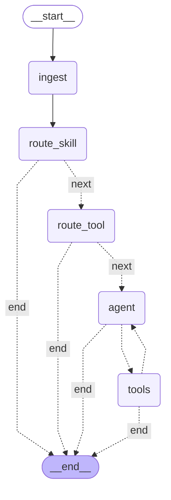

# Host graph

Generated by `uv run study graph`. Routing-only runs compile the same graph with `interrupt_before=["agent"]`; E0 (native) passes through `route_skill` and `route_tool`.

```mermaid
---
config:
  flowchart:
    curve: linear
---
graph TD;
	__start__([<p>__start__</p>]):::first
	ingest(ingest)
	route_skill(route_skill)
	route_tool(route_tool)
	agent(agent)
	tools(tools)
	__end__([<p>__end__</p>]):::last
	__start__ --> ingest;
	agent -. &nbsp;end&nbsp; .-> __end__;
	agent -.-> tools;
	ingest --> route_skill;
	route_skill -. &nbsp;end&nbsp; .-> __end__;
	route_skill -. &nbsp;next&nbsp; .-> route_tool;
	route_tool -. &nbsp;end&nbsp; .-> __end__;
	route_tool -. &nbsp;next&nbsp; .-> agent;
	tools -. &nbsp;end&nbsp; .-> __end__;
	tools -.-> agent;
	classDef default fill:#f2f0ff,line-height:1.2
	classDef first fill-opacity:0
	classDef last fill:#bfb6fc
```
