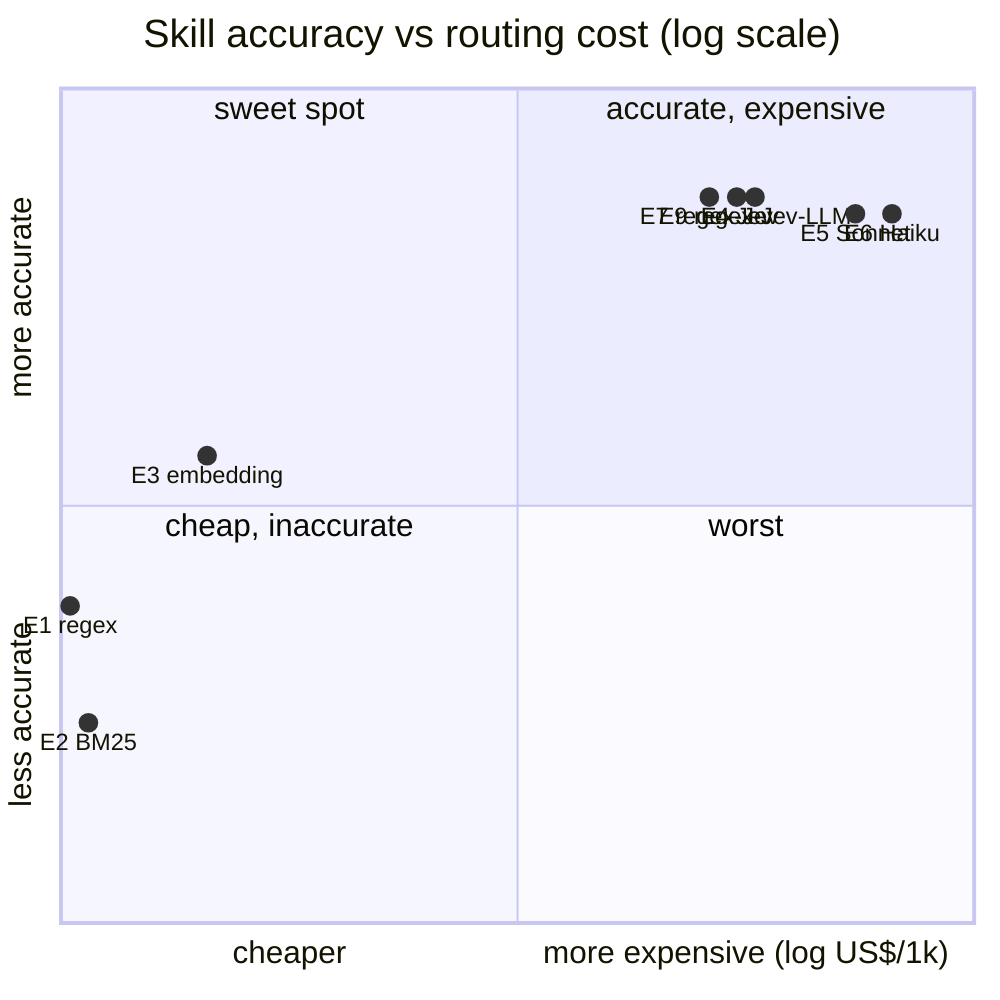

# Routing study — results on the dev split

**Date:** 2026-09-29 · **Split:** dev (151 cases, pt-BR) · **Repetitions:** 1 ·
**Status:** preliminary (dev only, dataset not yet human-reviewed)

This document reports what the six routing strategies and their cascades actually did on the
same 151 cases, what it cost, and where each one fails. Every number below can be recomputed
from the raw files in [`docs/results/`](results) with:

```bash
uv run python scripts/analysis/study_report.py docs/results/shadow-dev-routing-only.jsonl \
  --single docs/results/e6-haiku-dev-routing-only.jsonl
uv run study simulate docs/results/shadow-dev-routing-only.jsonl -c config/experiments/e7_regex_jev.yaml
```

The rendered output of the first command is in [`results/study_report.md`](results/study_report.md).

---

## TL;DR

1. **Jev and a frontier LLM tie on accuracy; Jev costs ~5× less.** Skill accuracy 84.1 %
   (Jev) vs 83.4 % (Sonnet 5) vs 83.4 % (Haiku 4.5); routing cost US$ 0.43 vs 2.31 vs 3.40 per
   1,000 requests (both stages).
2. **The cascade `regex → Jev` (E7) is the best cost/benefit point.** Same skill accuracy as
   any LLM (84.1 %), 21.9 % of the traffic resolved for free by regex, US$ 0.42 / 1k.
   Adding an LLM as a third step (E9) resolved only 4 of 151 cases and raised cost 46 %
   without changing accuracy.
3. **Lexical routers are not viable alone.** Regex (62.3 %) and BM25 (55.6 %) collapse on
   paraphrase and multi-turn cases. Regex is still valuable as a **high-precision first
   step**: when it fires with confidence ≥ 0.9 it is right 91 % of the time at 0 ms / US$ 0.
4. **Dense embeddings are the cheapest semantic option (70.2 %) and the best-calibrated
   non-LLM**, but they cannot use conversation history (26.7 % on multi-turn) and never
   abstain.
5. **Nobody abstains.** The dominant error of every model-based router is routing
   out-of-scope messages to the global scope, and then to `escalate_to_human`. Under the
   study's own policy (escalation *is* the abstention behaviour) this is correct, and skill
   accuracy of Jev / LLM rises to ~90–91 %. The gold labels are inconsistent on this point
   and must be fixed before the test run.
6. **Haiku 4.5 is not cheaper than Sonnet 5 here.** Billed per call through OpenRouter, the
   Haiku skill call averaged US$ 0.00109 vs US$ 0.00089 for Sonnet 5, with equal accuracy.
   "Use the small model to save money" did not hold for this router prompt.

## 1. Setup

| Item | Value |
| --- | --- |
| Cases | 151 dev cases: 45 direct, 38 paraphrase, 30 ambiguous, 15 multi-turn, 15 out-of-scope, 8 adversarial |
| Skill options | 3 skills + `__global__` (global tools) ; abstention = `__abstain__` |
| Tool options | 5 tools of the loaded skill + 3 global tools, `expose_top_k = 2` |
| LLM (shadow) | `anthropic/claude-sonnet-5`, T = 0, enum structured output, self-reported confidence |
| LLM (E6) | `anthropic/claude-haiku-4.5`, same prompt, separate real run |
| Jev | `typesafe/jev-router` via OpenRouter, JSON `{choice, confidence}` |
| Embeddings | `qwen/qwen3-embedding-8b`, max cosine over option examples, softmax T = 0.05 |
| BM25 / hybrid | `rank_bm25` (k1 = 1.5, b = 0.75); RRF k = 60 |
| Regex | [`config/regex_rules.yaml`](../config/regex_rules.yaml), written from the catalog only |

**How the data was produced.** One `shadow` run of the E9 config
(`--mode routing-only --routing-mode shadow`): in every case all six strategies ran in
parallel at the skill stage; the E9 cascade decided, and all six strategies then ran again at
the tool stage over the tools of the skill the cascade had loaded. Cascades E1–E5 and E7–E9 were
then **replayed offline** with `study simulate`, which feeds the recorded decisions to the same
`RoutingPipeline` code used online, so the simulation cannot drift from the real logic.
E6 (Haiku) needs a different LLM, so it was a separate real run.

Total spend for this study: **US$ 0.42** (shadow, all strategies) + **US$ 0.51** (E6) =
**US$ 0.93**.

## 2. Isolated strategies

| Strategy | Skill acc. | Tool acc. (given right skill) | Joint acc.¹ | ECE (skill) | Median ms / call² | US$ / 1k (both stages) |
| --- | ---: | ---: | ---: | ---: | ---: | ---: |
| regex | 62.3 % | 62.0 % | 42.1 % | 0.218 | ~0 | 0.0000 |
| BM25 | 55.6 % | 69.8 % | 39.0 % | 0.230 | ~0 | 0.0000 |
| embedding | 70.2 % | 86.1 % | 59.6 % | **0.089** | 2,779 | 0.0005 |
| hybrid (RRF) | 58.9 % | 81.0 % | 45.4 % | 0.136 | 2,646 | 0.0004 |
| **Jev** | **84.1 %** | 83.2 % | 69.8 % | 0.131 | 2,506 | **0.43** |
| LLM Sonnet 5 | 83.4 % | 81.3 % | 67.8 % | **0.068** | 5,798 | 2.31 |
| LLM Haiku 4.5 (E6, real run) | 83.4 % | 84.9 % | 70.9 % | – | 1,541 | 3.40 |

¹ Joint = skill **and** tool correct. Tool decisions in the shadow run exist only for the skill
the cascade loaded, so a strategy's joint accuracy counts its wrong-skill cases as 0 and scores
the tool on the cases where its skill equals the loaded one (regex 76, BM25 67, embedding 120,
hybrid 94, Jev 148, LLM 145 of 151). For weak routers the conditional tool column is therefore
measured on a smaller, easier subset.

² Skill-stage call, median. In shadow mode six strategies share one process and one OpenRouter
rate limiter, so network latencies are **inflated by contention** (the embedding p95 reached
34 s). Treat them as ordinal. The Haiku number comes from a run without contention; Sonnet and
Jev under the same conditions are expected to be proportionally lower.

### Skill accuracy by category

| Strategy | direct | paraphrase | ambiguous | multi-turn | out-of-scope | adversarial |
| --- | ---: | ---: | ---: | ---: | ---: | ---: |
| regex | 82.2 | 42.1 | 56.7 | 20.0 | **100.0** | 75.0 |
| BM25 | 71.1 | 39.5 | 60.0 | 20.0 | 80.0 | 50.0 |
| embedding | 80.0 | 84.2 | 76.7 | 26.7 | 26.7 | 87.5 |
| hybrid | 73.3 | 55.3 | 73.3 | 20.0 | 20.0 | 87.5 |
| Jev | 93.3 | **86.8** | **90.0** | **86.7** | 26.7 | **100.0** |
| LLM Sonnet 5 | **95.6** | 84.2 | 83.3 | **86.7** | 33.3 | **100.0** |
| LLM Haiku 4.5 | 93.3 | 84.2 | **90.0** | **86.7** | 26.7 | **100.0** |

Reading the table:

- **Paraphrase separates lexical from semantic.** Regex and BM25 lose about half their accuracy
  when the user does not use the catalog's words ("meu pacote sumiu"). Embeddings keep up
  (84.2 %), on par with the LLMs.
- **Multi-turn needs a model that reads history.** Regex, BM25, embeddings and hybrid route the
  last message only ("e o outro pedido?"), and score 20–27 %. Jev and both LLMs receive the
  short history and reach 86.7 %.
- **Out-of-scope is the only category the lexical routers win**, and for a trivial reason:
  regex abstains on 54 of 151 cases (anything without a pattern match), so it catches all
  out-of-scope messages with 31 % precision. That is not a skill, it is a default.
- **Adversarial (n = 8)** is too small to rank anything; all model-based routers were robust to
  the tool-by-name and injection attempts in the dev set.

## 3. Cascades (offline replay)

| Config | Skill pipeline → tool pipeline | Skill acc. | Tool acc.³ | US$ / 1k | Resolved by (skill stage) |
| --- | --- | ---: | ---: | ---: | --- |
| E1 | regex → regex | 62.3 % | 46.9 % | 0.00 | regex 97, abstained 54 |
| E2 | BM25 → BM25 | 55.6 % | 53.4 % | 0.00 | BM25 115, abstained 36 |
| E3 | embedding → embedding | 70.2 % | 72.5 % | 0.0005 | embedding 151 |
| E4 | Jev → Jev | 84.1 % | 71.6 % | 0.43 | Jev 151 |
| E5 | LLM → LLM (Sonnet 5) | 83.4 % | 70.5 % | 2.31 | LLM 147, abstained 4 |
| E6 | LLM → LLM (Haiku 4.5, real) | 83.4 % | 70.9 % | 3.40 | LLM 151 |
| **E7** | **regex(≥0.9) → Jev → Jev** | **84.1 %** | **71.5 %** | **0.42** | regex 33, Jev 118 |
| E8 | regex(≥0.9) → LLM → LLM | 84.1 % | 70.7 % | 2.17 | regex 33, LLM 115, abstained 3 |
| E9 | regex(≥0.9) → Jev(≥0.75) → LLM → Jev(≥0.7) → LLM | 84.1 % | 70.2 % | 0.62 | regex 33, Jev 114, LLM 4 |

³ `study simulate` tool accuracy: the share of cases whose final tool is acceptable, on the cases
where the replayed skill equals the one recorded (n = 103–151). For E4–E9 this is effectively
joint accuracy over all cases.

### Accuracy × cost



(x = (log10(US$/1k + 10⁻⁴) + 4) / 5, with E1/E2 and E4/E7 nudged apart so the labels do not overlap; y = (skill accuracy − 45 %) / 45 %.)

**Pareto frontier (skill accuracy vs cost):** E1/E2 (free) → E3 (US$ 0.0005) → **E7
(US$ 0.42, 84.1 %)**. E4, E5, E6, E8 and E9 are all dominated by E7: none is more accurate, all
cost the same or more.

### What each cascade step buys

- **Regex as step 1 is free precision.** It fired with confidence ≥ 0.9 on 33 cases (21.9 %)
  and was right on 30 (91 %) — about Jev's own precision, at zero cost and latency. Its
  calibration buckets confirm the threshold: 0.91 accuracy at ≥ 0.9, 0.44 below 0.5.
- **Jev as step 2 absorbs almost everything.** At `min_confidence = 0.75` Jev accepted 114 of
  the remaining 118 cases; its self-reported confidence is ≥ 0.9 on 130 of 151 cases.
- **The LLM as step 3 is nearly idle.** It decided 4 skill cases and did not change accuracy;
  at the tool stage Jev (≥ 0.7) resolved 137 cases and the LLM 10. Those 14 LLM calls alone
  raised E9's routing cost 46 % over E7.
  **Jev's confidence is too compressed near 1.0 to be a useful gate** (accuracy is 0.85 at
  ≥ 0.9 and 0.81 at 0.75–0.9): raising the threshold would send more traffic to the LLM
  without selecting the cases Jev actually gets wrong.
- **Jev and the LLM agree on 145 of 151 skill decisions** and are both wrong on the same 22
  cases (10 out-of-scope, 5 paraphrase, 3 ambiguous, 2 multi-turn, 2 direct). A fallback
  between two models that fail together cannot recover much — this explains E9 ≈ E7.

## 4. Calibration

| Strategy | ECE | Accuracy by confidence bucket |
| --- | ---: | --- |
| LLM Sonnet 5 | 0.068 | ≥ 0.9: **0.99** (n 76) · 0.75–0.9: 0.84 (38) · 0.5–0.75: 0.62 (26) · < 0.5: 0.27 (11) |
| embedding | 0.089 | ≥ 0.9: 0.92 (24) · 0.75–0.9: 0.85 (33) · 0.5–0.75: 0.69 (58) · < 0.5: 0.44 (36) |
| Jev | 0.131 | ≥ 0.9: 0.85 (130) · 0.75–0.9: 0.81 (16) · 0.5–0.75: 0.75 (4) · < 0.5: 1.00 (1) |
| regex | 0.218 | ≥ 0.9: 0.91 (33) · 0.75–0.9: 0.89 (19) · 0.5–0.75: 0.71 (14) · < 0.5: 0.44 (85) |

The LLM's self-reported confidence is the **most useful gate** in this study, contrary to the
plan's expectation ("self-reported, poorly calibrated"): at ≥ 0.9 it was right 75 of 76 times.
That makes a *reversed* cascade worth testing — LLM first with a high threshold is pointless
cost-wise, but **Jev → LLM only when Jev and a cheap second opinion disagree** (e.g. Jev vs
embedding) is a better use of the LLM than a confidence threshold on Jev.

## 5. Error analysis

Most frequent errors per strategy (skill stage unless marked):

| Strategy | Top errors (count) |
| --- | --- |
| regex | pedidos → abstain (15) · trocas → pedidos (10) · pagamentos → abstain (7) · trocas → abstain (7) |
| BM25 | trocas → pedidos (10) · pedidos → abstain (8) · pagamentos → global (8) · trocas → global (6) |
| embedding | trocas → global (7) · pagamentos → trocas (7) · abstain → global (6) · pedidos → global (6) |
| hybrid | pagamentos → global (11) · trocas → pedidos (11) · trocas → global (7) · abstain → global (7) |
| Jev | abstain → global (10) · pagamentos → trocas (7) · tool: `get_order_status ⇄ track_shipment` (2 + 2) |
| LLM Sonnet 5 | abstain → global (9) · pagamentos → trocas (5) · pedidos/trocas → abstain (2) |

Patterns:

1. **`abstain → global` is a labelling-policy issue, not a routing failure.** In 14 of 15
   out-of-scope cases the tool stage ended in `escalate_to_human` (13 via the global scope, 1
   after a skill-stage abstention); only 1 went to a business skill. The study's own scorer
   treats escalation as abstention (policy D4), and 4 of the 15 gold labels already accept
   `__global__`/`escalate_to_human` — the other 11 do not.
   Counting "global + escalate" as a correct abstention:

   | | Jev | LLM Sonnet 5 | LLM Haiku 4.5 | E9 cascade | embedding |
   | --- | ---: | ---: | ---: | ---: | ---: |
   | Skill acc. (policy-adjusted) | **90.7 %** | 89.4 % | **90.7 %** | **90.7 %** | 72.2 % |

2. **`pagamentos → trocas` is the refund/return overlap by design** ("quero meu dinheiro de
   volta do produto com defeito"). It is the one confusable pair that survives in the best
   routers (7 for Jev, 5 for the LLM). All 7 Jev cases are single-label in the gold (4 of them
   paraphrases), so some may deserve a second acceptable skill after human review.
3. **Embeddings and hybrid drift to `__global__`.** The global option's examples
   (`search_help_center`, `get_customer_profile`) are generic and sit close to everything in
   vector space — the "permanent distractor" of the plan, confirmed.
4. **Tool stage: `get_order_status ⇄ track_shipment`** is the residual same-skill confusion for
   Jev and the LLM. With `expose_top_k = 2` the executor still sees both tools, so this error is
   likely harmless end-to-end.
5. **Jev is a meta-router, not one model.** Over 302 calls OpenRouter served
   `openai/gpt-6-luna` (206), `deepseek/deepseek-v4.1-flash` (85), `google/gemini-3.8-flash` (7),
   `openai/gpt-6.1-sol` (2) and `z-ai/glm-5.3-flash` (2). Zero parse failures. Its cost and
   latency variance come from this mix; the served model is recorded in every trace.

## 6. End-to-end smoke (preliminary)

Two small e2e runs exist with the executor (`anthropic/claude-sonnet-5`) filling arguments and
answering through the MCP tools. They are **too small to conclude anything** (n = 5 and 10) and
are reported only for completeness:

| Run | n | Skill | Tool | Args valid | E2E success | Grounded | US$ / turn | p50 turn |
| --- | ---: | ---: | ---: | ---: | ---: | ---: | ---: | ---: |
| E0 native (agent calls `load_skill`) | 5 | 80 % | 60 % | 80 % | 60 % | 100 % | 0.0176 | 9.7 s |
| E9 regex → Jev → LLM | 10 | 90 % | 70 % | 80 % | 60 % | 100 % | 0.0051 | 22.6 s |

The one directional signal: the routed agent turn was **~3.5× cheaper** than the native one
(the executor sees 2 tools + globals instead of the whole catalog and skips the `load_skill`
round-trip), at the price of higher latency from the sequential router calls.

## 7. Recommendations

| Scenario | Recommendation | Why |
| --- | --- | --- |
| Default production router | **E7: regex (≥ 0.9) → Jev**, both stages | Top accuracy, ~5× cheaper than any LLM router, 22 % of traffic free |
| No external decision model allowed | **regex (≥ 0.9) → LLM**, prefer Sonnet 5 over Haiku 4.5 | Same accuracy; Sonnet 5 was cheaper per call and better calibrated |
| Zero API budget / offline | **embedding** (not BM25, not hybrid) | 70 % skill, best non-LLM calibration; fails multi-turn — add the previous user turn to the query |
| Need a confidence gate | Use the **LLM's** confidence, not Jev's | ECE 0.068, 99 % accuracy at ≥ 0.9; Jev's confidence is compressed near 1 |
| Out-of-scope handling | Route to global + `escalate_to_human`, and label it that way | Every model already does this; fixing labels, not routers |

What **not** to do, based on this data: add the LLM as a third cascade step behind Jev (E9) —
it paid 46 % more for no accuracy gain; use BM25 or RRF hybrid as a primary router; assume the
"small" LLM is the cheap one without measuring billed cost.

## 8. Threats to validity

- **Dev split only, n = 151, one repetition.** Differences of ±1 pp between Jev, Sonnet and
  Haiku are noise (one case = 0.66 pp). The ranking lexical < embedding < {Jev, LLM} is robust;
  the order inside {Jev, LLM} is not.
- **Dataset not human-reviewed.** 396 of 500 cases are synthetic; the out-of-scope label policy
  is demonstrably inconsistent (§5.1).
- **Regex was tuned on dev.** Its dev accuracy is an upper bound for the test split.
- **Tool-stage comparability.** Tool decisions were recorded only for the skill the E9 cascade
  loaded; isolated-strategy tool/joint numbers for weak routers use subsets (§2, note 1).
- **Latency under contention.** Shadow mode runs six routers concurrently; absolute latencies
  are inflated (§2, note 2).
- **Jev is a moving target.** Early access, meta-routed across five models; its accuracy and
  cost may change without a version bump.
- **Small catalog.** 18 tools fit easily in any LLM's context, which is exactly why the native
  agent remains a strong baseline; a scaled catalog is needed to show where it breaks.

## 9. Next steps

1. Fix the out-of-scope label policy (accept `__global__` + `escalate_to_human` everywhere, or
   nowhere) and finish the human review in [`data/README.md`](../data/README.md).
2. Run E0 and E7 end-to-end on the **test split** (349 cases) with 3 repetitions.
3. Add a disagreement-gated cascade (Jev ≠ embedding → LLM) and a history-aware embedding query.
4. Re-measure latency with one strategy per process.
5. Scale the catalog (synthetic skills/tools) to find where the native agent starts losing.

## Raw data

| File | Content |
| --- | --- |
| [`results/shadow-dev-routing-only.jsonl`](results/shadow-dev-routing-only.jsonl) | 151 turns, every strategy's decision at both stages, costs, latencies, trace ids |
| [`results/e6-haiku-dev-routing-only.jsonl`](results/e6-haiku-dev-routing-only.jsonl) | 151 turns, E6 Haiku 4.5 real run |
| [`results/e0_native-dev-e2e-20260929-212610.jsonl`](results/e0_native-dev-e2e-20260929-212610.jsonl) | E0 e2e smoke (5 turns) |
| [`results/e9_regex_jev_llm-dev-e2e-20260929-212632.jsonl`](results/e9_regex_jev_llm-dev-e2e-20260929-212632.jsonl) | E9 e2e smoke (10 turns) |
| [`results/study_report.md`](results/study_report.md) | Output of `scripts/analysis/study_report.py` |
