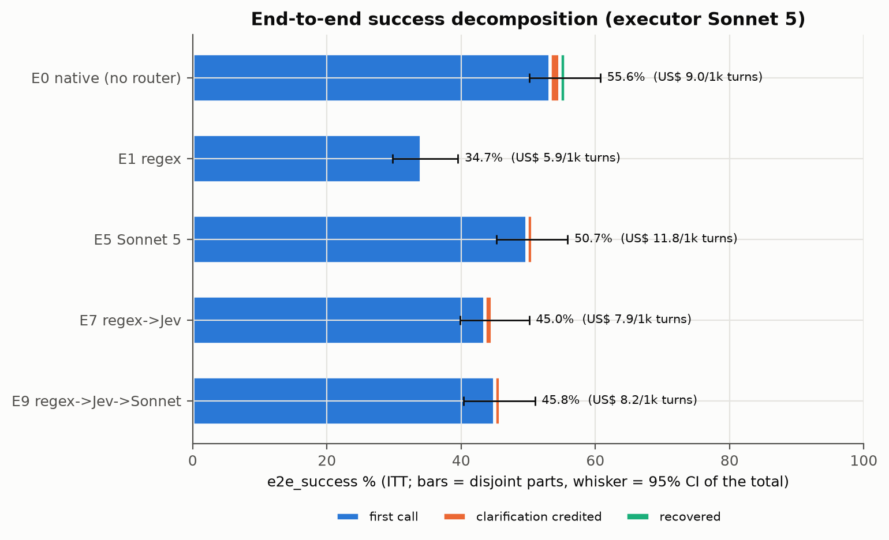

# 01 · Resumo executivo

> Todos os números vêm de `docs/results/final/` (gerados por `scripts/analysis/final_all.py`)
> sobre o split confirmatório **test-v2** (349 casos, pt-BR, pré-registro `prereg-v1`).
> Intervalos: IC 95% por bootstrap pareado por caso (10 mil reamostragens, seed 20260930).
> **[C]** = confirmatório (pré-registrado); **[E]** = estimativa; **[X]** = exploratório (post hoc).
> A seção "Fase 2" usa as tabelas de [`docs/results/addendum-a/`](../docs/results/addendum-a/)
> (Parte A, `prereg-v2a`) e [`docs/results/phase2-b/`](../docs/results/phase2-b/) (Parte B,
> `prereg-v2`, split test-L com 300 casos e catálogo de 62 tools).

## Fase 2: a resposta final, "quando vale ter roteador?"

**Com 18 tools, o nativo ganhava; com 62 tools, não houve diferença detectável de ponta a ponta
entre roteado e nativo, e o roteador custa mais quando o cache de prompt funciona.** No catálogo grande, a cascata E9-L
(regex → Jev → Sonnet) resolveu 57,0% dos turnos e o agente nativo 57,3%: Δ **−0,3 pp
[−4,0; 3,3]**, Holm p 1, o IC inclui 0, sem afirmação direcional **[C, H1-L]**; equivalência não testada
(S2 inconclusivo); tudo com o scorer simétrico que
pontua os dois braços pelo comportamento. O custo por turno do roteado foi **1,101× [1,014;
1,196]** o do nativo **[C, co-primária]**: o roteador corta o prompt do executor de 18.254 para
10.067 tokens por turno, mas o prefixo estável do nativo é lido do cache do Bedrock. Sem desconto
de cache, o roteado custaria 24,46 contra 39,95 US$ por mil turnos **[E]**
([phase2-b/primary.md](../docs/results/phase2-b/primary.md),
[estimation.md §F](../docs/results/phase2-b/estimation.md); capítulo [15](15-fase2-catalogo-grande.md)).

| Dimensão | 18 tools (fase 1 + Parte A) | 62 tools (Parte B) |
|---|---|---|
| **Qualidade de ponta a ponta** | o nativo é melhor: E9 − E0 = −9,7 pp [−13,5; −6,0] **[C, H3]** (−3,2 [−6,0; −0,3] com o scorer simétrico **[X]**) | **sem diferença detectável: −0,3 pp [−4,0; 3,3], o IC inclui 0, sem afirmação direcional [C, H1-L]; equivalência não testada (S2 inconclusivo)** |
| **Custo por turno, roteado / nativo (observado)** | 0,909 [0,859; 0,960]: o roteado é ~9% mais barato **[C]** | 1,101 [1,014; 1,196]: o roteado é ~10% mais caro **[C]** |
| **Melhor roteador isolado** | Jev 84,7% a US$ 0,82/1k **[E]** | Jev 84,9% a US$ 0,98/1k, não inferior ao Haiku 4.5 (+2,9 pp [−0,7; 6,6]) **[C, H3-L]** |
| **Roteador com p95 < 2 s** | Ministral 3 8B gerenciado, 82,2%, p95 1,6 s **[C, A1; E]** | Ministral, 79,3%, p95 1,4 s; não demonstrou não inferioridade ao Haiku (−2,7 pp [−7,0; 1,7]) **[C, H2-L]** |
| **Roteadores sem LLM (regex, BM25, embedding, sonda, híbrido)** | 49–75% | 50–62%; a sonda perde 25,9 pp para o Jev **[C, S7]** |
| **Efeito do tamanho, mesmos casos** | – | o catálogo maior custa 9,6 pp ao Jev e 13–17 pp à sonda e ao BM25 nos 114 casos das tools antigas **[X, X2]** |

**Quando vale ter roteador, então:**

- **Pela qualidade do agente: em nenhum dos dois tamanhos testados.** Com 18 tools ele piora o
  agente; com 62, sem diferença detectável: −0,3 pp [−4,0; 3,3], o IC inclui 0, sem afirmação direcional **[C, H1-L]**; equivalência não testada (S2 inconclusivo). Se existe um tamanho em que ele passa a ganhar, está acima de
  62 tools (ou num catálogo mais confuso que este).
- **Pelo custo: só sem cache de prompt.** Com cache (Bedrock, tráfego contínuo), o nativo é mais
  barato no catálogo grande **[C]**; sem cache, o roteado gasta ~39% menos por turno **[E]**.
- **Pela latência: o roteador sempre soma tempo.** A opção mais rápida com acerto ≥ 75% é o
  Ministral 3 8B gerenciado (p95 1,4–1,6 s); o Jev e as cascatas ficam em 7,5–9,6 s de p95
  ([phase2-b/estimation.md §D](../docs/results/phase2-b/estimation.md)) **[E]**.
- **Por governança: sim.** Quando a decisão de roteamento precisa ser registrada e auditada, ou o
  contexto do executor tem teto, o roteador é defensável: com 62 tools, ele não mostrou perda detectável de ponta a ponta
  **[C, H1-L]**. O Jev sozinho é a escolha (o melhor acerto e a maior cobertura a risco ≤ 5%,
  68,7%; as cascatas que terminam no Jev ficam perto: E7-L 67,9%, E9-L 67,3%, E12-L 64,9%) **[E]**.

## A resposta

**Neste catálogo (18 tools, 3 skills) não vale a pena colocar um roteador na frente do agente.**
O agente nativo (E0, Sonnet 5 chamando `load_skill` sozinho) resolveu **55,6%** dos turnos de
ponta a ponta, contra **45,8%** da cascata roteada E9 (regex → Jev → Sonnet): diferença de
**−9,7 pp [−13,5; −6,0]**, Holm p = 0,0003 **[C]** ([primary.md](../docs/results/final/primary.md), H3).
O roteador economiza só ~9% por turno (razão de custo E9/E0 = **0,909 [0,859; 0,960]**).

No roteamento isolado, as cascatas também não provaram o que prometiam: E9 ficou a −2,4 pp
[−5,4; 0,7] do Sonnet 5 e E7 (regex → Jev) a −4,2 pp [−7,8; −0,6]. A **não inferioridade
(margem 3 pp) não foi demonstrada** para nenhuma das duas **[C]**. A cascata E9 custa um quinto
do Sonnet sozinho (razão 0,199 [0,174; 0,224]) **[C, co-primária]**, mas o Jev sozinho (E4) já
chega a 84,7% [81,0; 88,2] por US$ 0,82 por mil casos **[E]**.

## Recomendação por cenário

| Cenário | Recomendação | Por quê (tabela de origem) |
|---|---|---|
| Catálogo pequeno (≲ 20 tools), qualidade de ponta a ponta importa | **Agente nativo (E0)**, sem roteador | E0 55,6% vs melhor roteado 50,7% (E5) e 45,8% (E9) no e2e ([estimation.md §J](../docs/results/final/estimation.md)) |
| Precisa de um roteador (governança, auditoria da decisão, catálogo crescendo), latência p95 < 10 s | **Jev sozinho (E4)** | 84,7% conjunta a US$ 0,82/1k, p95 6,9 s; melhor célula da matriz ([enterprise_matrix.md](../docs/results/final/enterprise_matrix.md)) |
| Sem chamada externa, custo zero de API | **Qwen3-8B local (E6b)** se p95 ~12 s for aceitável; **classificador (E10)** se precisar de p95 ~1 s | 79,9% e 74,8% conjunta ([estimation.md §A, §D](../docs/results/final/estimation.md)) |
| Latência p95 < 2 s com acurácia ≥ 75% | **Nenhuma configuração testada atende** | todas as células "none qualifies" ([enterprise_matrix.md](../docs/results/final/enterprise_matrix.md)) |
| Regex como primeira camada | **Não recomendado como decisor geral** | 84,8% no dev → 52,7% no teste (−32,1 pp) **[C, S3]** |
| **Fase 2:** sem inferência local, latência p95 < 2 s com acurácia ≥ 75% | **Ministral 3 8B gerenciado no Bedrock (E6m)** | 82,2% conjunta, p95 1,6 s, US$ 0,44/1k; não inferior ao Qwen3-8B local **[C, A1]** ([addendum-a/enterprise_matrix.md](../docs/results/addendum-a/enterprise_matrix.md)) |
| **Fase 2:** roteamento por embedding sem modelo local | **Não recomendado** com Cohere v4 ou Titan v2 | 54,4% / 55,9% conjunta, −19,2 / −17,8 pp vs o embedding local **[C, A3/A4]** ([addendum-a/primary.md](../docs/results/addendum-a/primary.md)) |
| **Fase 2:** catálogo grande (~60 tools), qualidade de ponta a ponta importa | **Agente nativo (E0)**, o padrão mais simples; roteado só se houver motivo de governança | e2e_sym 57,3% (E0) vs 57,0% (E9-L): sem diferença detectável: −0,3 pp [−4,0; 3,3], o IC inclui 0, sem afirmação direcional **[C, H1-L]**; equivalência não testada (S2 inconclusivo). Com 62 tools, o roteador não mostrou perda detectável de ponta a ponta e custou 10% mais por turno (com cache, o roteado é 10% mais caro); o nativo é o padrão mais simples ([phase2-b/primary.md](../docs/results/phase2-b/primary.md)) |
| **Fase 2:** catálogo grande, precisa de roteador | **Jev sozinho (E4)** | 84,9% conjunta a US$ 0,98/1k, não inferior ao Haiku 4.5 **[C, H3-L]** ([phase2-b/estimation.md §A](../docs/results/phase2-b/estimation.md)) |

Detalhes por caso de uso no capítulo [11](11-matriz-enterprise.md); as linhas da fase 2 nos capítulos [14](14-fase2-nuvem.md) e [15](15-fase2-catalogo-grande.md).

## Fase 2 (Parte A): modelos gerenciados na nuvem

A fase 1 mediu a latência local numa máquina só, e a operação alvo não quer inferência local. A
Parte A (pré-registro `prereg-v2a`, só roteamento, mesmo test-v2) trocou cada roteador local por
um gerenciado no Bedrock, reaproveitando as linhas locais da fase 1 como referência. O **Ministral
3 8B** acerta 82,2% [77,9; 86,2] contra 79,9% do Qwen3-8B local, Δ +2,3 pp [−2,0; 6,6], **não
inferior** com Holm p 0,0136 **[C, A1]**, com p95 de 1,6 s (o Qwen local: 12,0 s, outra janela) e
US$ 0,44/1k **[E]**. É a única configuração do estudo com ≥ 75% e p95 < 2 s que passou na regra
de não inferioridade pré-registrada: o Nemotron Nano 9B v2 (E6n) também ficou acima de 75% abaixo
de 2 s (77,1%, p95 1465 ms), mas não demonstrou não inferioridade (−2,9 pp [−7,4; 1,7]) **[C, A2]**. Os **embeddings gerenciados**
(Cohere v4, Titan v2) perdem 18–19 pp para o embedding local e não servem para este roteamento em
pt-BR **[C, A3/A4]**. Fontes: [addendum-a/primary.md](../docs/results/addendum-a/primary.md),
[estimation.md §G](../docs/results/addendum-a/estimation.md); detalhes no capítulo [14](14-fase2-nuvem.md).

## Números principais

| Resultado | Valor [IC 95%] | Status | Fonte |
|---|---|---|---|
| H1: conjunta E9 − Sonnet 5 | −2,4 pp [−5,4; 0,7]; NI **não** demonstrada | C | [primary.md](../docs/results/final/primary.md) |
| H1 co-primária: custo de roteamento E9/E5 | 0,199 [0,174; 0,224] | C | idem |
| H2: conjunta E7 − Sonnet 5 | −4,2 pp [−7,8; −0,6]; NI **não** demonstrada | C | idem |
| H3: e2e_success E9 − E0 | −9,7 pp [−13,5; −6,0]; Holm p 0,0003 | C | idem |
| H3: custo por turno E9/E0 | 0,909 [0,859; 0,960] | C | idem |
| S1: ganho de engenharia de prompt | nenhum: P0 escolhido nas duas trilhas para os 4 LLMs | C (degenerado) | [secondary.md](../docs/results/final/secondary.md) |
| S2: Haiku / Qwen / Jev ≡ Sonnet (±3 pp)? | inconclusivo / inconclusivo / equivalente pelo IC, mas não após Holm (p 0,131) | C | idem |
| S3: regex teste − dev | −32,1 pp [−37,5; −26,9] | C | idem |
| S4: embedding − regex | +20,9 pp [15,2; 26,6] | C | idem |
| Melhor conjunta | E4 Jev 84,7 [81,0; 88,2]; E6 Haiku 84,5; E5 Sonnet 84,1 | E | [estimation.md §A](../docs/results/final/estimation.md) |
| D-002: expor todas as tools da skill roteada (E9) | e2e 48,1% (+2,3 pp [0,0; 4,6] vs E9), ainda −7,4 pp [−11,5; −3,4] vs E0 | X | [exploratory_e2e.md](../docs/results/final/exploratory_e2e.md) |
| Por que o roteado perde para o nativo | 22 dos 40 casos em que só o E0 acerta têm **as mesmas chamadas** do E0; o E9 falha porque o rótulo de skill do roteador não é aceito | X | idem |

*Figura 1. `e2e_success` por configuração, decomposto em primeira chamada, clarificação e
recuperação; barra = IC 95% do total (fonte: estimation.md §J).*

## O que não deu certo (resultados nulos e negativos)

- **Regex não generaliza:** escrito lendo os erros do dev, cai de 84,8% para 52,7% no teste **[C]**.
- **Cascatas não mostraram não inferioridade** ao Sonnet (H1, H2) **[C]**.
- **Engenharia de prompt não rendeu nada mensurável:** a regra de um erro-padrão escolheu P0 para
  Sonnet, Haiku, Jev e Qwen; a trilha otimizada ficou igual à canônica **[C]**.
- **Equivalência entre LLMs ficou inconclusiva** depois de Holm **[C]**.
- **Haiku não é mais barato que Sonnet** por caso roteado (US$ 5,23 vs 4,98/1k observados),
  porque o prompt do Haiku fica abaixo do mínimo de cache do Bedrock **[E]**.
- **O roteador piora o agente de ponta a ponta** (H3) **[C]**. A análise exploratória sugere
  que mais da metade da diferença vem de como o rótulo de skill do roteador é pontuado, e não
  do comportamento do executor (capítulo [07](07-ponta-a-ponta.md)). Essa hipótese precisa de
  um split novo para virar conclusão.

Custo total do estudo final (ledger): US$ 34,48 Bedrock + US$ 1,43 OpenRouter
([13](13-reprodutibilidade.md)). Fase 2 (Partes A e B, desde a marca do ledger): US$ 27,65
Bedrock + US$ 1,69 OpenRouter ([13 §7](13-reprodutibilidade.md#7-fase-2)); fonte: o ledger de
gastos `results/spend_ledger.jsonl`, lido com `uv run study budget`.
