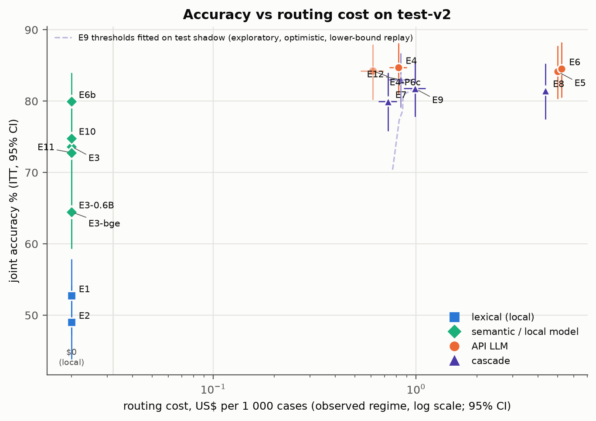
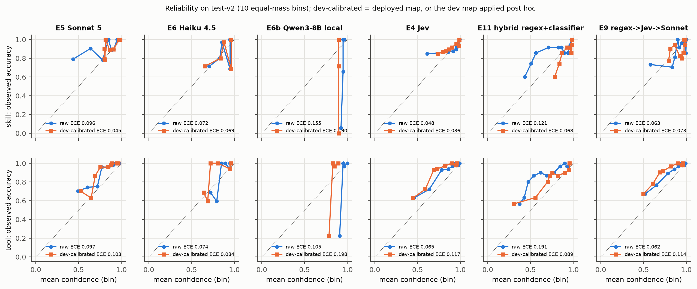
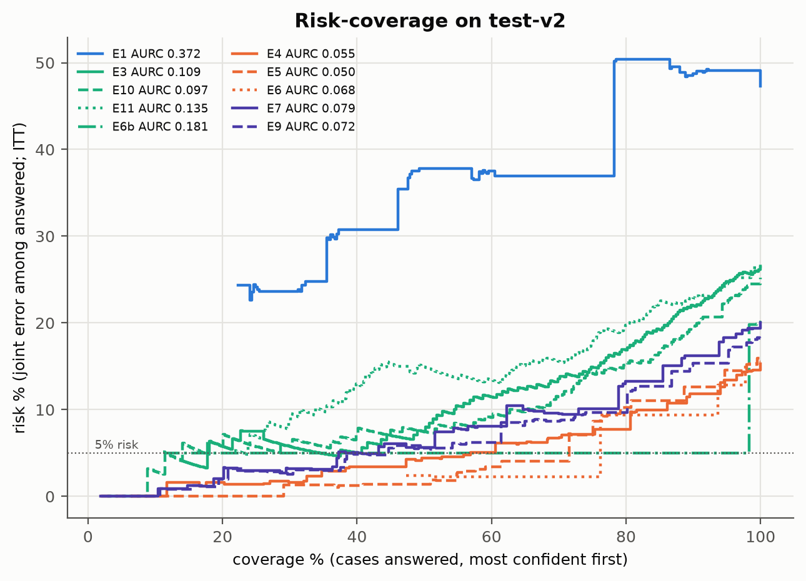

# 05 · Resultados de roteamento (routing-only)

> Split test-v2, 349 casos. Métrica primária: **acurácia conjunta top-1** (skill e tool certas),
> por intenção de tratar (erro de infraestrutura = errado). IC 95% por bootstrap por caso.
> Fontes: [primary.md](../docs/results/final/primary.md),
> [secondary.md](../docs/results/final/secondary.md),
> [estimation.md §A–C](../docs/results/final/estimation.md).
> **[C]** confirmatório · **[E]** estimativa · **[X]** exploratório.

Responde às perguntas de pesquisa 1 (acurácia por estratégia) e 3 (cascatas vs LLM).

## 1. Acurácia por estratégia [E]

| Roteador | Reps | Skill % | Tool % dado skill certa | **Conjunta %** [IC 95%] | Conjunta só 1º rótulo % | recall@3 | Erros |
|---|---|---|---|---|---|---|---|
| E1 regex | 1 | 75,6 | 69,7 | **52,7** [47,3; 57,9] | 48,4 | 57,6 | 0 |
| E2 BM25 | 1 | 71,9 | 68,1 | **49,0** [43,8; 54,2] | 46,1 | 65,6 | 0 |
| E3 embedding (qwen3-emb 8B) | 1 | 85,1 | 86,5 | **73,6** [68,8; 78,2] | 67,0 | 84,8 | 0 |
| E3 ablação qwen3-emb 0.6B | 1 | 78,5 | 82,1 | 64,5 [59,3; 69,3] | 57,9 | 77,9 | 0 |
| E3 ablação bge-m3 | 1 | 78,5 | 82,1 | 64,5 [59,3; 69,6] | 59,6 | 77,1 | 0 |
| E10 classificador (sonda linear) | 1 | 87,1 | 85,9 | **74,8** [70,2; 79,4] | 67,9 | 84,8 | 0 |
| E11 híbrido regex + classificador | 1 | 86,0 | 84,7 | **72,8** [67,9; 77,4] | 65,0 | 84,2 | 0 |
| E6b Qwen3-8B local | 1 | 87,1 | 91,8 | **79,9** [75,6; 84,0] | 70,8 | 86,5 | 0 |
| E4 Jev (jev-router via OpenRouter) | 3 | 92,6 | 91,4 | **84,7** [81,0; 88,2] | 75,9 | 91,0 | 2 (0,2%) |
| E5 Sonnet 5 | 3 | 92,6 | 90,9 | **84,1** [80,3; 87,8] | 75,6 | 92,5 | 0 |
| E6 Haiku 4.5 | 1 | 91,7 | 92,2 | **84,5** [80,5; 88,3] | 74,8 | 91,4 | 0 |
| E7 regex → Jev | 3 | 87,8 | 91,1 | **79,9** [75,8; 84,0] | 71,8 | 86,0 | 0 |
| E8 regex → Sonnet | 3 | 89,8 | 90,7 | **81,5** [77,5; 85,3] | 73,4 | 89,4 | 0 |
| E9 regex → Jev → Sonnet | 3 | 89,0 | 91,8 | **81,8** [77,8; 85,6] | 74,2 | 88,1 | 0 |
| E12 híbrido → Jev → Sonnet **[X]** | 3 | 90,0 | 92,3 | 83,0 [79,1; 86,7] | 74,9 | 89,2 | 0 |
| E4 Jev P0+P6c **[X]** | 1 | 92,3 | 91,3 | 84,2 [80,2; 88,0] | 75,1 | 91,4 | 1 (0,3%) |

Fonte: [estimation.md §A](../docs/results/final/estimation.md). Os dois erros do E4 são falhas de
parse que o rescore transformou em erro; contam como errados (ITT). A sensibilidade sem erros
não muda nenhum veredito ([secondary.md](../docs/results/final/secondary.md)).

*Figura 1. Acurácia conjunta × custo de roteamento (US$/1k casos, regime observado, escala log).
Roteadores locais ficam em US$ 0. Linha tracejada: limiares do E9 ajustados no próprio teste
(exploratório, otimista). Fonte: estimation.md §A e §I.*

**Leitura.** Há três patamares: léxico (~50%), semântico local (73–80%) e LLMs/Jev (84–85%).
Dentro do patamar de cima, as diferenças são de menos de 1 pp com ICs de ±4 pp.

## 2. Hipóteses primárias de roteamento [C]

| Id | Contraste | Δ pp [IC 95%] | McNemar (só run / só ref) | Holm p | Veredito pré-registrado |
|---|---|---|---|---|---|
| H1 | E9 − E5 Sonnet | −2,4 [−5,4; 0,7] | 15 / 21 | 0,697 | **não inferioridade NÃO demonstrada** (limite inferior < −3) |
| H2 | E7 − E5 Sonnet | −4,2 [−7,8; −0,6] | 18 / 31 | 0,728 | **não inferioridade NÃO demonstrada** |

Fonte: [primary.md](../docs/results/final/primary.md). A margem pré-registrada era −3 pp. O IC
do E9 cruza a margem: não dá para afirmar que E9 é não inferior, nem que é inferior. O IC do E7
fica inteiro abaixo de zero: o E7 é **pior** que o Sonnet, embora a não inferioridade fosse a
hipótese testada.

**Co-primária de custo (H1):** E9 custa 0,989 [0,868; 1,116] US$/1k contra 4,981
[4,909; 5,052] do Sonnet; razão **0,199 [0,174; 0,224]**, abaixo da meta de 0,5. E7: razão 0,146
[0,131; 0,162] **[E]**.

## 3. Equivalência entre LLMs (S2) [C]

TOST ±3 pp contra o Sonnet 5 (E5), IC 90% pareado:

| Par | Δ pp [IC 95%] | IC 90% | TOST p | Holm p | Veredito pelo IC | Após Holm |
|---|---|---|---|---|---|---|
| Haiku 4.5 − Sonnet | 0,4 [−2,9; 3,6] | −2,4 a 3,1 | 0,062 | 0,131 | inconclusivo | inconclusivo |
| Qwen3-8B − Sonnet | −4,2 [−8,1; −0,2] | −7,5 a −0,9 | 0,723 | 0,723 | inconclusivo | inconclusivo |
| Jev − Sonnet | 0,6 [−2,1; 3,2] | −1,6 a 2,8 | 0,044 | 0,131 | equivalente | **não estabelecida** |

Fonte: [secondary.md S2](../docs/results/final/secondary.md). O Jev passa pela regra do IC, mas
não depois da correção de Holm. A leitura conservadora é: **equivalência não estabelecida para
nenhum par**. O Qwen local fica abaixo do Sonnet (IC 95% inteiro abaixo de zero), mas a margem
de equivalência não permite chamar isso de "não equivalente" com segurança.

## 4. Léxico × semântico (S4) e generalização dev → teste (S3) [C]

- **S4:** embedding − regex = **+20,9 pp [15,2; 26,6]**, p = 1e-4 (96 casos só o embedding
  acerta, 23 só o regex).
- **S3:**

| Roteador | Dev | Test-v2 [IC 95%] | Gap pp [IC 95%] |
|---|---|---|---|
| Regex (regras escritas lendo o dev) | 84,8 | 52,7 [47,3; 57,9] | **−32,1 [−37,5; −26,9]** |
| BM25 (configuração fixa no dev) | 55,7 | 49,0 [43,8; 54,2] | −6,7 [−11,9; −1,5] |

Fonte: [secondary.md S3/S4](../docs/results/final/secondary.md). **Resultado negativo forte:** as
regras de regex foram superajustadas ao dev. A queda de 32 pp é o efeito mais claro do estudo.

## 5. Calibração [E]

Brier / ECE (10 bins de massa igual) sobre as decisões tomadas, confiança "implantada" (com o
mapa do dev aplicado quando a regra `ece_cal < ece_raw` o manteve):

| Roteador | Skill ECE (bruto → implantado) | Tool ECE (bruto → implantado) |
|---|---|---|
| E4 Jev | 0,048 → 0,036 | 0,065 → 0,065 |
| E5 Sonnet 5 | 0,096 → 0,045 | 0,097 → 0,097 |
| E6 Haiku 4.5 | 0,072 → 0,072 | 0,074 → 0,074 |
| E6b Qwen3-8B | 0,155 → 0,190 | 0,105 → 0,198 |
| E3 embedding | 0,060 → 0,063 | 0,040 → 0,070 |
| E10 classificador | 0,292 → 0,051 | 0,451 → 0,095 |
| E1 regex | 0,184 → 0,179 | 0,190 → 0,182 |

Fonte: [estimation.md §B](../docs/results/final/estimation.md). Os mapas do dev ajudaram onde a
confiança bruta era muito ruim (classificador, BM25, skill do Sonnet) e **pioraram** o Qwen
local no teste (0,155 → 0,190; 0,105 → 0,198). Mapas ajustados em 151 casos não transferem bem.

*Figura 2. Diagramas de confiabilidade no test-v2 (fonte: estimation.md §B).*

## 6. Classificação seletiva [E]

| Roteador | AURC (menor = melhor) | Cobertura com risco ≤ 5% | Conjunta em cobertura total |
|---|---|---|---|
| E5 Sonnet 5 | 0,050 | 61,5% | 84,1 |
| E4 Jev | 0,055 | 55,9% | 84,7 |
| E8 regex → Sonnet | 0,062 | 59,6% | 81,5 |
| E6 Haiku 4.5 | 0,068 | 51,3% | 84,5 |
| E9 regex → Jev → Sonnet | 0,072 | 42,1% | 81,8 |
| E3 embedding | 0,109 | 40,4% | 73,6 |
| E10 classificador | 0,097 | 17,5% | 74,8 |
| E6b Qwen3-8B | 0,181 | 11,5% | 79,9 |
| E1 regex | 0,372 | 0,0% | 52,7 |

Fonte: [estimation.md §C](../docs/results/final/estimation.md). A confiança do Sonnet é a que
melhor ordena acertos e erros. O regex não tem nenhum ponto de operação com risco ≤ 5%: **a
premissa de "regex como primeira camada de alta precisão" não se sustenta no teste.**

*Figura 3. Curvas risco × cobertura (confiança = mín(skill, tool)); fonte: estimation.md §C.*

## 7. Determinismo (taxa de mudança entre repetições) [E]

| Verificação | Casos | Decisão mudou | Acerto mudou |
|---|---|---|---|
| E1 regex (20 × 2) | 20 | 0 | 0 |
| E6 Haiku 4.5 (60 × 2) | 60 | 0 | 0 |
| E6b Qwen3-8B (50 × 2) | 50 | 0 | 0 |
| E4 Jev, rep 1 vs 2 | 349 | 23 (6,6% [4,0; 9,2]) | 12 (3,4%) |
| E5 Sonnet 5, rep 1 vs 2 | 349 | 8 (2,3% [0,9; 4,0]) | 6 (1,7%) |

Fonte: [estimation.md §G](../docs/results/final/estimation.md). Haiku e Qwen rodam com
temperatura 0; o Sonnet no Bedrock não aceita `temperature`; o Jev é um meta-roteador e troca de
modelo por chamada (capítulo [09](09-erros.md)).

## 8. Replicação no test-v1 exposto (exploratório) [X]

| Roteador | Test-v1 conjunta % | Test-v2 conjunta % |
|---|---|---|
| E1 regex | 60,5 [55,3; 65,6] | 52,7 [47,3; 57,9] |
| E2 BM25 | 53,0 [47,9; 58,2] | 49,0 [43,8; 54,2] |
| E3 embedding | 80,5 [76,2; 84,5] | 73,6 [68,8; 78,2] |
| E10 classificador | 76,8 [72,2; 81,1] | 74,8 [70,2; 79,4] |
| E11 híbrido | 76,5 [71,9; 80,8] | 72,8 [67,9; 77,4] |

Fonte: [estimation.md §K](../docs/results/final/estimation.md). Todos os roteadores livres
acertam mais no test-v1, que foi lido antes do reajuste (desvio D-003 só mudou o upload do
dataset no Langfuse). O padrão é compatível com contaminação, mas o test-v1 também tem outra
composição (contém casos semente escritos por um modelo Claude), então a diferença não isola a
contaminação. As linhas não trazem o campo `source`, por isso a estratificação semente ×
sintético prevista não foi feita.
