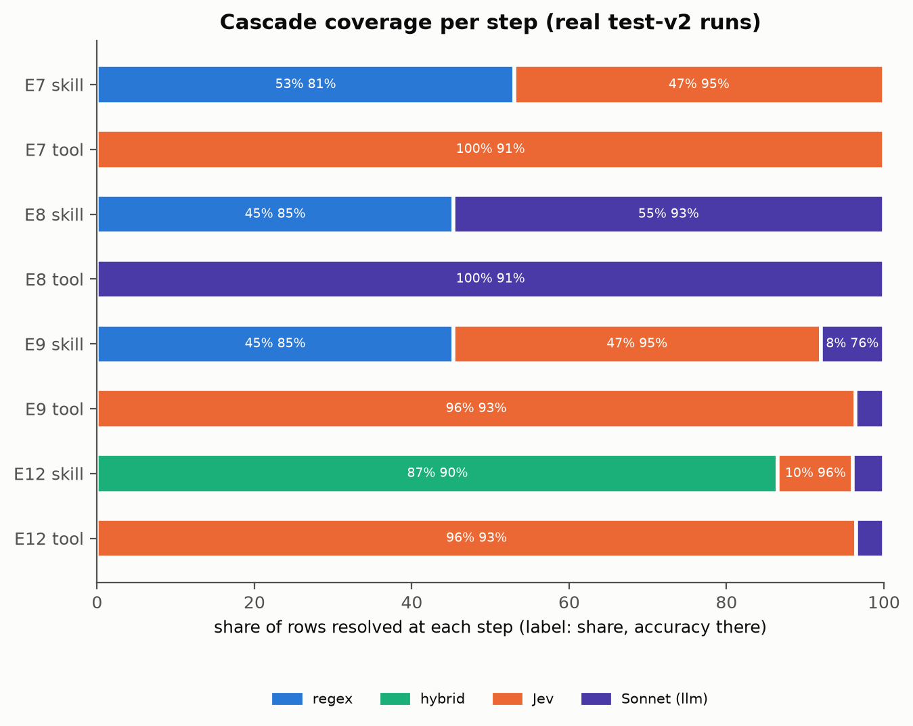

# 06 · Cascatas

> Fontes: limiares e referências do dev em [prereg-v1.md §4](../docs/prereg/prereg-v1.md) e
> [cascade-thresholds-dev.md](../docs/results/cascade-thresholds-dev.md); resultados do teste em
> [estimation.md §I](../docs/results/final/estimation.md) e [primary.md](../docs/results/final/primary.md).
> Responde à pergunta de pesquisa 3: uma cascata chega perto do LLM a que fração do custo?

## 1. Como os limiares foram escolhidos (dev, antes do teste)

Regra declarada antes do passe *shadow* do dev: **máxima acurácia conjunta com custo de
roteamento ≤ 0,5 × o custo do Sonnet 5 P0 no dev** (US$ 5,975/1k → orçamento US$ 0,0029875 por
caso), grade 0,50..0,99 por passo, estimativa honesta por *cross-fitting* em 5 partes. A regra
de precisão (b) ficou como sensibilidade.

| Exp | Skill (min_confidence) | Tool | Dev conjunta | CV held-out [IC 95%] | CV US$/1k |
|---|---|---|---|---|---|
| E7 | regex 0,81 → Jev | Jev | 79,5 | 78,8 [72,2; 85,4] | 0,865 |
| E8 | regex 0,88 → Sonnet (orçamento inviável; regra sem restrição) | Sonnet | 78,8 | 78,1 [71,5; 84,8] | 5,14 |
| E9 | regex 0,88 → Jev 0,76 → Sonnet | Jev 0,50 → Sonnet | 80,1 | 77,5 [70,9; 84,1] | 1,28 |
| E12 **[X]** | híbrido 0,83 → Jev 0,77 → Sonnet | Jev 0,50 → Sonnet | 80,1 | 78,1 [71,5; 84,8] | 1,19 |

Fonte: [prereg-v1.md §4](../docs/prereg/prereg-v1.md).

## 2. Resultado no teste

| Cascata | Conjunta % [IC 95%] | US$/1k observado | vs Sonnet sozinho (E5 84,1%, US$ 4,98) |
|---|---|---|---|
| E7 regex → Jev | 79,9 [75,8; 84,0] | 0,727 | Δ −4,2 pp [−7,8; −0,6] **[C, H2]**; custo 0,146× |
| E8 regex → Sonnet | 81,5 [77,5; 85,3] | 4,351 | custo 0,87× (estimativa) |
| E9 regex → Jev → Sonnet | 81,8 [77,8; 85,6] | 0,989 | Δ −2,4 pp [−5,4; 0,7] **[C, H1]**; custo 0,199× |
| E12 híbrido → Jev → Sonnet **[X]** | 83,0 [79,1; 86,7] | 0,841 | sem teste |
| *E4 Jev sozinho (referência)* | *84,7 [81,0; 88,2]* | *0,818* | — |

Fontes: [estimation.md §A](../docs/results/final/estimation.md), [primary.md](../docs/results/final/primary.md).
A razão E8/E5 = 4,351/4,981 é derivada das médias da tabela, sem IC próprio.

**A resposta à pergunta 3:** a cascata E9 fica 2,4 pp abaixo do Sonnet (IC até −5,4) por um
quinto do custo. Mas o **Jev sozinho** já tem a acurácia do Sonnet (84,7%) por US$ 0,82/1k, menos
que o E9. Neste catálogo, **colocar o regex na frente do Jev não economiza nada que valha a perda
de acurácia**: o E7 custa 0,727 contra 0,818 do Jev sozinho (−11%) e perde 4,8 pp na média.

## 3. Cobertura por passo

| Run | Estágio | Resolvido por | Fração | Acurácia nesse passo |
|---|---|---|---|---|
| E7 | skill | regex | 53,0% | 81,1% |
| E7 | skill | Jev | 47,0% | 95,3% |
| E9 | skill | regex | 45,3% | 85,4% |
| E9 | skill | Jev | 46,7% | 94,7% |
| E9 | skill | Sonnet | 8,0% | 76,2% |
| E9 | tool | Jev | 96,4% | 92,6% |
| E9 | tool | Sonnet | 3,6% | 69,0% |
| E12 **[X]** | skill | híbrido | 86,5% | 90,4% |

Fonte: [estimation.md §I](../docs/results/final/estimation.md).

*Figura 1. Fração de linhas resolvidas em cada passo e acurácia ali (rótulo: fração, acurácia).
Fonte: estimation.md §I.*

**Leitura.** O regex aceita metade do tráfego e acerta 81–85% da skill ali, abaixo dos ~95% do
Jev nos casos que sobram. Os passos finais (Sonnet) recebem os casos mais difíceis e acertam
menos (69–76%), como esperado. No E12, o híbrido decide 86,5% dos casos com 90,4% de acerto de
skill: um primeiro passo melhor que o regex, ao custo de ~0,4 s de latência local.

## 4. Replay no shadow do teste (exploratório, limite inferior)

O passe *shadow* do teste (`v2-shadow-tuned-routing-r3`) registrou as decisões de todas as
estratégias, o que permite simular outros limiares sem novas chamadas. **O replay é um limite
inferior:** quando a cascata simulada escolhe uma skill diferente da do E9, o estágio de tool
não pode ser reproduzido e conta como erro. Só compare pontos simulados entre si.

| Cascata | Referência (shadow do teste) | Conjunta % | US$/1k |
|---|---|---|---|
| E9 | limiares congelados (D5) | 81,9 [77,9; 85,7] | 1,002 |
| E9 | sempre o primeiro passo aceita | 69,9 [65,1; 74,5] | 0,652 |
| E9 | sempre o último (Sonnet sozinho) | 79,6 [75,3; 83,7] | 5,768 |
| E9 | **oráculo** (melhor passo por linha) | **86,9** [83,4; 90,3] | 0,780 |
| E9 | adiamento aleatório nas mesmas taxas | 75,0 | 0,972 |
| E7 | limiares congelados | 77,9 [73,7; 82,0] | 0,714 |
| E7 | oráculo | 84,4 [80,7; 87,9] | 0,494 |
| E7 | adiamento aleatório nas mesmas taxas | 74,0 | 0,690 |

Fonte: [estimation.md §I](../docs/results/final/estimation.md).

- Os limiares congelados **batem o adiamento aleatório** com as mesmas taxas de aceitação (E9:
  81,9 vs 75,0; E7: 77,9 vs 74,0). A confiança calibrada carrega informação.
- Mas ficam **5 pp abaixo do oráculo** no E9 (81,9 vs 86,9), que ainda por cima seria mais
  barato. O gargalo é a qualidade da confiança do primeiro passo, não o limiar.
- Os pontos da fronteira de Pareto do dev replayados no teste (limiares de regex 0,63–0,81) ficam
  todos abaixo do ponto congelado (70,3–78,2 no E9). O dev escolheu bem entre seus próprios
  pontos; a perda vem do regex, não da escolha do limiar.

## 5. O que fica

- Cascata só compensa quando o primeiro passo é ao mesmo tempo barato **e** preciso no que
  aceita. Aqui o regex não é preciso o bastante (capítulo [05](05-resultados-roteamento.md), §6)
  e o modelo seguinte (Jev) já é barato.
- O E12 (híbrido no lugar do regex) é o melhor ponto de cascata observado, mas é exploratório e
  não foi testado contra o Sonnet.
- A cascata pode valer a pena quando o último passo for muito mais caro que o primeiro modelo
  (por exemplo, com um LLM de fronteira sem cache). Com o Jev a US$ 0,82/1k, não é o caso.
