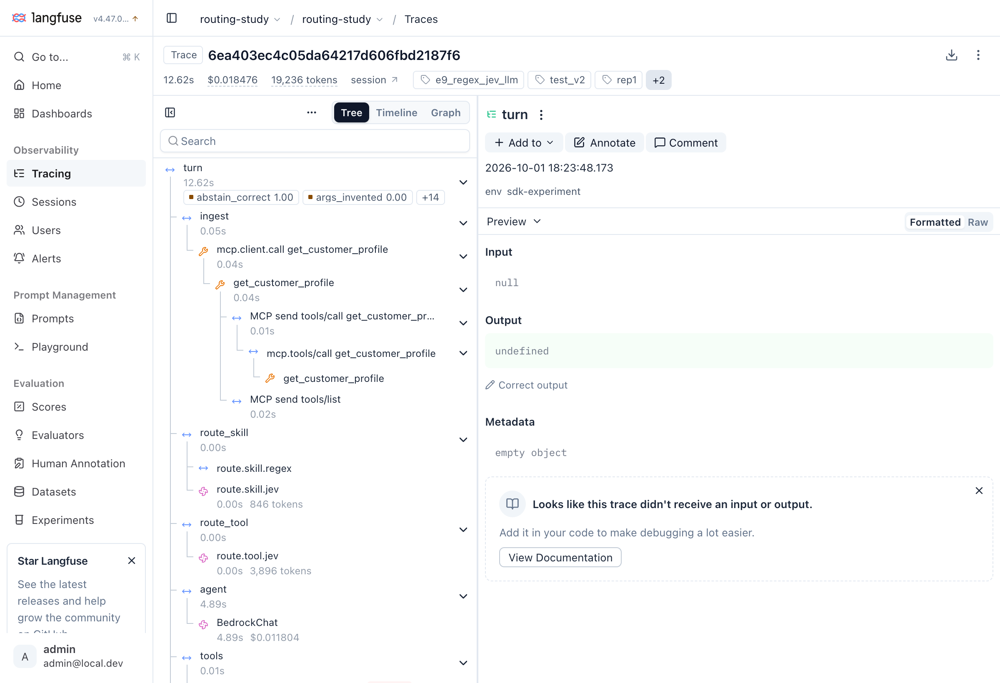
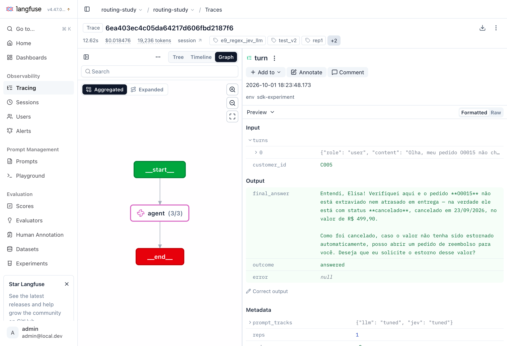
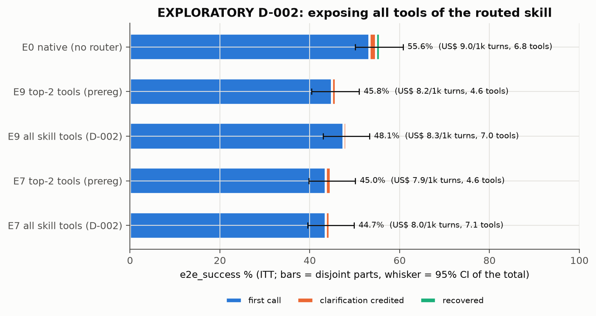
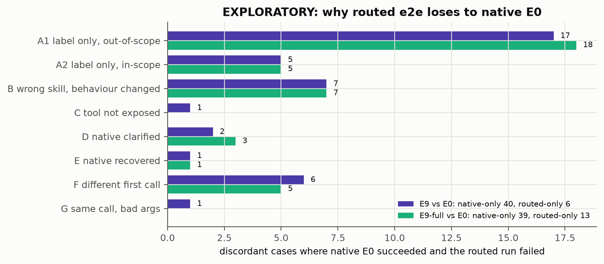

# 07 · Ponta a ponta: vale ter roteador?

> Fontes: [primary.md](../docs/results/final/primary.md) (H3),
> [estimation.md §J](../docs/results/final/estimation.md) (decomposição, custo, variância do
> executor) e [exploratory_e2e.md](../docs/results/final/exploratory_e2e.md) (D-002 e análise de
> erros). Executor: Claude Sonnet 5 no Bedrock, 1 repetição, 349 casos.
> **[C]** confirmatório · **[E]** estimativa · **[X]** exploratório (post hoc, mesmo split).

## 1. O desenho

- **E0 (nativo):** o executor vê as tools globais e `load_skill`, e decide sozinho qual skill
  carregar.
- **Roteado (E1, E5, E6b, E7, E9, E11):** o roteador escolhe a skill e as top-2 tools; o executor
  vê só essas 2 + as 3 globais.
- **Métrica primária:** `e2e_success` = a skill está certa **e** a primeira chamada de negócio
  resolveu, ou houve uma clarificação creditada, ou uma chamada posterior recuperou
  ([docs/metrics.md](../docs/metrics.md)). No roteado, "skill" é o rótulo do roteador; no nativo,
  é a primeira skill que o agente carregou (ou `__abstain__`/`__global__` se não carregou nenhuma).

*Figura 1. Um turno do E9 no Langfuse (test-v2): `ingest` → `route_skill` (regex, Jev) →
`route_tool` (Jev) → `agent` (BedrockChat) → `tools`, com a chamada MCP como span filho.*

*Figura 2. O mesmo trace na visão de grafo, com a resposta final, o desfecho e os metadados do run.*

> **[slot Langfuse]** `estudos/figuras/langfuse-trace-e0-e2e.png`: trace de um turno nativo E0
> com `load_skill`, para comparar com a Figura 1 (a capturar).

## 2. H3: roteado × nativo [C]

| | E9 roteado | E0 nativo | Δ / razão [IC 95%] |
|---|---|---|---|
| `e2e_success` | 45,8% [40,4; 51,0] | 55,6% [50,1; 60,7] | **−9,7 pp [−13,5; −6,0]**, Holm p 0,0003 |
| McNemar (só E9 / só E0) | 6 | 40 | p = 3,1e-07 |
| Custo por turno (US$/1k) | 8,206 [7,722; 8,734] | 9,031 [8,533; 9,576] | razão **0,909 [0,859; 0,960]** |

Fonte: [primary.md](../docs/results/final/primary.md). **O agente roteado é pior que o nativo**,
com IC que exclui zero, e economiza só ~9% por turno.

## 3. Todos os runs ponta a ponta [E]

| Run | Skill | Tool 1ª chamada | Args válidos | **e2e_success** | = 1ª chamada | + clarificação | + recuperação | US$/1k turnos |
|---|---|---|---|---|---|---|---|---|
| E0 nativo | 88,8 | 75,1 | 68,5 | **55,6** [50,1; 60,7] | 53,3 | 1,4 | 0,9 | 9,03 |
| E5 Sonnet 5 | 89,4 | 75,1 | 68,2 | **50,7** [45,3; 55,9] | 49,9 | 0,9 | 0,0 | 11,84 |
| E6b Qwen3-8B local | 83,1 | 74,8 | 67,6 | **46,4** [41,3; 51,6] | 45,3 | 0,9 | 0,3 | 7,90 |
| E9 regex → Jev → Sonnet | 85,4 | 73,9 | 66,2 | **45,8** [40,4; 51,0] | 45,0 | 0,9 | 0,0 | 8,21 |
| E7 regex → Jev | 83,7 | 73,9 | 67,0 | **45,0** [39,8; 50,1] | 43,6 | 1,1 | 0,3 | 7,87 |
| E11 híbrido | 82,8 | 71,3 | 66,8 | **44,4** [39,3; 49,6] | 43,3 | 1,1 | 0,0 | 7,45 |
| E1 regex | 75,6 | 57,9 | 55,0 | **34,7** [29,8; 39,5] | 34,1 | 0,3 | 0,3 | 5,93 |

Fonte: [estimation.md §J](../docs/results/final/estimation.md). Nenhum run teve erro. `args_invented`
ficou ≤ 0,4% e `entity_grounded` ≥ 97,3% em todos: a diferença não está em alucinação de
argumentos.

*Figura 3. Decomposição do `e2e_success` com IC 95% do total e custo por mil turnos. Fonte:
estimation.md §J.*

Observações:

- Até o melhor roteador (E5, Sonnet roteando para o próprio Sonnet executar) fica 4,9 pp abaixo
  do nativo, com a **mesma** acurácia de primeira chamada (75,1%). O que o E0 tem a mais está fora
  da primeira chamada e fora da skill (seção 5).
- O nativo atingiu o limite de laço em 23 turnos; o E9 em 1 ([exploratory_e2e.md §1](../docs/results/final/exploratory_e2e.md)).
- **Variância do executor:** num segundo run de 60 casos, o `e2e_success` mudou em 5,0%
  [0,0; 11,7] dos casos no E0 e 1,7% [0,0; 5,0] no E9 ([estimation.md §J](../docs/results/final/estimation.md)).
  A amostragem do executor sozinha não explica 9,7 pp.

## 4. D-002: e se o executor visse todas as tools da skill? [X]

O resultado de H3 junto com o E5 empatando com o E0 na primeira chamada levantou a hipótese de que
**esconder tools** (expor só as top-2) causaria a perda. Depois do pré-registro, rodamos E9 e E7
com `expose_top_k: 5` (as 5 tools da skill roteada + 3 globais), com as mesmas decisões de
roteamento (cache de respostas; skill idêntica em 349/349 casos). Desvio registrado como D-002.

| Run | e2e_success [IC 95%] | Tools expostas/turno | US$/1k turnos | Tokens de prompt/turno |
|---|---|---|---|---|
| E0 nativo | 55,6 [50,1; 60,7] | 6,80 | 9,03 | 14.737 |
| E9 top-2 (pré-registrado) | 45,8 [40,4; 51,0] | 4,61 | 8,21 | 8.734 |
| **E9 todas as tools (D-002)** | **48,1** [43,0; 53,3] | 7,03 | 8,33 | 11.092 |
| E7 top-2 (pré-registrado) | 45,0 [39,8; 50,1] | 4,62 | 7,87 | 8.858 |
| **E7 todas as tools (D-002)** | **44,7** [39,5; 49,9] | 7,05 | 7,97 | 11.062 |

| Contraste pareado (não ajustado) | Δ e2e pp [IC 95%] | Só run / só ref |
|---|---|---|
| E9-full − E9 | +2,3 [0,0; 4,6] | 12 / 4 |
| E9-full − E0 | −7,4 [−11,5; −3,4] | 13 / 39 |
| E7-full − E7 | −0,3 [−2,3; 2,0] | 7 / 8 |
| E7-full − E0 | −10,9 [−14,9; −6,9] | 8 / 46 |

Fonte: [exploratory_e2e.md §1](../docs/results/final/exploratory_e2e.md). Razões pareadas: custo
E9-full/E0 = 0,922 [0,879; 0,969]; tokens de prompt E9-full/E9 = 1,270 [1,236; 1,307].

*Figura 4 (exploratória). `e2e_success` com todas as tools da skill expostas, comparado com o
top-2 pré-registrado e com o E0. Fonte: exploratory_e2e.md §1.*

**Leitura.** Expor todas as tools ajuda pouco no E9 (+2,3 pp, IC tocando zero) e nada no E7. O
roteado continua 7–11 pp abaixo do nativo. **Esconder tools explica uma parte pequena do gap.**

## 5. Por que o roteado perde para o nativo? Análise de erros [X]

Cada caso discordante (sucesso em só um dos dois runs) recebeu uma única classe, pela primeira
regra que se aplica. As classes são mecânicas, calculadas a partir das linhas gravadas, sem
leitura humana das transcrições.

**E9 (top-2) × E0: 40 casos só o nativo acerta, 6 só o roteado.**

| Classe | Por que o turno roteado falhou | Casos | Fração | Acerta no E9-full |
|---|---|---|---|---|
| A1 | rótulo de skill do roteador não aceito, **mesmas chamadas** do nativo, gold fora de escopo | 17 | 42% | 0/17 |
| A2 | idem, gold dentro do escopo (ex.: `search_help_center` global) | 5 | 12% | 0/5 |
| B | skill errada e o executor agiu diferente (o erro de roteamento mudou o turno) | 7 | 18% | 0/7 |
| C | skill certa, nenhuma tool aceitável exposta | 1 | 2% | 1/1 |
| D | o nativo foi creditado por uma pergunta de clarificação | 2 | 5% | 0/2 |
| E | o nativo recuperou com uma chamada posterior | 1 | 2% | 0/1 |
| F | tool aceitável exposta, mas o executor roteado chamou outra primeiro | 6 | 15% | 3/6 |
| G | mesma primeira chamada, argumentos inválidos no roteado | 1 | 2% | 1/1 |

Nos 6 casos em que só o E9 acerta: 3 vezes o nativo respondeu sem nenhuma chamada, 2 vezes errou
argumentos na mesma tool, 1 vez bateu no limite de laço. O nativo carregou duas skills
(`load_skill` duas vezes) em só 1 dos 40 e 1 dos 6 casos discordantes; no total, fez isso em 21
turnos e acertou 10. **Trocar de skill não é o que dá vantagem ao nativo.**

Fonte: [exploratory_e2e.md §2](../docs/results/final/exploratory_e2e.md).

*Figura 5 (exploratória). Casos em que o E0 acerta e o roteado erra, por classe, para E9 e
E9-full. Fonte: exploratory_e2e.md §2.*

**O achado principal (exploratório):** **22 dos 40 casos (classes A1 + A2) têm exatamente as
mesmas chamadas de negócio no E9 e no E0.** Exemplo típico: um pedido fora de escopo; os dois
executores recusam com educação sem chamar nenhuma tool. O nativo é pontuado como abstenção
(certo); o roteado é pontuado pelo rótulo `__global__` que o roteador deu, que não é aceito para
um gold `__abstain__`. É o scorer pré-registrado e ele **não** foi mudado. Como sensibilidade
post hoc, se esses turnos fossem pontuados pelo comportamento como no nativo:

| Run | e2e_success (sensibilidade) | Δ vs E0 [IC 95%] |
|---|---|---|
| E9 | 52,1% | −3,4 pp [−6,3; −0,9] |
| E9 todas as tools | 54,7% | −0,9 pp [−4,0; 2,3] |
| E7 | 52,4% | −3,2 pp [−6,0; −0,3] |

Fonte: [exploratory_e2e.md §2](../docs/results/final/exploratory_e2e.md).

**Interpretação (hipótese, não conclusão):** a maior parte da diferença de H3 vem de uma
assimetria entre como a skill é atribuída no roteado (rótulo do roteador) e no nativo
(comportamento). O que sobra (~3 pp no E9 top-2) vem de erros reais de roteamento que mudam o
turno (classe B), de tools escondidas (C, F) e de clarificações que o nativo faz e o roteado não
(D). Com todas as tools expostas e pontuação pelo comportamento, o roteado ficaria
estatisticamente indistinguível do nativo. As duas mudanças foram decididas depois de ver os
dados do teste, no mesmo split: confirmar exige um split novo e um scorer que pontue os dois
braços pelo mesmo critério, declarado antes.

O veredito confirmatório **não muda**: pelo critério pré-registrado, E0 > E9.

## 6. Contexto e custo por turno [E]

| Run | Tokens de prompt do executor/turno | Fração em cache | Chamadas do executor/turno | US$/1k turnos (observado) | Sem cache (tabela) |
|---|---|---|---|---|---|
| E0 nativo | 14.737 [13.994; 15.516] | 91,0% | 2,79 | 9,03 | 33,14 |
| E9 | 8.734 [8.340; 9.142] | 87,4% | 1,97 | 8,21 | 22,14 |
| E1 regex | 7.188 [6.629; 7.752] | 87,7% | 1,56 | 5,93 | 17,20 |
| E5 Sonnet | 8.605 [8.238; 8.987] | 88,5% | 1,97 | 11,84 | 32,23 |

Fonte: [estimation.md §J](../docs/results/final/estimation.md). O roteamento corta ~40% dos tokens
de prompt do executor (menos tools no contexto e menos uma chamada, a do `load_skill`). Como 87–91%
desses tokens são lidos do cache, a economia em dólar é pequena (9%). **Sem cache** de prompt, a
economia relativa seria bem maior (US$ 22,14 vs 33,14 por mil turnos), o que sugere que a conta
muda em provedores sem cache ou com tráfego frio (capítulo [08](08-economia.md)).
