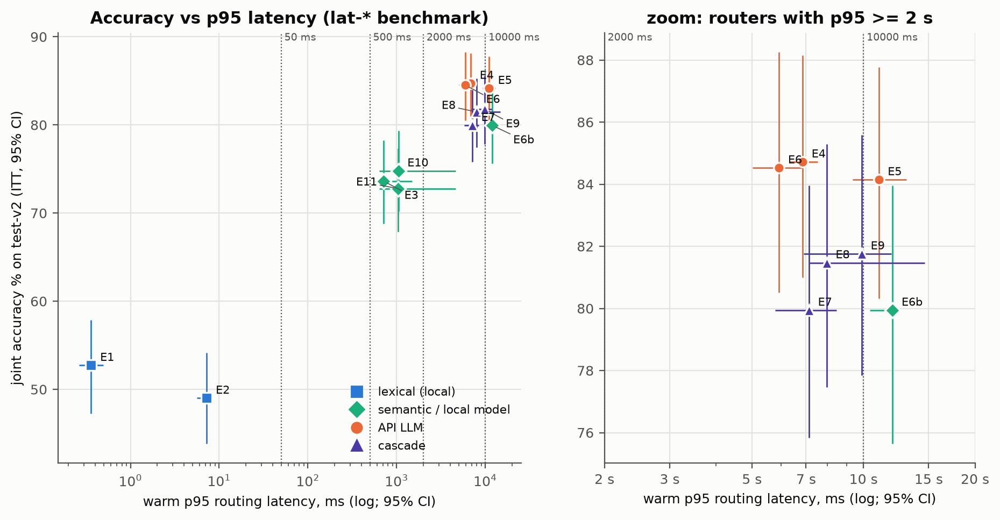
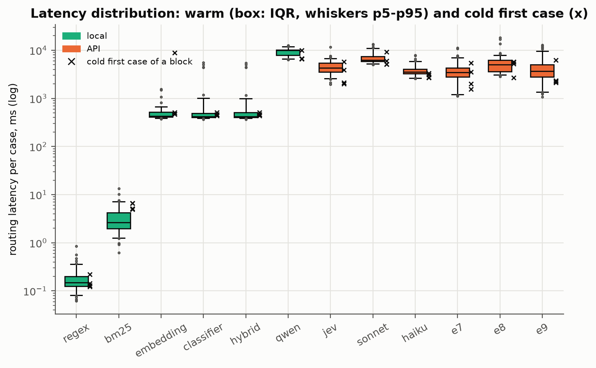

# 08 · Custo, latência e contexto

> Fontes: [estimation.md §A (custos), §D (latência), §J (e2e)](../docs/results/final/estimation.md)
> e [prompt-apex.md](../docs/prompt-apex.md) (contexto no dev). Tudo **[E]** (estimativa,
> sem teste), exceto as razões co-primárias de H1/H3 **[C]**.
> Responde à pergunta de pesquisa 2: custo por 1.000 requisições e latência p50/p95.

## 1. Três regimes de custo de roteamento

- **Observado:** o custo gravado de cada decisão, com o cache de prompt do provedor como estava
  (cache quente, pois os runs compartilham as amostras do passe shadow). É o regime pré-registrado
  da co-primária de H1.
- **Tabela sem cache:** tokens gravados × preço de tabela (`config/prices.yaml`), sem desconto de
  cache. O Jev não tem preço de tabela: usa-se o custo reportado pelo OpenRouter.
- **Cache modelado:** chegadas Poisson à QPS indicada, TTL de 5 min renovado a cada acerto, por
  prefixo de prompt. É modelo, não medição.

| Roteador | Observado [IC 95%] | Tabela sem cache | @ 0,01 QPS | @ 0,1 QPS | @ 1 QPS | @ ∞ |
|---|---|---|---|---|---|---|
| Locais (E1, E2, E3, E10, E11, E6b) | 0,000 | 0,000 | 0 | 0 | 0 | 0 |
| E4 Jev | 0,818 [0,739; 0,900] | 0,818 (reportado) | 0,818 | 0,818 | 0,818 | 0,818 |
| E5 Sonnet 5 | 4,981 [4,909; 5,052] | 11,820 | 7,694 | 4,951 | 4,947 | 4,947 |
| E6 Haiku 4.5 | 5,228 [5,154; 5,299] | 5,228 | 5,228 | 5,228 | 5,228 | 5,228 |
| E7 regex → Jev | 0,727 [0,654; 0,805] | 0,727 | 0,727 | 0,727 | 0,727 | 0,727 |
| E8 regex → Sonnet | 4,351 [4,258; 4,448] | 10,107 | 7,242 | 4,319 | 4,315 | 4,315 |
| E9 regex → Jev → Sonnet | 0,989 [0,868; 1,116] | 1,351 | 1,391 | 1,164 | 0,999 | 0,986 |
| E12 **[X]** | 0,841 [0,730; 0,959] | 1,094 | 1,146 | 1,026 | 0,849 | 0,835 |
| E4 Jev P0+P6c **[X]** | 0,611 [0,533; 0,692] | 0,611 | 0,611 | 0,611 | 0,611 | 0,611 |

US$ por 1.000 casos (skill + tool). Fonte: [estimation.md §A](../docs/results/final/estimation.md).
Custo local = US$ 0 de API; hardware e energia não estão contados.

**Leitura.**

- **Assimetria de cache:** o prefixo do Sonnet (~2,1 mil tokens) é cacheável; o do Haiku nunca
  atinge o mínimo de 4.096 tokens do Bedrock (nenhuma leitura de cache foi observada). Por isso,
  **no regime observado o Haiku custa mais que o Sonnet** (5,23 vs 4,98). Sem cache, o Sonnet
  custaria 11,82, mais que o dobro do Haiku. Em tráfego muito baixo (0,01 QPS, ~1 requisição a
  cada 100 s), o cache do Sonnet expira e o custo modelado sobe para 7,69.
- **O Jev é ~6× mais barato que o Sonnet** com a mesma acurácia (capítulo [05](05-resultados-roteamento.md)).
- **Co-primária H1 [C]:** custo E9/E5 = 0,199 [0,174; 0,224] ([primary.md](../docs/results/final/primary.md)).

## 2. Latência: benchmark dedicado

As latências vêm **só** do benchmark `lat-*`: 100 casos estratificados do test-v2 em 4 blocos de
25, estratégias intercaladas por bloco, concorrência 1, cache de respostas desligado. O primeiro
caso de cada bloco é **frio** e aparece à parte; os 96 restantes são **quentes**. Latência de
roteamento = estágio de skill + estágio de tool, por caso.

| Estratégia | Onde | p50 ms [IC 95%] | p95 ms [IC 95%] | p99 ms | Frio (mediana / máx) |
|---|---|---|---|---|---|
| regex | local | 0,15 [0,14; 0,17] | 0,36 [0,26; 0,50] | 0,58 | 0,14 / 0,22 |
| BM25 | local | 2,62 [2,26; 3,15] | 7,25 [5,64; 8,20] | 10 | 5,90 / 6,66 |
| embedding (qwen3-emb 8B) | local | 427 [419; 436] | 710 [574; 1492] | 1514 | 493 / 8921 |
| classificador | local | 419 [413; 425] | 1048 [635; 4634] | 5093 | 465 / 509 |
| híbrido | local | 419 [414; 428] | 1037 [634; 4624] | 5088 | 465 / 509 |
| Qwen3-8B | local | 9875 [8726; 9960] | 11983 [10394; 12264] | 12366 | 6675 / 10012 |
| Jev | API | 4308 [4066; 4576] | 6851 [6303; 7531] | 7789 | 3015 / 5718 |
| Sonnet 5 | API | 6287 [6140; 6580] | 10994 [9333; 13065] | 13226 | 5592 / 9149 |
| Haiku 4.5 | API | 3507 [3421; 3648] | 5919 [5027; 6861] | 7668 | 2903 / 3359 |
| E7 regex → Jev | API | 3431 [3094; 3842] | 7129 [5785; 8470] | 10719 | 2777 / 5475 |
| E8 regex → Sonnet | API | 5059 [4313; 5760] | 7956 [7149; 14653] | 17007 | 5428 / 5811 |
| E9 regex → Jev → Sonnet | API | 3662 [3349; 4212] | 9892 [6903; 11874] | 12439 | 2302 / 6282 |

Fonte: [estimation.md §D](../docs/results/final/estimation.md). Uma linha de erro no E8 (95
casos quentes). O p99 de 96 valores é quase o máximo da amostra: leia como indicador de cauda.

*Figura 1. Acurácia conjunta × latência p95 quente (escala log; linhas em 50 ms, 500 ms, 2 s e
10 s). À direita, o zoom nos roteadores acima de 2 s. Fonte: estimation.md §A e §D.*

*Figura 2. Distribuição das latências quentes por estratégia (benchmark lat-*). Fonte: estimation.md §D.*

**Leitura.**

- Os roteadores semânticos locais ficam em ~0,4 s no p50 e ~0,7–1 s no p95, com cauda longa
  no classificador e no híbrido (p99 ~5 s; IC do p95 até 4,6 s).
- Nenhum LLM, local ou de API, fica abaixo de 2 s no p95. O Qwen local, rodando numa máquina só
  (Apple Silicon, Ollama, concorrência 1), é o mais lento: ~10 s no p50.
- As cascatas reduzem o p50 (o regex responde em microssegundos metade das vezes), mas não o p95,
  que é dominado pelos casos que vão até o último passo.

## 3. Local × API

| Opção | Conjunta | US$/1k | p95 | Observação |
|---|---|---|---|---|
| E6b Qwen3-8B local | 79,9 | 0 | 12,0 s | ~9 GB de memória de GPU no benchmark do dev (`.omc/handoffs/providers.md`, local, não versionado) |
| E10 classificador local | 74,8 | 0 | 1,0 s | re-treino em 0,09 s ao entrar uma tool (RQ5, dev) |
| E4 Jev via OpenRouter | 84,7 | 0,82 | 6,9 s | meta-roteador; modelo atendido varia |
| E6 Haiku 4.5 via Bedrock | 84,5 | 5,23 | 5,9 s | sem cache de prompt |

Fontes: [estimation.md §A, §D](../docs/results/final/estimation.md). O roteador local custa zero
de API, mas a latência depende do hardware e não é diretamente comparável à latência de API (que
inclui rede e fila no provedor, região `sa-east-1`). O E5b (Qwen3-32B local) foi planejado e
**retirado antes do pré-registro**: no benchmark do dev levava ~34 s no p50 do estágio de tool
(`.omc/handoffs/providers.md`, `bench_local.py` em 20 casos do dev).

## 4. Custo por turno no e2e e tokens de contexto

| Run | US$/1k turnos (observado) | Roteamento | Executor | Sem cache | Tokens de prompt do executor/turno |
|---|---|---|---|---|---|
| E0 nativo | 9,03 | 0,00 | 9,03 | 33,14 | 14.737 |
| E9 | 8,21 | 1,01 | 7,20 | 22,14 | 8.734 |
| E7 | 7,87 | 0,76 | 7,11 | 21,95 | 8.858 |
| E5 Sonnet | 11,84 | 5,05 | 6,79 | 32,23 | 8.605 |
| E11 híbrido | 7,45 | 0,00 | 7,45 | 21,45 | 8.956 |
| E1 regex | 5,93 | 0,00 | 5,93 | 17,20 | 7.188 |

Fonte: [estimation.md §J](../docs/results/final/estimation.md). **[C]** custo por turno E9/E0 =
0,909 [0,859; 0,960] ([primary.md](../docs/results/final/primary.md)).

- O roteador corta ~40% dos tokens de prompt do executor, mas o executor já lê 87–91% do prompt
  do cache. A economia em dólar no regime observado é de 9% (E9) a 18% (E11, roteador local).
- Rotear com o Sonnet (E5) **encarece** o turno: o custo do roteamento (5,05) passa a economia
  no executor.
- No regime sem cache a economia relativa do roteamento seria maior (E9 22,14 vs E0 33,14).

## 5. Contexto do prompt do roteador

Medido no dev ([prompt-apex.md](../docs/prompt-apex.md)): o Sonnet 5 com P0 usa ~2.229 tokens de
prompt por chamada (2.119 fixos), dos quais ~1.746 vêm do cache; o Jev usa ~1.157 (784 de cache,
reportado pelo upstream do OpenRouter). Os tokens de saída pesam mais que os de entrada: o
ranking compacto P6c corta pela metade a saída do Jev e reduz o custo em ~35% no dev
(capítulo [04](04-prompts.md)).
