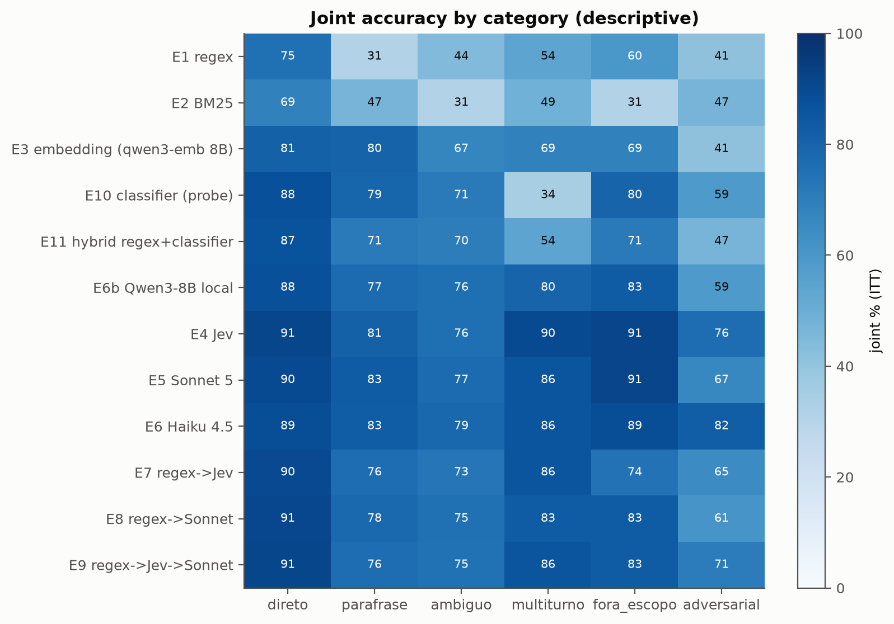
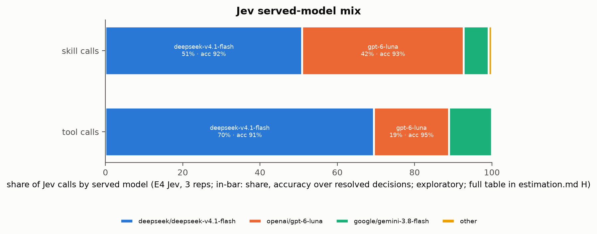

# 09 · Análise de erros

> Fontes: [estimation.md §E e §H](../docs/results/final/estimation.md) (categorias, tools,
> rótulos múltiplos, Jev) e [exploratory_e2e.md §3](../docs/results/final/exploratory_e2e.md)
> (pares confundidos). Tudo descritivo **[E]**, sem testes; n por categoria pequeno.
> Responde à pergunta de pesquisa 4: onde cada técnica erra.

## 1. Por categoria

Acurácia conjunta % [IC 95%] no test-v2:

| Roteador | direto (105) | paráfrase (87) | ambíguo (70) | multi-turno (35) | fora de escopo (35) | adversarial (17) |
|---|---|---|---|---|---|---|
| E1 regex | 75,2 | **31,0** | 44,3 | 54,3 | 60,0 | 41,2 |
| E2 BM25 | 68,6 | 47,1 | 31,4 | 48,6 | **31,4** | 47,1 |
| E3 embedding | 81,0 | 80,5 | 67,1 | 68,6 | 68,6 | 41,2 |
| E10 classificador | 87,6 | 79,3 | 71,4 | **34,3** | 80,0 | 58,8 |
| E11 híbrido | 86,7 | 71,3 | 70,0 | 54,3 | 71,4 | 47,1 |
| E6b Qwen3-8B | 87,6 | 77,0 | 75,7 | 80,0 | 82,9 | 58,8 |
| E4 Jev | 91,1 | 81,2 | 75,7 | 89,5 | 91,4 | 76,5 |
| E5 Sonnet 5 | 89,5 | 83,1 | 77,1 | 85,7 | 91,4 | 66,7 |
| E6 Haiku 4.5 | 88,6 | 82,8 | 78,6 | 85,7 | 88,6 | 82,4 |
| E7 regex → Jev | 90,2 | 76,2 | 72,9 | 85,7 | 74,3 | 64,7 |
| E9 regex → Jev → Sonnet | 91,1 | 76,2 | 74,8 | 85,7 | 82,9 | 70,6 |

Fonte: [estimation.md §E](../docs/results/final/estimation.md) (ICs completos lá).

*Figura 1. Acurácia conjunta por roteador e categoria. Fonte: estimation.md §E.*

**Leitura.**

- **Paráfrase derruba o regex** (31%): as regras casam a forma, não o sentido.
- **Multi-turno derruba o classificador** (34%), que lê pouco histórico; o embedding com as duas
  últimas mensagens na consulta chega a 69%; LLMs e Jev ficam em 80–90%.
- **Fora de escopo:** o BM25 quase não abstém (31%); Jev e Sonnet acertam 91%.
- **Ambíguo é difícil para todos (67–79% nos melhores)**, mas os rótulos dessa categoria são os
  mais fracos: o auditor A aceitou só 23 dos 70 conjuntos de rótulos
  ([dataset-card.md](../docs/dataset-card.md)). Leia essa coluna com cautela.
- **Adversarial** tem n = 17: os ICs vão de ~±20 pp.
- As cascatas herdam a fraqueza do regex em paráfrase (E7 e E9: 76,2% contra 81–83% de Jev e
  Sonnet sozinhos).

## 2. Rótulo único × múltiplo

| Roteador | Rótulo único (256): conjunta | Múltiplo (93): qualquer rótulo | Múltiplo: só o 1º rótulo |
|---|---|---|---|
| E1 regex | 56,6 | 41,9 | 25,8 |
| E3 embedding | 77,0 | 64,5 | 39,8 |
| E4 Jev | 86,6 | 79,6 | 46,6 |
| E5 Sonnet 5 | 86,5 | 77,8 | 45,9 |
| E6 Haiku 4.5 | 85,5 | 81,7 | 45,2 |
| E9 | 84,6 | 73,8 | 45,5 |

Fonte: [estimation.md §E](../docs/results/final/estimation.md). Nos casos de rótulo múltiplo,
exigir o primeiro rótulo corta a acurácia quase pela metade em todos os roteadores. A métrica
primária (qualquer rótulo aceitável) é generosa nesses casos; a ordem entre roteadores não muda.

## 3. Por tool (gold do primeiro rótulo)

Pontos fracos comuns ([estimation.md §E](../docs/results/final/estimation.md), estimativas pontuais):

- **`search_help_center`** (22 casos): o pior para todos (Sonnet 59%, Jev 53%, embedding 9%).
  É o distrator permanente previsto no desenho: perguntas de política sem pedido.
- **`request_refund`** (18): 59–78% nos LLMs; confundido com `create_return_request`.
- **`open_warranty_claim`** (13): Sonnet 62%, embedding e regex 92–100%. Um caso em que o léxico
  ganha do LLM.
- `reschedule_delivery`, `update_delivery_address` e `generate_boleto_second_copy` ficam em
  85–100% para quase todos.

## 4. Pares confundidos

Erros mais frequentes (gold → predito), repetição 1, só casos com conjunta errada:

| Roteador | Casos errados | Principais confusões (n) |
|---|---|---|
| E1 regex | 165 | quase todas são abstenções: `get_order_status` → `__abstain__` (11), `cancel_order` → `__abstain__` (8) |
| E3 embedding | 92 | `get_order_status` → `track_shipment` (8); `cancel_order` → `check_return_eligibility` (5); `request_refund` → `create_return_request` (5) |
| E10 classificador | 88 | `get_order_status` → `track_shipment` (6); `search_help_center` → `create_return_request` (5) |
| E4 Jev | 56 | `request_refund` → `create_return_request` (5); `track_shipment` → `get_order_status` (4) |
| E5 Sonnet 5 | 53 | `get_order_status` → `track_shipment` (5); `request_refund` → `create_return_request` (4); `open_warranty_claim` → `create_return_request` (3) |
| E9 | 65 | `search_help_center` certo com skill `trocas_devolucoes` (4); `track_shipment` → `get_order_status` (4) |

Fonte: [exploratory_e2e.md §3](../docs/results/final/exploratory_e2e.md). Os pares desenhados como
confundíveis (`get_order_status` × `track_shipment`; `request_refund` × `create_return_request`)
aparecem no topo de todos os roteadores semânticos e LLMs. O regex erra de outro jeito: não casa
nada e abstém.

## 5. Jev: qual modelo atendeu (exploratório)

O `jev-router` via OpenRouter é um meta-roteador: cada chamada é atendida por um modelo que ele
escolhe. No E4 (skill): `deepseek/deepseek-v4.1-flash` 50,9%, `openai/gpt-6-luna` 41,8%,
`google/gemini-3.8-flash` 6,4%, `anthropic/claude-sonnet-5.5` 0,6%. No estágio de tool, o DeepSeek
atendeu 69,5% ([estimation.md §H](../docs/results/final/estimation.md)).

*Figura 2. Modelos que efetivamente atenderam as chamadas do Jev e a acurácia de cada um. Fonte:
estimation.md §H.*

A acurácia por modelo atendido (skill 91,7–100%) é confundida com a dificuldade do caso, porque
o próprio Jev escolhe o modelo a partir da entrada: não há leitura causal. O que se mede como
"Jev" neste estudo é esse produto (jev-router via OpenRouter), não a API tipada nativa do Jev.

## 6. Erros ponta a ponta

A análise de erros do e2e (por que o roteado perde para o nativo) está no capítulo
[07, seção 5](07-ponta-a-ponta.md). Resumo: dos 40 casos em que só o E0 acerta, 22 têm as mesmas
chamadas no roteado e falham pelo rótulo de skill do roteador; 7 são erros de roteamento que mudam
o comportamento; o resto vem de tools escondidas, ordem de chamadas e clarificações.

## 7. Semente × sintético

Não se aplica ao test-v2: os 349 casos são `synthetic_v2` (gerados por `google/gemini-2.5-flash`),
sem casos semente ([estimation.md §E](../docs/results/final/estimation.md)).
