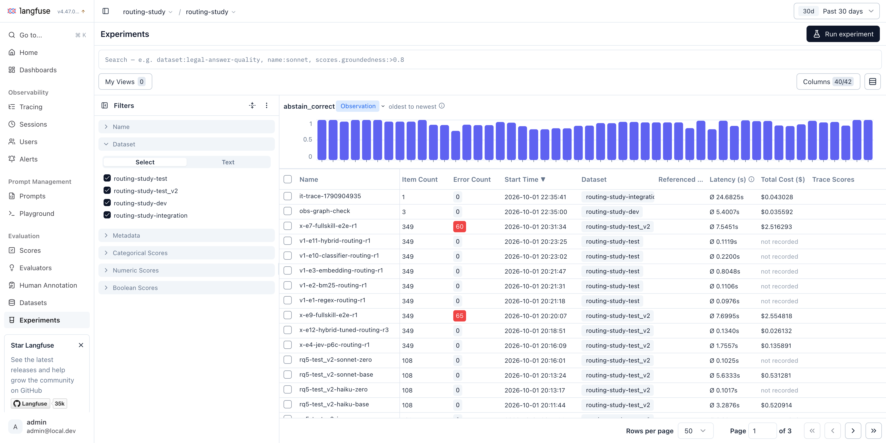
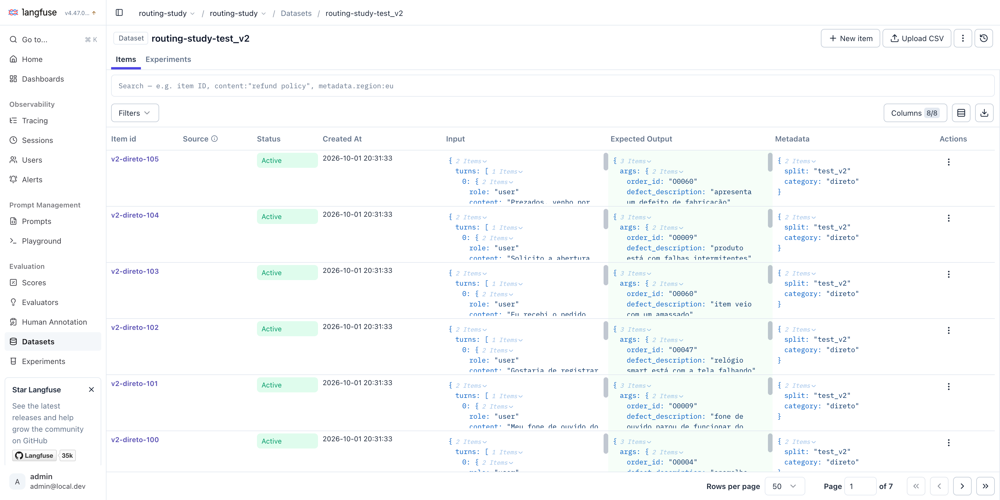
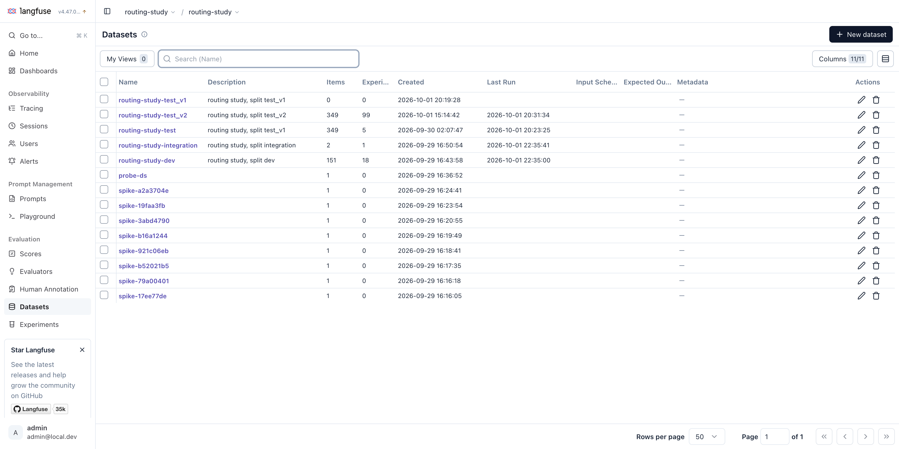
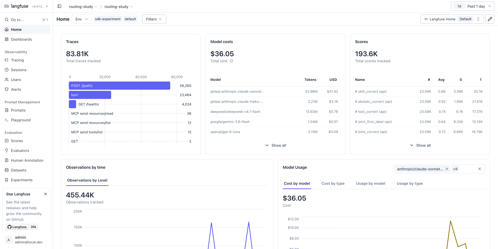
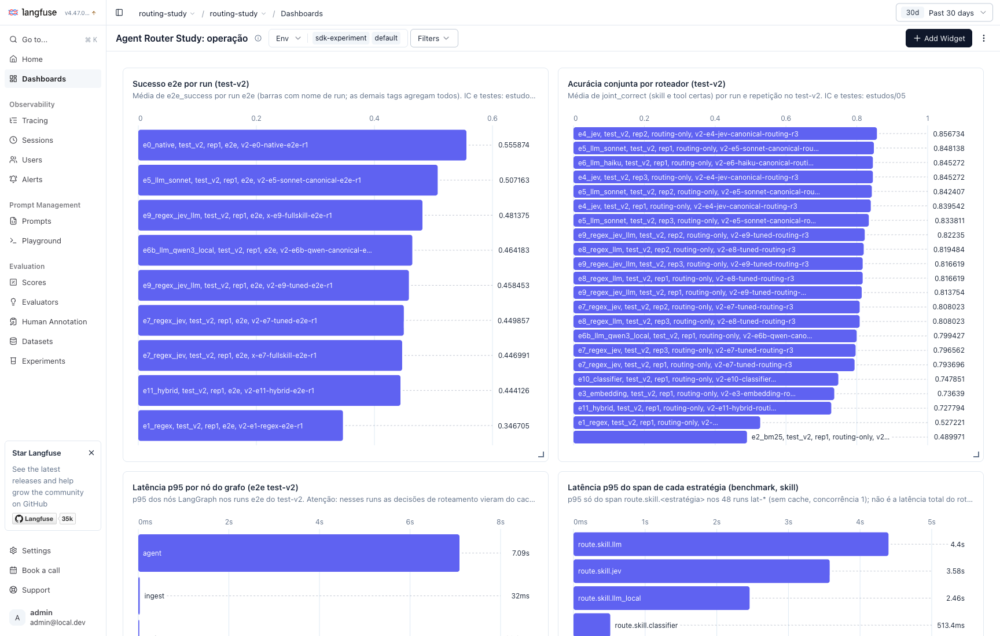
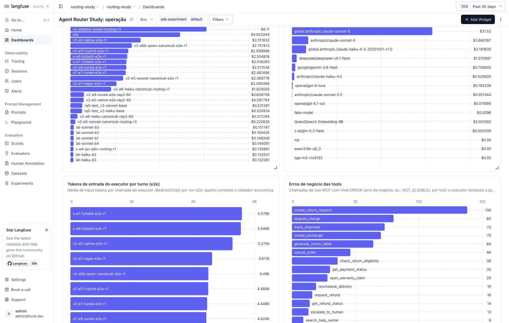
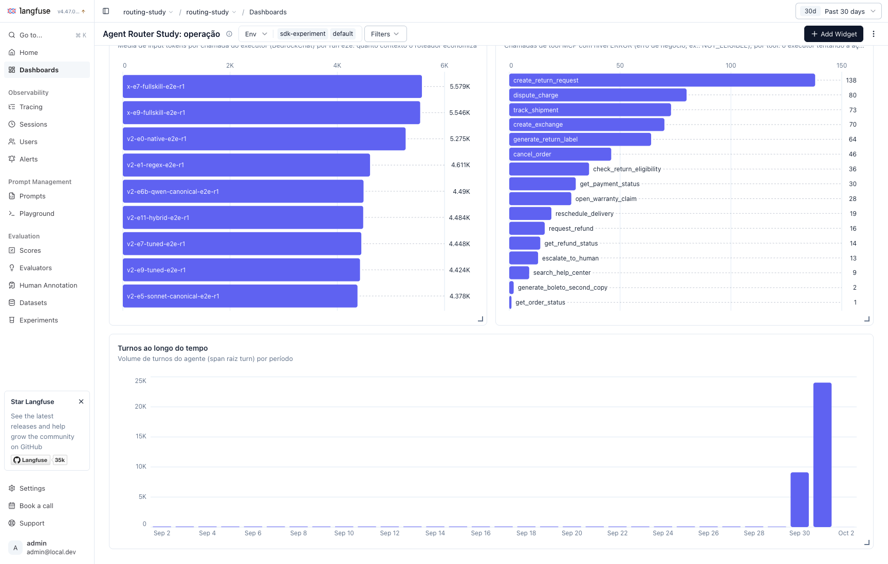

# 13 · Reprodutibilidade

## 1. Artefatos congelados

| Artefato | Valor |
|---|---|
| Código do pré-registro | tag `prereg-v1` → commit `d14816e` |
| Dataset confirmatório | `data/dataset_test_v2.jsonl`, 349 casos, sha256 `6637c4795b2340b953ac5867498c1aeba7953fea25d76b8614de265cf2902a66` |
| Dataset de replicação (exposto) | `data/dataset_test_v1.jsonl` → `dataset_test.jsonl`, sha256 `994d20623384931f9bf06ab9f3ee7028397118b66a7ff0abd800bffeef543a77` |
| Dataset de ajuste | `data/dataset_dev.jsonl`, 151 casos, sha256 `112fc7f0791e35cf1e250a40e362698212f029b4209b6ff7f33dc33717a8874a` |
| Hash do catálogo | `128584617807` |
| Hash do scorer | `e0eef1fb0073` |
| Hash dos prompts do run | `c61ad0a7b7f8` |
| Manifesto principal | `config/study_manifest.yaml`, sha256 `9e4cdb2626213dbb805ae54b0218b7cedd96d81fff920befc2c2c46282836868` (102 entradas; `config_hash`/`prompt_hash` por entrada em [hashes.md](../docs/prereg/hashes.md)) |
| Manifesto exploratório (D-002) | `config/study_manifest_explore.yaml`, sha256 `93694326db6d32a1e9fa5bc16a71ba846dc15dd15589dc837fe822ff0147cf2b` (2 entradas) |
| Seleção de prompts | `config/prompt_selection.yaml`, sha256 `3648a71d90c0c6583b4ab27ce6a1bc7e856b2f29249ce92551e3eb2d34d980fb` |
| Bootstrap | seed 20260930, 10.000 reamostragens, por caso |

Fonte: [prereg-v1.md §1](../docs/prereg/prereg-v1.md). Desvios D-001 a D-003 em
[deviations.md](../docs/prereg/deviations.md): D-001 e D-003 são só de infraestrutura (sem efeito
na análise); D-002 são os dois runs exploratórios com todas as tools expostas.

## 2. Executar os runs

```bash
make up && make up-app            # Langfuse, Redis, servidor MCP
# Ollama local com qwen3:8b-q8_0, qwen3-embedding:8b-q8_0 (+ 0.6b, bge-m3 para as ablações)
# credenciais AWS (cadeia padrão do boto3, região sa-east-1) e OPENROUTER_API_KEY no .env

BUDGET__AWS_USD_CAP=85 uv run study run-manifest config/study_manifest.yaml
uv run study run-manifest config/study_manifest_explore.yaml     # D-002 (exploratório)
```

O `run-manifest` confere o `config_hash`/`prompt_hash` de cada entrada, verifica o orçamento antes
de cada run, retoma por (caso, repetição) e marca como FLAGGED um run com mais de 2% de erros
depois de 2 retentativas. Os logs ficam em `results/final/run-manifest.log` e
`results/final/run-manifest-explore.log`; o status final de cada run está em
[runs_status.md](../docs/results/final/runs_status.md). Com o cache de respostas
(`.cache/responses`) preenchido, repetir os runs não custa nada.

## 3. Regenerar a análise

```bash
uv run python scripts/analysis/final_all.py     # ~50 s; idempotente
```

Lê só `results/rescored/` (a única fonte de números), `results/final/run-manifest.log`, `config/`
e `docs/results/`. As figuras precisam de matplotlib, que não é dependência do projeto: o script
se reexecuta com `uv run --with matplotlib`.

| Tabela / figura | Arquivo | Módulo |
|---|---|---|
| H1–H3, razões de custo | [primary.md](../docs/results/final/primary.md) / `.json` | `final_primary.py` |
| S1–S4 | [secondary.md](../docs/results/final/secondary.md) / `.json` | `final_primary.py` |
| A–K (estratégias, custo, calibração, latência, categorias, repetições, Jev, cascatas, e2e, v1, RQ5) | [estimation.md](../docs/results/final/estimation.md) / `.json` | `final_estimation.py` |
| Matriz enterprise | [enterprise_matrix.md](../docs/results/final/enterprise_matrix.md) | `final_enterprise.py` |
| D-002, análise de erros do e2e, pares confundidos | [exploratory_e2e.md](../docs/results/final/exploratory_e2e.md) / `.json` | `final_exploratory.py` |
| Relatório de registro (`study report`) | [study_report_test_v2.md](../docs/results/final/study_report_test_v2.md) | CLI |
| `estudos/figuras/final-*.png` | — | `final_figures.py`, `final_exploratory.py` |

Comandos de CLI equivalentes para partes isoladas:

```bash
uv run study report --manifest config/study_manifest.yaml --split test_v2   # tabela por run + contrastes
uv run study rq5 config/study_manifest.yaml --split test_v2                 # tabela RQ5
uv run study simulate results/rescored/v2-shadow-tuned-routing-r3.jsonl \
    -c config/experiments/e9_regex_jev_llm.yaml                             # replay de cascata
uv run study rescore results/<run>.jsonl                                    # rescore offline
uv run study budget                                                         # ledger de gastos
```

Busca e seleção de prompts (dev): ver [prompt-apex.md](../docs/prompt-apex.md). Ajuste dos
roteadores livres: [tuning-effort.md](../docs/tuning-effort.md). Limiares das cascatas:
[cascade-thresholds-dev.md](../docs/results/cascade-thresholds-dev.md).

## 4. Gastos

| Escopo | Bedrock (AWS) | OpenRouter |
|---|---|---|
| Estudo final (do congelamento ao fim dos runs; delta do ledger) | **US$ 34,48** (17,63 → 52,11) | **US$ 1,43** (4,40 → 5,83) |
| Projeto inteiro, no ledger (`uv run study budget`) | **US$ 52,11** | **US$ 5,83** |
| OpenRouter antes do ledger existir | — | US$ 10,19 (informado pelo responsável; não verificável a partir do repositório) |

Detalhe do ledger por modelo (`results/spend_ledger.jsonl`, 33.972 chamadas): Sonnet 5
US$ 41,05; Haiku 4.5 US$ 11,06; `typesafe/jev-router` US$ 3,32; geração do test-v2
(`google/gemini-2.5-flash`) US$ 1,65; auditores `deepseek/deepseek-v4-pro` US$ 0,65 e
`openai/gpt-5.6-luna` US$ 0,21. Modelos locais (Ollama) custam US$ 0.

## 5. Observabilidade

Cada turno é um trace no Langfuse local (v4), com spans por nó do grafo, por estratégia de
roteamento e pela chamada MCP. Cada run é um experimento ligado ao dataset do Langfuse.



*Figura 1. Cada run é um experimento ligado ao dataset (aqui, os mais recentes: replicação v1,
exploratórios D-002, RQ5). A coluna "Error Count" do Langfuse conta spans de nível ERROR,
incluindo erros de negócio das tools (por exemplo, `NOT_ELIGIBLE`): nos runs `x-e*-fullskill`,
60 e 65 são esses erros, e não falhas de infraestrutura (0 erros de infraestrutura no
manifesto).*



*Figura 2. Os 349 itens do test-v2, com entrada, saída esperada (tool e argumentos) e metadados.*



*Figura 3. Datasets do projeto: test-v2 com 99 experimentos; o test-v1 usa o dataset original
`routing-study-test` (desvio D-003).*



*Figura 4. Painel principal no dia do run final: custo por modelo (US$ 36,05, que bate com o
ledger) e notas. Os traces raiz `POST /{path}` e `GET /healthz` são o ruído anterior à correção
`a6c4330`; depois dela, esses spans ficam aninhados ou não são exportados.*

### Painel personalizado no Langfuse

O painel **"Agent Router Study: operação"** (Langfuse local → Dashboards) tem 9 widgets montados
para operar e auditar o agente. Os números oficiais, com IC, continuam sendo os de
`docs/results/final/`; o painel é a visão operacional sobre os mesmos traces.

| Widget | Pergunta que responde |
|---|---|
| Sucesso e2e por run (test-v2) | Qual configuração resolve mais turnos de ponta a ponta? (E0 0,556; E9 0,458) |
| Acurácia conjunta por roteador (test-v2) | Qual roteador acerta skill e tool, por run e repetição? |
| Latência p95 por nó do grafo (e2e) | Onde o tempo do turno é gasto? (executor ~7 s; nos runs e2e o roteador veio do cache) |
| Latência p95 do span de cada estratégia | Quanto custa em tempo cada estratégia no estágio skill (benchmark `lat-*`)? |
| Custo por experimento | Quanto custou cada run (roteador + executor)? |
| Custo por modelo | Para onde foi o dinheiro (Sonnet, Haiku, modelos atendidos pelo Jev)? |
| Tokens de entrada do executor (e2e) | Quanto contexto o roteador economiza (≈ 4,4 mil vs 5,3 mil tokens do nativo)? |
| Erros de negócio das tools | Quais tools o executor chama na hora errada (ex.: `NOT_ELIGIBLE`)? |
| Turnos ao longo do tempo | Volume de turnos por dia |



*Figura 5. Painel personalizado, parte 1: sucesso e2e por run e acurácia conjunta por roteador
(test-v2), latência por nó e por estratégia.*



*Figura 6. Parte 2: custo por experimento e por modelo, tokens de entrada do executor e erros de
negócio das tools.*



*Figura 7. Parte 3: tokens do executor por run e2e, erros de negócio por tool e volume de turnos.*

Ressalvas de leitura, também escritas na descrição de cada widget: o widget de latência por
estratégia mede só o span da estratégia no estágio skill, não a latência total do roteador
(capítulo [08](08-economia.md)); "Custo por modelo" inclui o gasto de desenvolvimento (geração e
auditoria do dataset).

Os traces de exemplo já capturados estão no capítulo [07](07-ponta-a-ponta.md).

## 6. Ambiente

- Máquina local: Apple Silicon (Apple M5 Pro, 48 GB), Ollama, concorrência 1 para modelos locais.
- Bedrock em `sa-east-1` com perfis de inferência `global.*`; OpenRouter para Jev, geração e
  auditoria.
- Python 3.12, dependências travadas em `uv.lock`.
