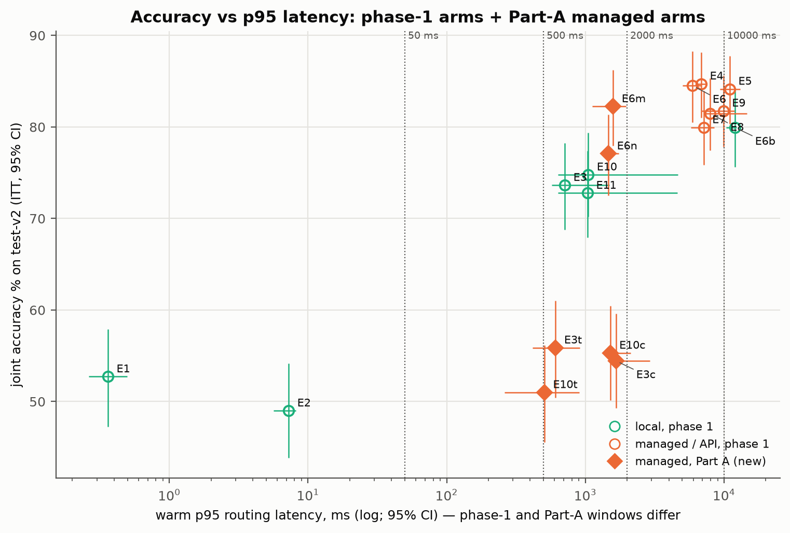
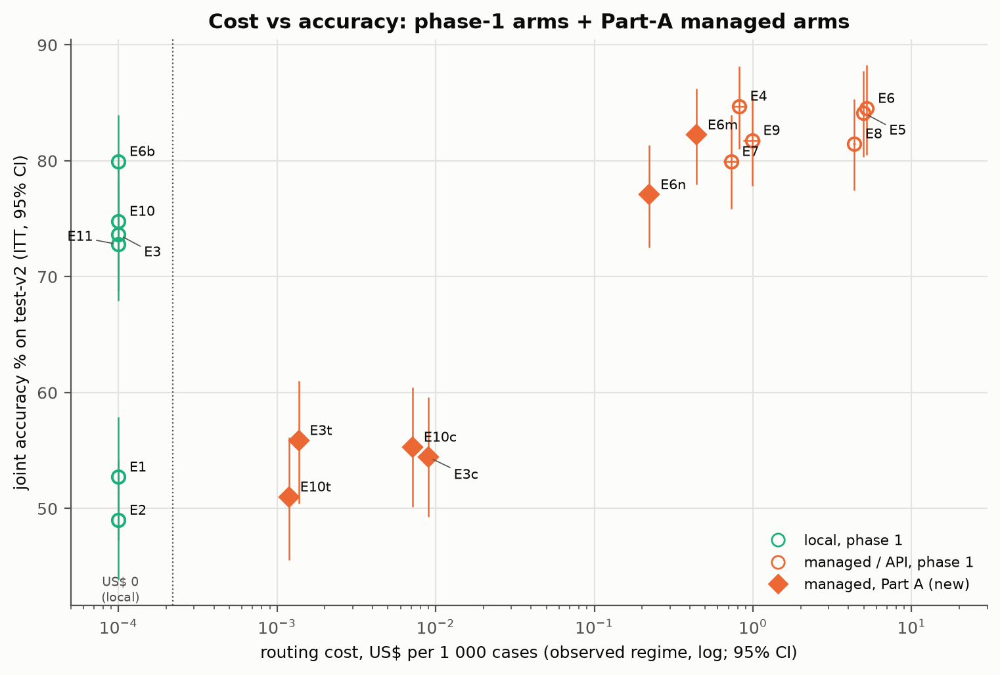
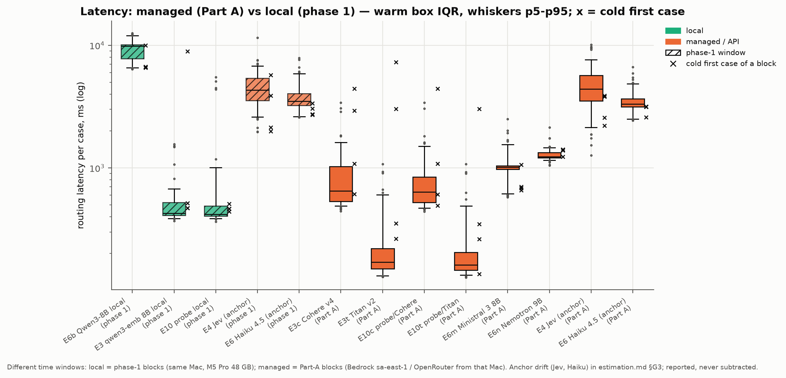

# 14 · Fase 2, Parte A: modelos gerenciados na nuvem (Bedrock) × locais: acurácia, latência e custo

> Split test-v2 (349 casos, pt-BR), catálogo pequeno (18 tools, `catalog_hash` 128584617807),
> só roteamento. Pré-registro na tag `prereg-v2a` ([prereg-v2a.md](../docs/prereg/prereg-v2a.md)).
> Todo número vem de [`docs/results/addendum-a/`](../docs/results/addendum-a/)
> ([primary.md](../docs/results/addendum-a/primary.md),
> [estimation.md](../docs/results/addendum-a/estimation.md),
> [enterprise_matrix.md](../docs/results/addendum-a/enterprise_matrix.md)), gerado por
> `scripts/analysis/addendum_a.py`, ou do registro de ajuste no dev
> ([tuning-effort-l.md §A](../docs/tuning-effort-l.md)).
> IC 95% por bootstrap pareado por caso (10 mil reamostragens, seed 20260930).
> **[C]** confirmatório (família A, pré-registrada) · **[E]** estimativa · **[X]** exploratório.

## 1. Por que esta fase existe

A fase 1 mediu a latência dos roteadores locais numa máquina só (Mac M5 Pro 48 GB, Ollama,
concorrência 1). O Qwen3-8B local deu p95 de ~12 s ([estimation.md §G2](../docs/results/addendum-a/estimation.md); capítulo [08](08-economia.md)). Esse número
descreve aquela máquina, não o modelo: em outro hardware ele seria outro. A latência local
**não generaliza**.

Além disso, a operação alvo não quer inferência local: nada de GPU própria, nada de Ollama. A
pergunta prática passou a ser outra. Existe, num provedor gerenciado (Bedrock, `sa-east-1`), um
substituto para cada roteador local que acerte tanto quanto ele?

## 2. O que foi comparado

Seis braços novos, todos no Bedrock `sa-east-1`, contra os pares locais da fase 1
([prereg-v2a.md §2](../docs/prereg/prereg-v2a.md)):

| Braço novo | Modelo gerenciado | Par local (fase 1) | Papel |
|---|---|---|---|
| E6m | Ministral 3 8B (`mistral.ministral-3-8b-instruct`), P0, temperatura 0 | E6b Qwen3-8B local | LLM roteador, A1 |
| E6n | Nemotron Nano 9B v2 (`nvidia.nemotron-nano-9b-v2`), P0, temperatura 0, `/no_think` | E6b Qwen3-8B local | LLM roteador, A2 |
| E3c | Cohere Embed v4 (`global.cohere.embed-v4:0`, perfil entre regiões) | E3 qwen3-embedding 8B local | roteador por embedding, A3 |
| E3t | Titan Text Embeddings v2 (1024-d) | E3 qwen3-embedding 8B local | roteador por embedding, A4 |
| E10c | sonda linear sobre os vetores do Cohere | E10 sonda local | só estimativa |
| E10t | sonda linear sobre os vetores do Titan | E10 sonda local | só estimativa |

O prompt é o P0 da fase 1 (`prompt_hash` c61ad0a7b7f8), sem busca de prompt. Os embedders e as
sondas usaram as grades da fase 1 sem alteração, ajustadas só no dev (151 casos, CV de 5 folds)
([tuning-effort-l.md §A](../docs/tuning-effort-l.md)).

## 3. Pré-registro e a restrição "nenhum modelo local"

O protocolo foi congelado na tag `prereg-v2a` antes da primeira linha do test-v2 da Parte A
([prereg-v2a.md §1](../docs/prereg/prereg-v2a.md)). Herda tudo da fase 1 (ITT, bootstrap por
caso, Holm dentro da família, latência só do benchmark dedicado, custo em três regimes).

**Restrição da fase 2 (vinculante):** nenhum modelo local foi executado. Os braços locais (E6b,
E3, E10) são **as linhas congeladas da fase 1**, reaproveitadas só para leitura, pareadas nos
mesmos 349 casos e conferidas por sha256 ([primary.md, Provenance](../docs/results/addendum-a/primary.md)).
Para a acurácia isso não muda nada: as linhas locais são determinísticas e os casos são os
mesmos. Para a latência muda: ver a seção 6.

A família A (Holm entre A1–A4, α = 0,05):

- **A1 (não inferioridade, margem 3 pp):** Conjunta(E6m) − Conjunta(E6b) > −3 pp.
- **A2 (não inferioridade, margem 3 pp):** Conjunta(E6n) − Conjunta(E6b) > −3 pp.
- **A3 (bilateral):** Conjunta(E3c) − Conjunta(E3).
- **A4 (bilateral):** Conjunta(E3t) − Conjunta(E3).

Expectativa no dev, que não faz parte do teste: E6m 79,5 e E6n 78,1 contra E6b 82,2; E3c 59,6 e
E3t 60,3 contra E3 77,5 ([tuning-effort-l.md §A](../docs/tuning-effort-l.md)). Já se esperava
que A3 e A4 dessem diferenças negativas grandes.

## 4. Resultados da família A [C]

| Id | Contraste | Δ conjunta pp [IC 95%] | McNemar (só run / só ref) | Holm p | Veredito pré-registrado |
|---|---|---|---|---|---|
| A1 | E6m Ministral − E6b Qwen local | **+2,3 [−2,0; 6,6]** | 34 / 26 | 0,0136 | **não inferior** (limite inferior > −3 pp) |
| A2 | E6n Nemotron − E6b Qwen local | −2,9 [−7,4; 1,7] | 26 / 36 | 0,4722 | **não inferioridade NÃO demonstrada** |
| A3 | E3c Cohere − E3 qwen3-emb local | **−19,2 [−24,6; −14,0]** | 16 / 83 | 0,0004 | diferença: o Cohere é **pior** |
| A4 | E3t Titan − E3 qwen3-emb local | **−17,8 [−23,2; −12,6]** | 20 / 82 | 0,0004 | diferença: o Titan é **pior** |

Fonte: [primary.md, Family A (ITT)](../docs/results/addendum-a/primary.md). Na sensibilidade
sem linhas de erro, o A1 sobe para +2,9 [−1,4; 7,2] (347 casos) e os outros não mudam (mesma
fonte, tabela "error-free cases").

| Braço | Skill % | Tool % dado skill certa | **Conjunta %** [IC 95%] | recall@3 | Linhas de erro |
|---|---|---|---|---|---|
| E6m Ministral 3 8B | 88,5 | 92,9 | **82,2** [77,9; 86,2] | 88,0 | 2 (falha de parse) |
| E6n Nemotron Nano 9B v2 | 85,4 | 90,3 | **77,1** [72,5; 81,4] | 84,2 | 0 |
| E6b Qwen3-8B local (fase 1) | 87,1 | 91,8 | **79,9** [75,6; 84,0] | 86,5 | 0 |
| E3c Cohere Embed v4 | 74,5 | 73,1 | **54,4** [49,3; 59,6] | 70,8 | 0 |
| E3t Titan v2 | 72,8 | 76,8 | **55,9** [50,4; 61,0] | 70,2 | 0 |
| E10c sonda / Cohere **[E]** | 71,1 | 77,8 | **55,3** [50,1; 60,5] | 66,5 | 0 |
| E10t sonda / Titan **[E]** | 70,5 | 72,4 | **51,0** [45,6; 56,2] | 65,0 | 0 |
| E3 qwen3-emb 8B local (fase 1) | 85,1 | 86,5 | **73,6** [68,8; 78,2] | 84,8 | 0 |
| E10 sonda local (fase 1) | 87,1 | 85,9 | **74,8** [70,2; 79,4] | 84,8 | 0 |

Fonte: [estimation.md §A](../docs/results/addendum-a/estimation.md). As sondas sobre vetores
gerenciados também ficam muito abaixo da sonda local: E10c − E10 = −19,5 pp [−24,6; −14,6] e
E10t − E10 = −23,8 pp [−29,2; −18,3] **[E]** ([estimation.md §B](../docs/results/addendum-a/estimation.md)).

**Leitura.**

- **O Ministral 3 8B gerenciado substitui o Qwen3-8B local sem perda demonstrável**: 82,2%
  contra 79,9%, não inferior pela regra do IC e pelo teste com Holm **[C]**.
- O Nemotron fica no limite: a estimativa pontual (−2,9 pp) está quase na margem, e o IC desce
  até −7,4. A não inferioridade não foi demonstrada **[C]**.
- **Os embeddings gerenciados não servem para este roteamento em pt-BR.** Cohere e Titan perdem
  18–19 pp para o qwen3-embedding local, com IC longe de zero **[C]**. O dev já mostrava isso
  (59,6 / 60,3 contra 77,5): a perda aparece nos dois estágios e é maior em `fora_escopo` no
  Cohere ([tuning-effort-l.md §A](../docs/tuning-effort-l.md), "What moved the numbers").

Outros pontos de estimativa **[E]** ([estimation.md §D2, §E, §F](../docs/results/addendum-a/estimation.md)):

- As 2 linhas de erro do E6m são falhas de parse (0,29% das chamadas), contadas como erro (ITT).
- Na repetição de 50 casos, o E6m mudou a decisão em 2 (4,0% [0,0; 10,0]) e o acerto em 1; o
  E6n não mudou nenhuma.
- A confiança do Ministral ordena melhor que a do Qwen local (AURC 0,123 contra 0,181), mas
  nenhum dos 8B gerenciados tem ponto de operação útil com risco ≤ 5% (cobertura 0,9% e 0,0%).

*Figura 1. Acurácia conjunta × latência p95 quente (escala log; IC 95% nos dois eixos; linhas
em 50 ms, 500 ms, 2 s e 10 s). Círculos: braços da fase 1 (verde = local, laranja = API);
losangos: braços gerenciados novos da Parte A. As janelas de medição da fase 1 e da Parte A são
diferentes (seção 6). Fonte: estimation.md §A e §G.*

## 5. Custo [E]

| Braço | US$/1k casos, observado [IC 95%] | Faturado US$/1k | Observação |
|---|---|---|---|
| E6m Ministral 3 8B | 0,441 [0,434; 0,448] | 0,441 | sem preço de cache: igual nos três regimes |
| E6n Nemotron Nano 9B v2 | 0,222 [0,220; 0,225] | 0,222 | idem |
| E3c Cohere Embed v4 | 0,009 [0,008; 0,010] | 0,0045 | o estágio de tool reusa o vetor da consulta |
| E3t Titan v2 | 0,001 [0,001; 0,001] | 0,0007 | idem |
| E10c sonda / Cohere | 0,007 [0,007; 0,008] | 0,0001 | o guarda de orçamento precifica a sonda como grátis |
| E10t sonda / Titan | 0,001 [0,001; 0,001] | 0,0000 | idem |
| Locais (E6b, E3, E10) | 0 | 0 | hardware e energia fora |

Fonte: [estimation.md §A (três regimes) e §C (faturado)](../docs/results/addendum-a/estimation.md).
Nenhum modelo da Parte A tem preço de cache nem leitura de cache observada, então o regime
modelado é igual ao de tabela sem cache.

Para comparação, no mesmo regime observado: E4 Jev 0,818, E6 Haiku 4.5 5,228 e E5 Sonnet 5
4,981 US$/1k ([enterprise_matrix.md §2, Candidates](../docs/results/addendum-a/enterprise_matrix.md)).
**O Ministral custa cerca de metade do Jev e menos de um décimo do Haiku**, com acurácia 2,5 pp
abaixo do Jev (82,2 contra 84,7; sem teste entre os dois).

*Figura 2. Custo de roteamento (US$ por mil casos, regime observado, escala log) × acurácia
conjunta (IC 95%). Os roteadores locais aparecem à esquerda, em US$ 0. Os embeddings gerenciados
custam frações de centavo, mas ficam no patamar do regex. Fonte: estimation.md §A.*

## 6. Latência [E]

Benchmark dedicado, como na fase 1: os mesmos 100 casos estratificados do test-v2 em 4 blocos de
25, braços intercalados por bloco, concorrência 1, caches de resposta desligados. O primeiro caso
de cada bloco é frio e fica à parte; os 96 restantes são quentes. Os âncoras gerenciados (Jev e
Haiku 4.5) foram **rodados de novo na mesma janela** dos braços novos.

### 6.1 Mesma janela: braços novos e âncoras (Parte A)

| Estratégia | Onde | p50 ms [IC 95%] | **p95 ms** [IC 95%] | p99 ms | Frio (mediana / máx) |
|---|---|---|---|---|---|
| E3t Titan v2 | Bedrock | 170 [157; 187] | **610** [416; 910] | 937 | 1687 / 7300 |
| E10t sonda / Titan | Bedrock | 162 [153; 174] | **506** [261; 907] | 934 | 305 / 3020 |
| E3c Cohere v4 | Bedrock (entre regiões) | 650 [594; 780] | **1665** [1466; 2927] | 3077 | 2010 / 4436 |
| E10c sonda / Cohere | Bedrock (entre regiões) | 635 [585; 729] | **1522** [1386; 2128] | 3075 | 844 / 4433 |
| E6m Ministral 3 8B | Bedrock | 1010 [999; 1019] | **1584** [1124; 1958] | 2056 | 691 / 1061 |
| E6n Nemotron 9B | Bedrock | 1236 [1229; 1283] | **1465** [1384; 1744] | 1769 | 1398 / 1413 |
| E4 Jev (âncora) | OpenRouter | 4396 [4131; 4735] | **8128** [6939; 9590] | 9732 | 3191 / 3892 |
| E6 Haiku 4.5 (âncora) | Bedrock | 3311 [3252; 3480] | **4883** [4504; 5594] | 5966 | 3151 / 3166 |

Fonte: [estimation.md §G1](../docs/results/addendum-a/estimation.md). O E6m tem 94 casos
quentes (2 falhas de parse fora) e o Jev 95.

### 6.2 Outra janela: os pares locais (fase 1)

| Estratégia | Onde | p50 ms [IC 95%] | **p95 ms** [IC 95%] |
|---|---|---|---|
| E6b Qwen3-8B local | Mac | 9875 [8726; 9960] | **11983** [10394; 12264] |
| E3 qwen3-emb 8B local | Mac | 427 [419; 436] | **710** [574; 1492] |
| E10 sonda local | Mac | 419 [413; 425] | **1048** [635; 4634] |

Fonte: [estimation.md §G2](../docs/results/addendum-a/estimation.md).

### 6.3 Deriva dos âncoras e diferença gerenciado − local

| Comparação | Δ p50 ms [IC 95%] | Δ p95 ms [IC 95%] |
|---|---|---|
| Deriva: Jev, Parte A − fase 1 | +98 [−354; 542] | +1267 [−212; 2999] |
| Deriva: Haiku 4.5, Parte A − fase 1 | −196 [−350; −18] | −1036 [−2006; 209] |
| E6m Ministral − E6b Qwen local | **−8858** [−8939; −7679] | **−10399** [−10978; −8689] |
| E6n Nemotron − E6b Qwen local | −8639 [−8728; −7491] | −10518 [−10828; −8880] |
| E3t Titan − E3 local | −257 [−271; −240] | −101 [−890; 254] |
| E3c Cohere − E3 local | +223 [167; 353] | +955 [156; 2216] |

Fonte: [estimation.md §G3 e §G4](../docs/results/addendum-a/estimation.md). Pareado nos mesmos
casos quentes. A deriva é reportada e **nunca subtraída**.

**Leitura.**

- **Os 8B gerenciados respondem em ~1,5 s no p95**, contra ~12 s do Qwen local: cerca de 10 s
  a menos, uma diferença muito maior que a deriva dos âncoras (ICs do Δ p95 entre −2,0 e +3,0 s).
- Os 8B gerenciados são os únicos LLMs do estudo com p95 abaixo de 2 s. Haiku (4,9 s) e Jev
  (8,1 s), medidos na mesma janela, ficam bem acima.
- O Titan é tão rápido quanto o embedding local (Δ p95 −101 ms, IC inclui zero); o Cohere é mais
  lento. Velocidade, porém, não salva os embedders: a acurácia (seção 4) os elimina.
- A latência do Cohere inclui o roteamento entre regiões que o Bedrock aplicou; a região que
  serviu não é observável ([estimation.md §H](../docs/results/addendum-a/estimation.md)).

*Figura 3. Latência de roteamento por caso (escala log): caixa = intervalo interquartil dos
casos quentes, bigodes p5–p95, × = primeiro caso frio de cada bloco. Hachurado = janela da fase 1
(locais e âncoras da fase 1); sólido = janela da Parte A. Fonte: estimation.md §G.*

## 7. Leitura enterprise atualizada [E]

Regra pré-registrada ([prereg-v2a.md §3](../docs/prereg/prereg-v2a.md)): uma opção gerenciada
**qualifica** num orçamento de latência quando o limite superior do IC do seu p95 fica abaixo do
orçamento **e** sua acurácia não é inferior à do par local (regra de A1/A2 para os 8B; para os
embedders, o IC de A3/A4 precisa excluir perda maior que 3 pp).

| Gerenciado | Par local | Não inferior? | p95 < 2 s | p95 < 10 s |
|---|---|---|---|---|
| E6m Ministral | E6b | sim (A1) | **qualifica** | **qualifica** |
| E6n Nemotron | E6b | não (A2) | não (acurácia) | não (acurácia) |
| E3c Cohere | E3 | não (A3) | não (p95, acurácia) | não (acurácia) |
| E3t Titan | E3 | não (A4) | não (acurácia) | não (acurácia) |
| E10c / E10t sondas | E10 | não (estimativa) | não | não (acurácia) |

Fonte: [enterprise_matrix.md §1](../docs/results/addendum-a/enterprise_matrix.md). Abaixo de
500 ms nada qualifica.

A mesma lógica da matriz da fase 1 (capítulo [11](11-matriz-enterprise.md)), agora com os seis
braços gerenciados como candidatos, piso de acurácia de **75%**:

| SLO p95 \ teto de custo | US$ 0 | ≤ US$ 0,5 | ≤ US$ 2 | ≤ US$ 10 |
|---|---|---|---|---|
| < 50 ms | nenhuma | nenhuma | nenhuma | nenhuma |
| < 500 ms | nenhuma | nenhuma | nenhuma | nenhuma |
| < 2 s | nenhuma | **E6m** 82,2%, robusto | **E6m** 82,2%, robusto | **E6m** 82,2%, robusto |
| < 10 s | nenhuma | **E6m** 82,2%, robusto | **E4 Jev** 84,7%, robusto | **E4 Jev** 84,7%, robusto |

Fonte: [enterprise_matrix.md §2, "Minimum joint accuracy 75%"](../docs/results/addendum-a/enterprise_matrix.md).
Com piso de 80%, as células do E6m continuam, mas **não robustas** (o IC inferior, 77,9, fica
abaixo do piso); com piso de 85%, nenhuma célula qualifica (mesma fonte).

**O que muda na recomendação.**

- **A linha "p95 < 2 s" deixou de estar vazia.** Na fase 1 nenhuma configuração chegava a 75%
  com p95 abaixo de 2 s ([11 §3](11-matriz-enterprise.md)). Agora o **Ministral 3 8B gerenciado
  (E6m)** chega: 82,2% conjunta, p95 1,6 s, US$ 0,44/1k. É a opção de LLM de baixa latência.
- **Sem inferência local**, o E6m substitui o Qwen3-8B local (E6b) com acurácia não inferior
  **[C, A1]**, ~10 s a menos de p95 e custo de API baixo.
- **Embeddings gerenciados (Cohere v4, Titan v2) não são viáveis para roteamento em pt-BR
  neste catálogo**, nem como roteador nem como base de sonda: 51–56% de conjunta, no patamar do
  regex **[C, A3/A4]**. Quem precisa de embedding sem modelo local não tem, entre os testados,
  um substituto para o qwen3-embedding.
- **Nada muda acima de 2 s:** com teto de US$ 2 ou mais e SLO de 10 s, o E4 Jev continua sendo a
  célula de maior acurácia. A fase 1 também continua valendo para o agente inteiro: nenhum
  roteador superou o nativo de ponta a ponta (capítulo [07](07-ponta-a-ponta.md)). A Parte A
  mede só roteamento.

## 8. Ressalvas

- **Janelas diferentes.** Os braços locais são os blocos `lat-*` da fase 1; os gerenciados são da
  Parte A. Os âncoras rodados nas duas janelas mostram deriva com IC que inclui zero no p95
  (Jev +1,3 s, Haiku −1,0 s), mas o Haiku ficou ~0,2 s mais rápido no p50 com IC que exclui
  zero ([estimation.md §G3](../docs/results/addendum-a/estimation.md)). A deriva não foi
  subtraída.
- **Hardware diferente.** O lado local é um Mac (M5 Pro 48 GB). O lado gerenciado roda no
  hardware do provedor e é chamado desse Mac, passando por rede e fila. A comparação de
  latência é "esta máquina × este provedor", não "modelo × modelo".
- **Reuso do test-v2.** Os analistas já tinham lido os erros da fase 1 no test-v2. Mitigação:
  os braços novos foram ajustados só no dev, com as grades da fase 1, e congelados antes de
  qualquer linha nova ([prereg-v2a.md §9](../docs/prereg/prereg-v2a.md)).
- **Uma repetição por braço** no teste ([primary.md](../docs/results/addendum-a/primary.md)); a variação entre repetições só foi medida em 50 casos (seção 4).
- **Cohere entre regiões:** a região que atendeu não é observável (seção 6).
- **Só roteamento.** A Parte A não roda o agente de ponta a ponta. A matriz é de acurácia de
  roteamento.
- **Grade da fase 1 sem adaptação.** O prefixo de instrução no estilo Qwen custa 5–15 pontos aos
  embedders gerenciados no dev e foi mantido na grade de propósito (a grade escolheu "sem
  instrução" para os dois) ([tuning-effort-l.md §A](../docs/tuning-effort-l.md)). Outras
  representações (fine-tuning, reranker) não foram testadas.

## 9. Reanálise da fase 1 com o scorer simétrico [X]

Para a fase 2 foi escrito um scorer de ponta a ponta que atribui a skill **pelo comportamento**
nos dois braços (roteado e nativo), em vez de usar o rótulo do roteador num braço e o
`load_skill` no outro. Ele foi reaplicado offline às linhas da fase 1, sem custo de API.

- H3 (E9 − E0): **−9,7 pp [−13,5; −6,0]** com o scorer pré-registrado; **−3,2 pp [−6,0; −0,3]**
  com o simétrico. O E0 vai de 55,6% para 56,2% e o E9 de 45,8% para 53,0%.
- Em nenhum braço um sucesso virou falha; a assimetria explicava cerca de dois terços do gap.
- O roteado continua abaixo do nativo, por pouco.

Fonte: [exploratory_e2e_sym.md §1](../docs/results/phase1-sym/exploratory_e2e_sym.md). É
exploratório (post hoc, mesmo split) e **não muda o veredito confirmatório da fase 1**: E0 > E9.
A tabela completa e a leitura estão no capítulo [07 §5.1](07-ponta-a-ponta.md#51-reanálise-com-o-scorer-simétrico-x).
