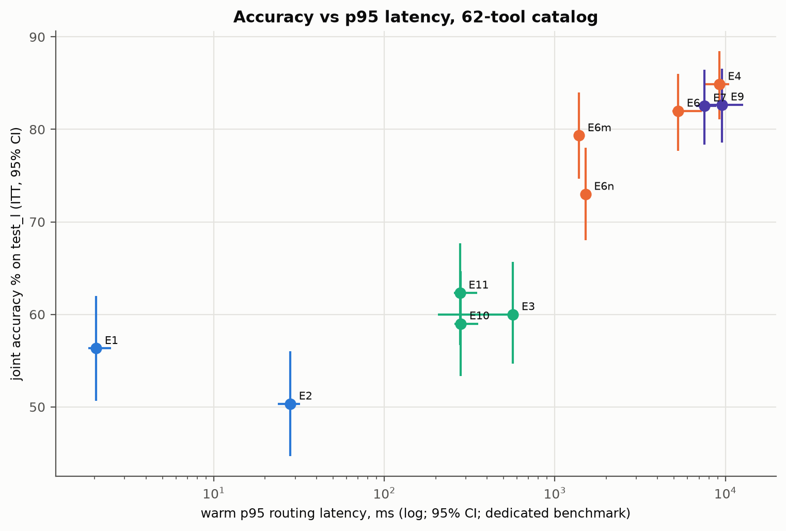
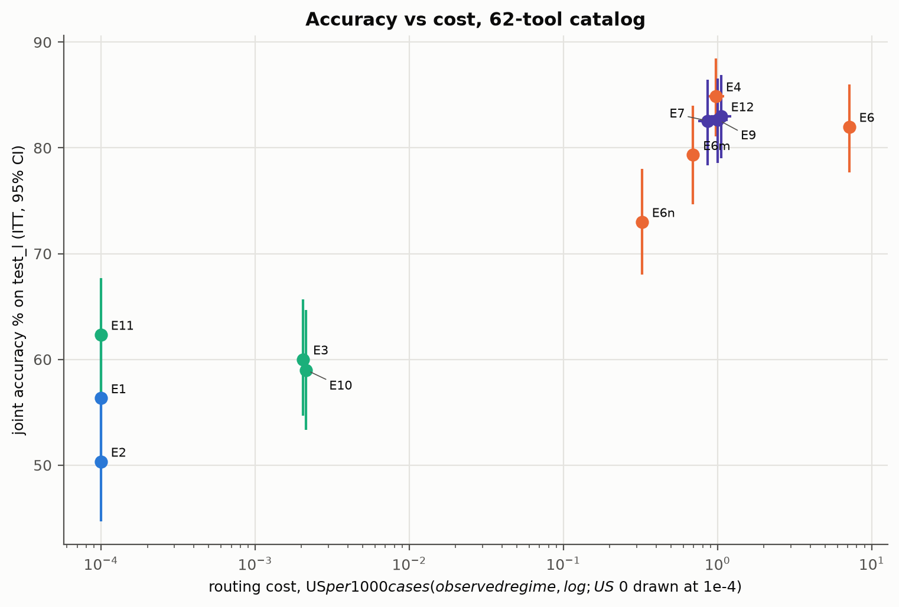
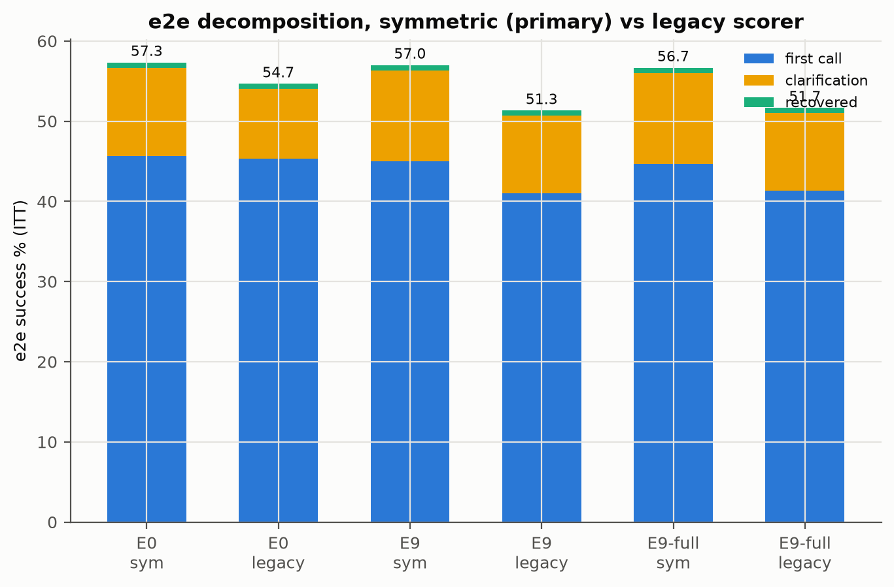
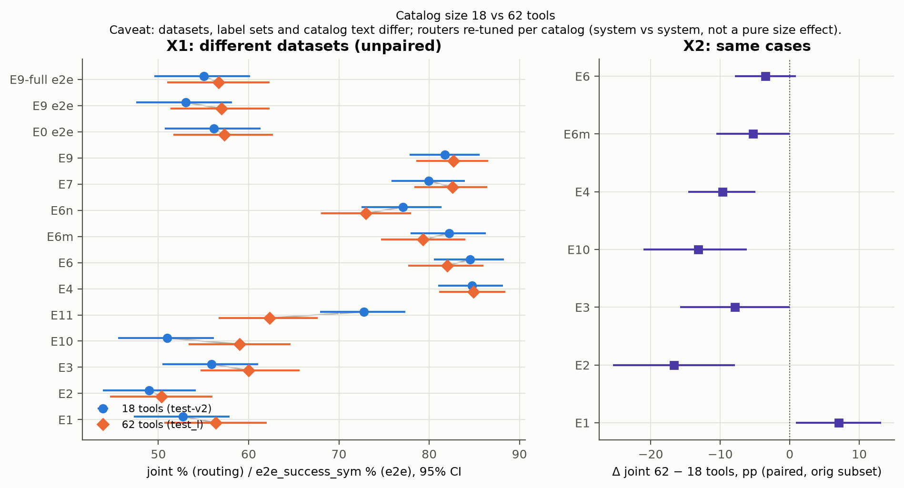

# 15 · Fase 2, Parte B: catálogo grande (62 tools): o roteador passa a valer a pena?

> Split **test-L** (300 casos, pt-BR), catálogo grande (62 tools em 10 skills + globais,
> `catalog_hash` bc7cd75fce87). Pré-registro na tag `prereg-v2`
> ([prereg-v2.md](../docs/prereg/prereg-v2.md)), executado uma vez (73/73 runs COMPLETE, 0 erros
> no log do manifesto). Todo número de resultado vem de
> [`docs/results/phase2-b/`](../docs/results/phase2-b/)
> ([primary.md](../docs/results/phase2-b/primary.md),
> [secondary.md](../docs/results/phase2-b/secondary.md),
> [estimation.md](../docs/results/phase2-b/estimation.md),
> [catalog_size.md](../docs/results/phase2-b/catalog_size.md)), gerado por
> `scripts/analysis/phase2_b.py` sem alteração desde a tag. Os números de desenho (dataset,
> auditoria, ajuste) vêm do [dataset-card.md](../docs/dataset-card.md), do
> [catalog-large.md](../docs/catalog-large.md) e do [prereg-v2.md](../docs/prereg/prereg-v2.md), citados
> onde aparecem. IC 95% por bootstrap pareado por caso (10 mil reamostragens, seed 20260930).
> **[C]** confirmatório (pré-registrado, Holm) · **[E]** estimativa · **[X]** exploratório.

## 1. Por que esta parte existe

A fase 1 respondeu "não vale ter roteador" num catálogo de **18 tools e 3 skills** (capítulo
[07](07-ponta-a-ponta.md)), e o próprio estudo marcou isso como a principal limitação externa:
nesse tamanho o agente nativo tende a ser forte, e as conclusões "não se estendem
automaticamente" a catálogos maiores (capítulo [12](12-limitacoes.md)). A Parte B testa
justamente esse ponto. Com **62 tools**, muitas delas parecidas de propósito, o agente nativo
precisa escolher entre 10 skills e o contexto do executor cresce. Se existe um tamanho em que
o roteador começa a compensar, ele deveria aparecer aqui.

A restrição da fase 2 continua valendo: **nenhum modelo local** foi executado (sem Ollama). Tudo
roda no Bedrock, menos o Jev, que roda no OpenRouter. O Sonnet 5 nunca é roteador sozinho no
test-L: aparece só como último passo das cascatas E9-L/E12-L e como executor
([prereg-v2.md §0](../docs/prereg/prereg-v2.md)).

## 2. O desenho

### 2.1 O catálogo: 62 tools, 12 grupos confundíveis

O perfil `large` do servidor MCP serve 3 skills originais × 5 tools + 7 skills novas × 6 tools
+ 5 globais = **62 tools** ([catalog-large.md](../docs/catalog-large.md)). As 18 tools da fase 1
continuam lá, com o mesmo código; as cópias servidas no perfil grande só ganham ponteiros "NÃO
USE PARA" apontando para as irmãs novas. Duas das skills novas são de um domínio adjacente
(fidelidade/cashback e cartão da loja/crediário).

As tools novas foram desenhadas para colidir com as antigas. São 12 grupos confundíveis, cada um
com uma regra de desambiguação no SKILL.md correspondente:

| Grupo | Gatilho | Tools que competem |
|---|---|---|
| G1 | "cobrança errada" | dispute_charge / contest_card_transaction / open_seller_mediation |
| G2 | "2ª via" | generate_boleto_second_copy / generate_card_bill_copy / get_card_bill |
| G3 | "o dinheiro/crédito não caiu" | get_refund_status / get_cashback_status / claim_missing_points |
| G4 | "cancelar" | cancel_order / cancel_subscription / cancel_service_order |
| G5 | "mudar a data" | reschedule_delivery / change_subscription_date / reschedule_technical_visit |
| G6 | "onde está" | track_shipment / track_seller_shipment |
| G7 | "defeito" | open_warranty_claim / request_technical_visit / check_extended_warranty |
| G8 | "mudar meus dados" | update_delivery_address / update_billing_data / update_contact_info |
| G9 | "baixou o preço" | request_price_protection / request_refund |
| G10 | "devolver produto de vendedor parceiro/PJ" | create_return_request / issue_return_invoice / open_seller_mediation |
| G11 | "comprovante" | get_payment_status / get_purchase_receipt / get_invoice |
| G12 | "cupom/vale" | validate_coupon / report_coupon_not_applied / redeem_gift_card |

Fonte: [catalog-large.md §2](../docs/catalog-large.md). O catálogo pequeno da fase 1 ficou
intacto (`catalog_hash` 128584617807), o que permite a comparação pareada da seção 11.

### 2.2 dev-L, test-L e a auditoria

- **dev-L** (150 casos) serviu só para ajuste: regras de regex, grades de BM25/embedding/sonda,
  limiares das cascatas e mapas de calibração ([prereg-v2.md §5](../docs/prereg/prereg-v2.md)).
- **test-L** (300 casos) foi gerado **depois** do congelamento das configs, com o mesmo gerador
  (Kimi K2.5 no Bedrock, família diferente de todos os roteadores e auditores), seed 20261009 e
  cotas fixas: direto 90, paráfrase 75, ambíguo 60, multiturno 30, fora de escopo 30,
  adversarial 15. Os casos de rótulo único cobrem as 62 tools; os 60 ambíguos cobrem G1–G12 (45)
  e os grupos da fase 1 (15). A deduplicação foi feita contra os 849 casos da fase 1 e os 150 do
  dev-L, com 0 colisões no relatório de sobreposição ([dataset-card.md, test-L](../docs/dataset-card.md)).
- **Auditoria cega** por dois modelos de outras famílias (gpt-oss-120b e DeepSeek V3.2), com a
  mesma regra de adjudicação do dev-L: κ de 0,22 na aceitação do gold (concordância bruta 0,80,
  efeito de prevalência) e κ de 0,85 na primeira tool proposta; decisões
  manter/corrigir/sinalizar = 203/12/85 (mesma fonte). Os 85 sinalizados entram numa
  sensibilidade (seção 4).
- **Subconjunto "orig"**: casos cujas tools aceitáveis estão todas entre as 18 originais, ou que
  são fora de escopo. São **114** dos 300 ([catalog_size.md §X2](../docs/results/phase2-b/catalog_size.md)).

## 3. Pré-registro e o scorer simétrico

O protocolo foi congelado na tag `prereg-v2` **antes da primeira linha do test-L**: configs,
limiares, mapas de calibração, prompt P0 (`prompt_hash` c61ad0a7b7f8), catálogo, scorers,
manifesto (73 entradas, sha256 788fac36…), arquivos de ids e o script de análise
([prereg-v2.md §1](../docs/prereg/prereg-v2.md)). O `phase2_b.py` foi escrito antes do test-L
(commit 27cacee) e, na tag, só diferia disso pelo bloco de constantes do congelamento. A análise
deste capítulo é esse script, rodado duas vezes com saídas `.md`/`.json` idênticas byte a byte.

**O scorer simétrico.** Na fase 1 o `e2e_success` pontuava o roteado pelo **rótulo do
roteador** e o nativo pelo **comportamento** (a skill carregada). A reanálise exploratória
mostrou que essa assimetria explicava cerca de dois terços do gap de H3 (capítulo
[14 §9](14-fase2-nuvem.md#9-reanálise-da-fase-1-com-o-scorer-simétrico-x)). Para a fase 2, o
scorer primário de ponta a ponta passou a ser o `e2e_success_sym` (`scorers_sym.py`,
5ad0f65296e4): a skill é atribuída **pelo que o executor fez**, igual nos dois braços (a skill da
primeira tool de negócio executada; senão, a da tool creditada por uma clarificação; senão,
abstenção ou global). Ele nunca lê o rótulo do roteador nem o campo `native`
([prereg-v2.md §4](../docs/prereg/prereg-v2.md)). O scorer antigo (legacy, e0eef1fb0073) continua
sendo o de roteamento e aparece no e2e como sensibilidade, lado a lado. Os dois são aplicados aos
mesmos bytes brutos, e o script confere isso.

Hipóteses primárias (Holm entre as três, α = 0,05):

- **H1-L (bilateral, e2e):** e2e_success_sym(E9-L) − e2e_success_sym(E0-L). Afirmação direcional
  só se o IC excluir zero. Co-primária: razão de custo por turno E9-L/E0-L.
- **H2-L (não inferioridade, 3 pp):** Conjunta(E6m Ministral 3 8B) − Conjunta(E6 Haiku 4.5) > −3 pp.
  Reespecificada pela restrição de 2026-10-02 (o par local do rascunho não roda mais).
  Co-primária: razão de p95 E6m/E6.
- **H3-L (não inferioridade, 3 pp):** Conjunta(E4 Jev) − Conjunta(E6 Haiku 4.5) > −3 pp.

Expectativa no dev-L, que não faz parte do teste: E9-L 86,0, E4 86,7, E6 84,0, E6m 78,7; no
dev-L (40 casos de validação), E9-L 60,0 e E0-L 65,0 de `e2e_success_sym`
([prereg-v2.md §3](../docs/prereg/prereg-v2.md)). A menor diferença detectável esperada para H1-L,
com ~300 casos, era de 5,5–7,5 pp (mesma fonte).

**Desvio.** Um só, de infraestrutura: o Redis do host foi morto por falta de memória por ~811 mil
checkpoints antigos do LangGraph; as chaves foram apagadas com aprovação do responsável e o
manifesto foi retomado por (caso, repetição). Nenhuma config, rótulo, scorer ou limiar mudou
(**D-L01**, [deviations-v2.md](../docs/prereg/deviations-v2.md)).

## 4. Resultados primários [C]

| Id | Contraste | n | Δ pp [IC 95%] | McNemar (só run / só ref) | Holm p | Veredito pré-registrado |
|---|---|---|---|---|---|---|
| **H1-L** | E9-L − E0-L, `e2e_success_sym` | 300 | **−0,3 [−4,0; 3,3]** | 16 / 17 | 1 | IC inclui 0: **sem afirmação direcional** |
| **H2-L** | E6m Ministral − E6 Haiku, conjunta | 300 | **−2,7 [−7,0; 1,7]** | 18 / 26 | 0,8795 | **não inferioridade NÃO demonstrada** |
| **H3-L** | E4 Jev − E6 Haiku, conjunta | 300 | **+2,9 [−0,7; 6,6]** | 26 / 12 | 0,0027 | **não inferior** (limite inferior > −3 pp) |

Fonte: [primary.md, Primary family](../docs/results/phase2-b/primary.md).

| Co-primária | Numerador [IC 95%] | Denominador [IC 95%] | Razão [IC 95%] |
|---|---|---|---|
| H1-L: custo por turno E9-L / E0-L (US$/1k turnos, observado) | 11,192 [10,390; 12,007] | 10,164 [9,407; 10,964] | **1,101 [1,014; 1,196]** |
| H2-L: p95 E6m / E6 (ms, benchmark dedicado) | 1383 [1360; 1410] | 5278 [4881; 7287] | **0,262 [0,189; 0,283]** |

Fonte: [primary.md, Co-primary estimates](../docs/results/phase2-b/primary.md).

**Leitura.**

- **H1-L:** com 62 tools, o agente roteado e o nativo resolvem a mesma fração de turnos: 57,0%
  [51,3; 62,3] contra 57,3% [51,7; 62,7]. O IC vai de −4,0 a +3,3 pp **[C]**. O estudo não mostra
  que o roteador ajuda nem que atrapalha. O IC é mais estreito que a diferença detectável
  prevista, então um efeito grande (≥ 5 pp em qualquer direção) fica improvável; um efeito
  pequeno não pode ser descartado. Isso não prova equivalência: a equivalência pré-registrada é
  a S2, na seção 5.
- **No custo, o roteador sai mais caro**: +10% por turno no regime observado, com IC que exclui
  1 **[C, co-primária]**. A seção 7 explica por quê: o cache de prompt do executor.
- **H2-L:** o Ministral 3 8B acerta 79,3% contra 82,0% do Haiku; a não inferioridade **não foi
  demonstrada** **[C]**. Na Parte A (18 tools), o Ministral tinha igualado o Qwen local; contra
  o Haiku no catálogo grande, o IC desce até −7,0 pp. O Ministral responde em ~1/4 do tempo do
  Haiku no p95 **[C, co-primária]**.
- **H3-L:** o **Jev é não inferior ao Haiku 4.5** (84,9% contra 82,0%; Holm p 0,0027) **[C]**, a
  ~1/7 do custo de roteamento (seção 7).

### 4.1 Sensibilidades [E]

| Variante | H1-L Δ pp [IC 95%] | H2-L Δ pp [IC 95%] | H3-L Δ pp [IC 95%] |
|---|---|---|---|
| Scorer legacy (assimétrico) | −3,3 [−7,7; 1,0] | – | – |
| Conjunta só com o primeiro rótulo | −0,3 [−4,0; 3,3] | −6,0 [−10,0; −2,0] | +0,6 [−3,1; 4,2] |
| Sem os ambíguos (n = 240) | −2,1 [−4,6; 0,4] | −5,0 [−9,2; −0,8] | −0,1 [−3,8; 3,3] |
| Só os ambíguos (n = 60) | +6,7 [−8,3; 21,7] | +6,7 [−6,7; 20,0] | +15,0 [4,4; 26,1] |
| Sem os 85 sinalizados pela auditoria (n = 215) | −1,9 [−6,0; 2,3] | −4,7 [−9,3; 0,0] | +2,2 [−1,4; 5,9] |

Fonte: [primary.md, Sensitivities e H1-L legacy](../docs/results/phase2-b/primary.md).

- **H1-L não muda de veredito com nenhum dos dois scorers.** Com o legacy, o roteado perde 3,3 pp,
  mas o IC também inclui zero. O scorer simétrico só move turnos de falha para sucesso (17 no E9,
  8 no E0, nenhum no sentido contrário), e o veredito pareado muda em 21 casos (mesma fonte).
- **H3-L é frágil fora da métrica principal:** com o primeiro rótulo ou sem os ambíguos, a
  vantagem do Jev some e a não inferioridade deixa de valer. Ela vem sobretudo dos ambíguos
  (+15,0 pp), onde o Jev escolhe melhor entre os vários rótulos aceitáveis.
- **H2-L piora nas sensibilidades:** sem os ambíguos ou com o primeiro rótulo, o IC do Ministral
  exclui zero do lado negativo.

## 5. Secundárias [C]

| Id | Contraste | n | Δ pp [IC 95%] | Holm p | Veredito |
|---|---|---|---|---|---|
| S1 | E9-L-fullskill − E9-L, e2e sym (unilateral, > 0) | 300 | −0,3 [−2,7; 1,7] | 0,7256 | sem ganho: o D-002 **não se confirma** |
| S2 | E9-L − E0-L nos casos com as mesmas chamadas de negócio (TOST ±3 pp) | 225 | +1,8 [0,4; 3,6] | 0,1518 | **inconclusivo** |
| S3 | regex: test-L − CV no dev-L (82,7%) | 300 | −26,4 [−32,0; −20,7] | – (só IC) | o regex **cai** fora do dev |
| S4 | E3 embedding Titan − E1 regex | 300 | +3,7 [−3,3; 10,3] | 0,343 | IC inclui 0 |
| S7 | E10 sonda Titan − E4 Jev | 300 | −25,9 [−31,7; −20,0] | 0,0002 | a sonda é **pior** |

Fonte: [secondary.md](../docs/results/phase2-b/secondary.md). S5 e S6 foram retiradas da
família antes do teste: o braço de referência delas era local.

- **S2:** nos 225 casos em que os dois agentes fizeram exatamente as mesmas chamadas, o roteado
  fica +1,8 pp acima (4 casos só dele, 0 só do nativo); o IC de 90% não cabe em ±3 pp, então a
  equivalência fica inconclusiva **[C]**. Com o scorer simétrico, quase não sobra diferença
  quando o comportamento é o mesmo.
- **S3:** as regras de regex escritas lendo o dev-L acertam 56,3% no test-L, 26,4 pp abaixo do
  dev-L. É o mesmo padrão da fase 1 (−32,1 pp, capítulo [05](05-resultados-roteamento.md)).

## 6. Acurácia de roteamento por braço [E]

| Braço | Repetições | Skill % | Tool % dado skill certa | **Conjunta %** [IC 95%] | Primeiro rótulo % | recall@3 | Linhas de erro |
|---|---|---|---|---|---|---|---|
| E1 regex | 1 | 79,7 | 70,7 | **56,3** [50,7; 62,0] | 54,7 | 65,7 | 0 |
| E2 BM25 | 1 | 68,7 | 73,3 | **50,3** [44,7; 56,0] | 45,3 | 65,0 | 0 |
| E3 embedding Titan v2 | 1 | 74,0 | 81,1 | **60,0** [54,7; 65,7] | 54,7 | 72,0 | 0 |
| E10 sonda sobre Titan | 1 | 72,3 | 81,6 | **59,0** [53,3; 64,7] | 54,3 | 69,7 | 0 |
| E11 híbrido regex + sonda | 1 | 80,7 | 77,3 | **62,3** [56,7; 67,7] | 60,0 | 77,3 | 0 |
| E4 Jev | 3 | 91,4 | 92,8 | **84,9** [81,1; 88,4] | 78,9 | 90,2 | 1 |
| E6 Haiku 4.5 | 1 | 92,0 | 89,1 | **82,0** [77,7; 86,0] | 78,3 | 91,3 | 0 |
| E6m Ministral 3 8B | 1 | 83,3 | 95,2 | **79,3** [74,7; 84,0] | 72,3 | 83,0 | 1 |
| E6n Nemotron Nano 9B v2 | 1 | 82,0 | 89,0 | **73,0** [68,0; 78,0] | 67,7 | 80,0 | 11 |
| E7-L regex → Jev | 3 | 89,7 | 92,1 | **82,6** [78,3; 86,4] | 77,2 | 88,1 | 0 |
| E9-L regex → Jev → Sonnet | 3 | 89,7 | 92,2 | **82,7** [78,6; 86,6] | 77,2 | 88,1 | 0 |
| E12-L híbrido → Jev → Sonnet **[X]** | 3 | 90,1 | 92,1 | **83,0** [79,0; 86,9] | 77,4 | 88,8 | 0 |

Fonte: [estimation.md §A](../docs/results/phase2-b/estimation.md). As linhas de erro são todas
falhas de parse da saída estruturada, contadas como erro (ITT); o Nemotron tem 3,7% [1,7; 6,0]
([estimation.md §H](../docs/results/phase2-b/estimation.md)).

- **Dois patamares, como na fase 1.** Os roteadores sem LLM ficam entre 50% e 62%; os LLMs e as
  cascatas, entre 73% e 85%. O melhor sem LLM (E11, 62,3%) fica 22,6 pp abaixo do Jev.
- **As cascatas não superam o Jev sozinho.** E7-L e E9-L ficam um pouco abaixo do E4 (82,6–82,7
  contra 84,9), porque o regex decide 60% dos casos com 91,1% de acerto de skill e o resto vai
  para o Jev (seção 9). O Sonnet no fim do E9-L quase nunca é chamado.
- **Abstenção:** o Jev tem precisão de 90,6% e recall de 89,7% em abster; o BM25 só abstém em
  14,3% dos casos que pediam abstenção (mesma fonte, §A).
- **Por categoria** ([estimation.md §I](../docs/results/phase2-b/estimation.md)): o Jev é o mais
  forte em ambíguos (81,7%) e o Haiku cai para 66,7% ali; em multiturno, o melhor é o Nemotron
  (83,3%); a sonda E10 erra todos os 30 multiturno (0,0%).
- **Repetições a temperatura 0** ([estimation.md §G](../docs/results/phase2-b/estimation.md)):
  regex e Haiku não mudaram nenhuma decisão; Ministral e Nemotron mudaram 1 de 50 cada.

*Figura 1. Acurácia conjunta no test-L × latência p95 quente do benchmark dedicado (escala log;
IC 95% nos dois eixos). Azul: léxicos; verde: Bedrock (vetores); laranja: LLMs; roxo: cascatas.
O E12-L não tem bloco de latência. Fonte: estimation.md §A e §D.*

## 7. Custo [E]

### 7.1 Roteamento

| Braço | US$/1k casos, observado [IC 95%] | Tabela sem cache [IC 95%] |
|---|---|---|
| E1 regex, E2 BM25, E11 híbrido | 0,000 | 0,000 |
| E3 embedding / E10 sonda (Titan) | 0,002 | 0,002 |
| E6n Nemotron | 0,324 [0,320; 0,327] | idem |
| E6m Ministral | 0,694 [0,685; 0,704] | idem |
| E7-L regex → Jev | 0,864 [0,747; 0,996] | idem (Jev: custo reportado) |
| E4 Jev | 0,977 [0,855; 1,109] | idem (Jev: custo reportado) |
| E9-L regex → Jev → Sonnet | 1,003 [0,859; 1,160] | 1,200 [0,994; 1,424] |
| E12-L híbrido → Jev → Sonnet | 1,054 [0,897; 1,226] | 1,261 [1,042; 1,501] |
| E6 Haiku 4.5 | 7,154 [7,067; 7,240] | 7,154 [7,067; 7,240] |

Fonte: [estimation.md §A, custo em três regimes](../docs/results/phase2-b/estimation.md). O Haiku
não usa cache: o prompt de roteamento tem em média 2.732 tokens, abaixo do mínimo de 4.096 do
Bedrock, e nenhuma das 600 chamadas leu ou escreveu cache **[X]**
([catalog_size.md §X3](../docs/results/phase2-b/catalog_size.md)). **O Jev acerta mais que o Haiku
por cerca de 1/7 do preço.**

*Figura 2. Custo de roteamento (US$ por mil casos, regime observado, escala log; os braços de
US$ 0 aparecem em 1e-4) × acurácia conjunta (IC 95%). O rótulo do eixo x sai com um defeito de
renderização do matplotlib (os "$" são lidos como fórmula): o script está congelado e não foi
editado. Fonte: estimation.md §A.*

### 7.2 Por turno, ponta a ponta

| Run | Total observado [IC 95%] | Roteamento | Executor | Total sem cache [IC 95%] | Tokens de prompt do executor por turno |
|---|---|---|---|---|---|
| E0-L nativo | 10,16 [9,41; 10,96] | 0,00 | 10,16 | 39,95 [38,03; 41,90] | 18254 [17363; 19152] |
| E9-L roteado (top-2) | 11,19 [10,39; 12,01] | 0,98 | 10,21 | 24,46 [23,49; 25,45] | 10067 [9669; 10475] |
| E9-L todas as tools da skill | 8,90 [8,32; 9,49] | 0,98 | 7,91 | 29,36 [28,10; 30,61] | 12477 [11916; 13038] |

US$ por mil turnos. Fonte: [estimation.md §F, Cost per turn](../docs/results/phase2-b/estimation.md).

- **O roteador quase corta pela metade o contexto do executor** (10.067 contra 18.254 tokens de prompt por
  turno), mas no regime observado o executor custa o mesmo nos dois braços (10,21 contra 10,16).
  O prefixo do nativo é estável e é lido do cache do Bedrock; o do roteado muda com as tools
  expostas e aproveita menos o cache. Somado o custo do roteamento, o roteado sai **10% mais
  caro** (H1-L co-primária).
- **Sem desconto de cache, a conta se inverte:** 24,46 contra 39,95 US$/1k turnos, cerca de 39%
  a menos para o roteado (razão das médias, calculada da tabela acima, sem IC). Quem não tem cache
  de prompt (outro provedor, tráfego baixo com o cache expirando) vê o roteador como economia.
- O E9-L com todas as tools da skill é o mais barato no regime observado (8,90), apesar de usar
  mais tokens que o top-2. A explicação mais provável é a mesma: o conjunto de tools por skill é
  estável e reaproveita o cache. É uma leitura **[X]**, não medida diretamente.

## 8. Latência [E]

Benchmark dedicado, como nas fases anteriores: 100 casos estratificados do test-L em 4 blocos de
25, braços intercalados, concorrência 1, caches de resposta desligados. O primeiro caso de cada
bloco é frio e fica à parte.

| Estratégia | p50 ms [IC 95%] | **p95 ms** [IC 95%] | Frio (mediana / máx) | Linhas de erro |
|---|---|---|---|---|
| regex | 1,14 [1,01; 1,28] | **2,04** [1,84; 2,49] | 2 / 4 | 0 |
| BM25 | 14 [12; 15] | **28** [24; 32] | 34 / 50 | 0 |
| sonda (classifier, Titan) | 144 [139; 148] | **280** [258; 355] | 246 / 311 | 0 |
| híbrido | 144 [139; 148] | **277** [256; 351] | 246 / 311 | 0 |
| embedding Titan | 146 [141; 150] | **567** [206; 596] | 291 / 23753 | 0 |
| E6m Ministral | 873 [852; 1055] | **1383** [1360; 1410] | 870 / 895 | 0 |
| E6n Nemotron | 1331 [1299; 1359] | **1510** [1482; 1595] | 1540 / 2328 | 5 |
| E6 Haiku 4.5 | 3727 [3637; 3834] | **5278** [4881; 7287] | 3054 / 3297 | 0 |
| E7-L regex → Jev | 3315 [2661; 3992] | **7542** [6735; 8858] | 3266 / 5720 | 1 |
| E4 Jev | 4895 [4537; 5528] | **9193** [7450; 10554] | 5919 / 8145 | 1 |
| E9-L regex → Jev → Sonnet | 3391 [2732; 3894] | **9552** [7659; 12719] | 3876 / 5813 | 0 |

Fonte: [estimation.md §D](../docs/results/phase2-b/estimation.md). Um primeiro caso frio do
embedding levou 23,8 s (máximo da coluna fria); fica fora do p95 quente por desenho.

- **Só os 8B gerenciados ficam abaixo de 2 s entre os LLMs** (Ministral 1,4 s, Nemotron 1,5 s no
  p95). O Haiku leva 5,3 s, e o Jev e as cascatas, 7,5–9,6 s.
- **A cascata não economiza tempo de cauda:** o regex resolve 60% dos casos em ~1 ms, o que baixa
  o p50 do E9-L para 3,4 s, mas o p95 (9,6 s) é o do Jev.
- Os números são de uma janela e de uma máquina chamando o provedor (rede e fila incluídas); não
  são comparáveis diretamente com os de outras janelas (capítulo [14 §8](14-fase2-nuvem.md#8-ressalvas)).

## 9. Calibração e cobertura das cascatas [E]

### 9.1 Calibração e predição seletiva

| Braço | Nível | Brier / ECE bruto | Brier / ECE em produção | AURC | Cobertura % com risco ≤ 5% |
|---|---|---|---|---|---|
| E4 Jev | skill | 0,076 / 0,049 | 0,073 / 0,051 | 0,039 | 68,7 |
| E9-L | skill | 0,093 / 0,058 | 0,089 / 0,057 | 0,044 | 67,3 |
| E6 Haiku 4.5 | skill | 0,079 / 0,088 | 0,074 / 0,094 | 0,088 | 0,0 |
| E6m Ministral | skill | 0,155 / 0,153 | 0,134 / 0,207 | 0,177 | 0,0 |
| E11 híbrido | skill | 0,137 / 0,103 | 0,128 / 0,060 | 0,162 | 13,7 |
| E1 regex | skill | 0,152 / 0,115 | 0,137 / 0,107 | 0,355 | 0,0 |

Fonte: [estimation.md §B e §C](../docs/results/phase2-b/estimation.md) (AURC e cobertura sobre a
conjunta, confiança = mín(skill, tool)).

- **A confiança do Jev é a única que serve para operar com risco controlado:** com risco ≤ 5%, o
  Jev ainda responde 68,7% dos casos. Haiku e Ministral não têm nenhum ponto de operação assim,
  como na Parte A.
- **Os mapas de calibração do dev-L nem sempre funcionaram no teste.** No Ministral e no
  Nemotron, o mapa aplicado aumentou o ECE (Ministral, skill: 0,153 → 0,207); no BM25 e no
  híbrido, reduziu bem (BM25, skill: 0,527 → 0,078).

### 9.2 Quem decide em cada passo

| Cascata | Estágio | Resolvido por | Parcela % | Acerto ali % |
|---|---|---|---|---|
| E9-L | skill | regex (limiar 0,88) | 60,0 | 91,1 |
| E9-L | skill | Jev | 40,0 | 87,5 |
| E9-L | tool | Jev | 96,7 | 93,1 |
| E9-L | tool | Sonnet 5 | 3,3 | 52,6 |
| E12-L | skill | híbrido | 71,0 | 90,6 |
| E12-L | skill | Jev | 29,0 | 88,9 |

Fonte: [estimation.md §E](../docs/results/phase2-b/estimation.md).

- No dev-L o regex cobria 70% do estágio de skill ([prereg-v2.md §5](../docs/prereg/prereg-v2.md));
  no test-L, 60%. A cobertura caiu, mas o acerto onde o regex decide ficou alto (91,1%).
- O Sonnet só entra em 3,3% das decisões de tool e acerta 52,6% delas: são os casos que nenhum
  roteador barato resolve com confiança, e o Sonnet também não.

## 10. E9-L com todas as tools e a variância do executor

### 10.1 Decomposição do e2e [E]

| Run | Scorer | Skill | **e2e_success** [IC 95%] | = 1ª chamada | + clarificação | + recuperação | Args válidos | `args_invented` | `entity_grounded` |
|---|---|---|---|---|---|---|---|---|---|
| E0-L nativo | sym | 79,3 | **57,3** [51,7; 62,7] | 45,7 | 11,0 | 0,7 | 66,3 | 0,9 | 94,6 |
| E9-L top-2 | sym | 81,7 | **57,0** [51,3; 62,3] | 45,0 | 11,3 | 0,7 | 69,3 | 0,4 | 95,7 |
| E9-L todas as tools | sym | 79,7 | **56,7** [51,0; 62,3] | 44,7 | 11,3 | 0,7 | 68,7 | 0,4 | 95,6 |
| E0-L nativo | legacy | 87,0 | 54,7 [49,0; 60,3] | 45,3 | 8,7 | 0,7 | 64,0 | 0,9 | 94,6 |
| E9-L top-2 | legacy | 88,0 | 51,3 [45,7; 57,0] | 41,0 | 9,7 | 0,7 | 67,7 | 0,4 | 95,7 |
| E9-L todas as tools | legacy | 88,7 | 51,7 [46,0; 57,3] | 41,3 | 9,7 | 0,7 | 67,0 | 0,4 | 95,6 |

Fonte: [estimation.md §F](../docs/results/phase2-b/estimation.md). Nenhum run teve linha de erro.

*Figura 3. `e2e_success` decomposto em primeira chamada, clarificação e recuperação, com os dois
scorers. Fonte: estimation.md §F.*

- **Os três agentes fazem quase a mesma coisa.** A primeira chamada resolve ~45% em todos; as
  clarificações creditadas somam ~11%; a recuperação é rara (0,7%). Argumentos inventados ficam
  abaixo de 1% e a ancoragem de entidades acima de 94%.
- **O D-002 da fase 1 não se repete.** Expor todas as tools da skill roteada (6 por skill no
  catálogo grande) não melhora o roteado: −0,3 pp [−2,7; 1,7] **[C, S1]**. Na fase 1, o mesmo
  ajuste tinha dado +2,3 pp no exploratório (capítulo [07 §4](07-ponta-a-ponta.md)).

### 10.2 Variância do executor [E]

| Braço | Casos | Turnos que mudaram de resultado % [IC 95%] | e2e rep 1 → rep 2 % |
|---|---|---|---|
| E0-L | 60 | 1,7 [0,0; 5,0] | 58,3 → 56,7 |
| E9-L | 60 | 0,0 [0,0; 0,0] | 58,3 → 58,3 |

Fonte: [estimation.md §F, Executor variance](../docs/results/phase2-b/estimation.md). A
amostragem do executor muda o resultado de no máximo 1 em 60 turnos, bem abaixo da largura do IC
de H1-L.

## 11. 18 × 62 tools: o tamanho do catálogo [X]

Duas comparações exploratórias, cada uma com a ressalva obrigatória.

**X1 (datasets diferentes, não pareado).** test-L contra test-v2. Os datasets têm casos, rótulos
e texto de catálogo diferentes; dividem a família do gerador, as proporções de categoria e a
deduplicação, mas a dificuldade dos casos **não** é controlada. Os roteadores foram reajustados
por catálogo, então Δ mede "o sistema com 18 tools × o sistema com 62 tools", não um efeito puro
de tamanho ([catalog_size.md §X1](../docs/results/phase2-b/catalog_size.md)).

| Braço | 62 tools (test-L) % | 18 tools (test-v2) % | Δ pp [IC 95%] |
|---|---|---|---|
| E4 Jev | 84,9 | 84,7 | +0,2 [−5,1; 5,4] |
| E6 Haiku | 82,0 | 84,5 | −2,5 [−8,3; 3,2] |
| E6m Ministral | 79,3 | 82,2 | −2,9 [−9,1; 3,2] |
| E9 cascata | 82,7 | 81,8 | +0,9 [−4,9; 6,5] |
| E11 híbrido | 62,3 | 72,8 | **−10,4 [−17,8; −3,3]** |
| E1 regex | 56,3 | 52,7 | +3,6 [−4,3; 11,2] |
| E0 nativo, e2e sym | 57,3 | 56,2 | +1,2 [−6,5; 8,9] |
| E9 roteado, e2e sym | 57,0 | 53,0 | +4,0 [−3,6; 11,5] |

Fonte: [catalog_size.md §X1](../docs/results/phase2-b/catalog_size.md). Na fase 1, o híbrido
usava a sonda **local** (qwen3-embedding); no catálogo grande, a sonda é sobre o Titan. Parte da
queda do E11 é a troca de embedder, não o tamanho.

**X2 (mesmos casos, pareado).** Os 114 casos do subconjunto orig, roteados pelas configs do
catálogo pequeno (perfil de 18 tools) e comparados com o braço do catálogo grande nos mesmos
casos. Ressalva: cada perfil tem seu próprio ajuste (dev × dev-L) e seu texto de catálogo; o Δ
isola o efeito das 44 tools confundíveis adicionadas, em casos que o catálogo pequeno consegue
responder, para sistemas ajustados por catálogo ([catalog_size.md §X2](../docs/results/phase2-b/catalog_size.md)).

| Braço | 62 tools % [IC 95%] | 18 tools % [IC 95%] | Δ 62 − 18 pp [IC 95%] |
|---|---|---|---|
| E1 regex | 50,9 [42,1; 59,6] | 43,9 [35,1; 53,5] | **+7,0 [0,9; 13,2]** |
| E2 BM25 | 26,3 [18,4; 35,1] | 43,0 [34,2; 51,8] | **−16,7 [−25,4; −7,9]** |
| E3 embedding Titan | 43,9 [35,1; 53,5] | 51,8 [42,1; 60,5] | −7,9 [−15,8; 0,0] |
| E10 sonda Titan | 46,5 [37,7; 55,3] | 59,6 [50,9; 68,4] | **−13,2 [−21,1; −6,1]** |
| E4 Jev | 77,2 [69,9; 84,2] | 86,8 [80,7; 93,0] | **−9,6 [−14,6; −5,0]** |
| E6m Ministral | 78,1 [70,2; 85,1] | 83,3 [76,3; 89,5] | −5,3 [−10,5; 0,0] |
| E6 Haiku 4.5 | 77,2 [69,3; 85,1] | 80,7 [73,7; 87,7] | −3,5 [−7,9; 0,9] |

Fonte: [catalog_size.md §X2](../docs/results/phase2-b/catalog_size.md). O E11 não roda no X2 (o
híbrido pequeno usa a sonda local).

*Figura 4 (exploratória). Esquerda: X1, acurácia em cada split com IC 95% (azul = 18 tools no
test-v2, laranja = 62 tools no test-L). Direita: X2, Δ pareado 62 − 18 nos 114 casos orig.
Fonte: catalog_size.md.*

**Leitura.**

- **Nos mesmos casos, o catálogo maior custa acurácia** a quase todos os roteadores: o Jev perde
  9,6 pp, a sonda 13,2 e o BM25 16,7 (IC excluindo zero). Haiku e Ministral perdem menos, com IC
  tocando zero. A exceção é o regex (+7,0): as regras do catálogo grande foram reescritas no dev-L
  e são melhores também nos casos antigos.
- **No X1 a perda some**, porque os casos novos são mais fáceis: no próprio test-L, o Jev acerta
  77,2% nos casos orig e 89,6% nos casos das tools novas; todos os braços acertam mais nos casos
  novos ([catalog_size.md, orig × new](../docs/results/phase2-b/catalog_size.md)). As tools
  originais são as que ganharam irmãs confundíveis; as novas foram desenhadas com a regra de
  desambiguação junto. Por isso a comparação não pareada (X1) esconde o custo do tamanho, e a
  pareada (X2) o mostra.

## 12. A leitura honesta: o que mudou em relação à fase 1 e o que não mudou

**O que mudou.**

1. **O roteado deixou de perder para o nativo.** Na fase 1, com o scorer pré-registrado, o
   roteado perdia 9,7 pp [−13,5; −6,0] (capítulo [07](07-ponta-a-ponta.md)); com o scorer
   simétrico, a reanálise exploratória da fase 1 dava −3,2 pp [−6,0; −0,3]
   ([phase1-sym](../docs/results/phase1-sym/exploratory_e2e_sym.md)). No catálogo de 62 tools,
   com o scorer simétrico pré-registrado, a diferença é −0,3 pp [−4,0; 3,3] **[C]**. O roteador
   não ganha, mas também não perde de forma detectável.
2. **A conta de custo virou.** Na fase 1, o roteado era ~9% mais barato por turno (razão 0,909;
   capítulo [07 §2](07-ponta-a-ponta.md)).
   Com 62 tools, é 10% **mais caro** no regime observado (1,101 [1,014; 1,196]) **[C]**, mesmo
   cortando o contexto do executor quase pela metade, por causa do cache de prompt do nativo. Sem
   cache, ele é ~39% mais barato **[E]**.
3. **Expor todas as tools da skill não ajuda mais** (S1) **[C]**.
4. **Existe uma opção de roteamento abaixo de 2 s** com 79,3% de acerto (Ministral, p95 1,4 s),
   mas ela não é não inferior ao Haiku **[C, H2-L]**.

**O que não mudou.**

1. **O Jev continua o melhor roteador isolado**, com a mesma acurácia nos dois catálogos (84,9 ×
   84,7, X1), agora não inferior ao Haiku a ~1/7 do custo **[C, H3-L]**.
2. **O regex escrito no dev não generaliza** (−26,4 pp no teste) **[C, S3]**.
3. **Os roteadores sem LLM ficam num patamar baixo** (50–62%), e a sonda perde 25,9 pp para o Jev
   **[C, S7]**.
4. **As cascatas não superam o Jev sozinho** e não reduzem o p95 **[E]**.
5. **O agente nativo continua sendo uma escolha segura de ponta a ponta.** Com 10 skills e 62
   tools, o Sonnet 5 que carrega a skill sozinho resolve tantos turnos quanto o roteado.

**Então, o roteador passa a valer a pena com 62 tools?** **Não pela qualidade de ponta a ponta:
roteado e nativo empatam dentro de ±4 pp [C], e o roteador fica 10% mais caro por turno quando o
cache de prompt do nativo funciona [C].** Ele passa a ser defensável por outros motivos:
contexto do executor ~45% menor (10.067 contra 18.254 tokens de prompt), uma decisão de
roteamento registrada e auditável, e custo menor quando não há cache **[E]**. A conclusão da fase 1
("não vale") fica mais fraca: deixou de ser "o nativo é melhor" e passou a ser "o nativo é tão
bom quanto e mais barato com cache". O tamanho em que o roteador começa a ganhar em qualidade,
se existe, está acima de 62 tools ou em catálogos com mais confusão do que este.

## 13. Ressalvas

- **Um domínio e dados sintéticos.** O catálogo grande foi desenhado com colisões de propósito;
  o gerador e os auditores são modelos; κ da aceitação do gold é baixo (0,22) por efeito de
  prevalência ([dataset-card.md](../docs/dataset-card.md)). As acurácias absolutas não são de
  produção.
- **Poder.** H1-L tem IC de ~7 pp de largura; efeitos de 2–3 pp não são detectáveis.
- **Regex otimista.** As regras e os limiares das cascatas foram escritos lendo erros do dev-L
  (S3 mostra o custo disso).
- **Um embedder.** Só o Titan v2 roda no catálogo grande; Cohere e os modelos locais ficaram de
  fora pela restrição da fase 2.
- **H2-L reespecificada** antes do teste: compara dois modelos gerenciados, não gerenciado × local.
- **Jev muda com o tempo:** é um meta-roteador cujo modelo atendido varia por chamada.
- **X1 não é efeito de tamanho**, e X2 controla os casos, mas não o ajuste por catálogo.
- **Cache de prompt.** A razão de custo depende do cache do Bedrock e do tráfego; o regime
  observado é o desta execução (concorrência e ordem do manifesto).

A lista completa de ameaças da fase 2 está no capítulo [12](12-limitacoes.md#fase-2-ameaças-adicionais).

## 14. Observabilidade

Os runs do test-L estão no Langfuse local, ligados ao dataset `routing-study-test_l`: 10.333
observações `turn` na janela do manifesto (13:05–15:36 UTC de 2026-10-02), lidas pela API
`/api/public/v2/observations`. O painel **"Agent Router Study: operação"** (capítulo
[13 §5](13-reprodutibilidade.md#5-observabilidade)) mostra os mesmos traces, filtrando pelo
dataset do test-L. Os números oficiais, com IC, continuam sendo os de
[`docs/results/phase2-b/`](../docs/results/phase2-b/).
